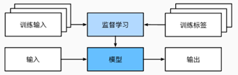
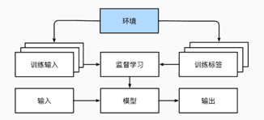
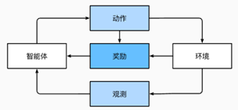

# 1基础知识

## 1.1机器学习组件

### 1.1.1数据

* 数据+=样本/数据点/数据实例（独立且同分布）
	* 独立：一个样本的出现不影响其他样本的出现概率。
	* 同分布：所有样本都来自相同的概率分布，即它们具有相似的统计特性。

- 样本+=特征/协变量

	在一个关于房屋价格的数据集中，一个样本（即一栋房屋）的特征可能包括面积、卧室数量、卫生间数量、地理位置等。

- 特征向量：将样本的所有特征值组合成一个向量。

- 维度：特征的个数，或特征向量的长度

### 1.1.2模型

### 1.1.3目标函数

- 目标函数（损失函数）：定义模型优劣程度的度量，一般越低越好。
	- 预测任务：平方误差，预测值与实际值之差的平方
	- 分类问题：最小化错误率
	- 训练数据集：拟合模型参数
	- 测试数据集：评估拟合模型

### 1.1.4优化算法

- 梯度下降：检查每个参数，若仅对该参数进行少量变动，在减少损失的方向上优化参数。

	

## 1.2常见机器学习问题

### 1.2.1监督学习

- 输入特征——映射——标签
- 每个样本：特征+标签

 

- 常见监督学习
	- 回归：标签取任意值——“有多少”
	- 分类：分类不一定用于最终决策
	- 标记
	- 搜索
	- 推荐系统
	- 序列学习

### 1.2.2无监督学习

- 无标签

- 常见无监督学习
	- 聚类
	- 主成分分析
	- 因果关系与概率图模型
	- 生成对抗性网络

### 1.2.3与环境互动

 

### 1.2.4强化学习

- 智能体在一系列的时间步骤上与环境交互，在每个特定时间点，智能体从环境接收一些观察，并且必须选择一个动作，然后通过某种机制（有时称为执行器）将其传输回环境，最后智能体从环境中获得奖励。
- 可以将任何监督学习问题转化为强化学习问题。

  

- 常见强化学习问题
	- 马尔可夫决策过程：环境可被完全被观察。
	- 上下文赌博机：状态不依赖于之前操作。
	- 多臂赌博机：没有状态，只有一组最初未知回报的可用动作。

