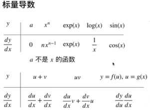
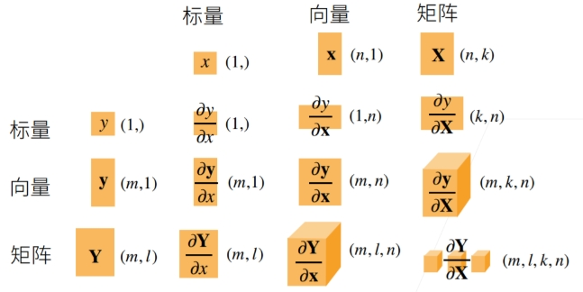
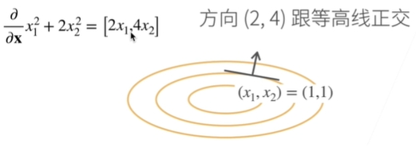
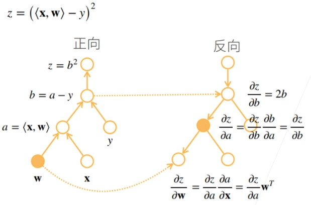
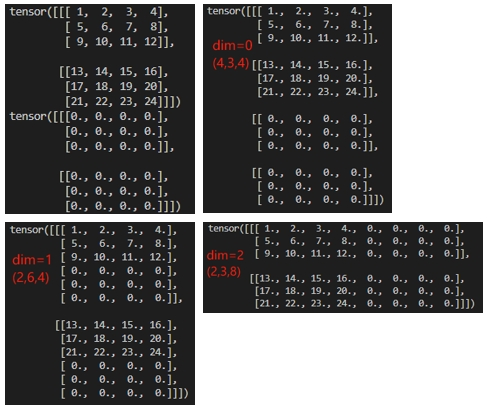

# 2数学相关知识

## 2.1线性代数

### 2.1.1标量

- 只有一个元素的张量，仅包含一个数值。


```python
# 标量由只有一个元素的张量表示
import torch

x = torch.tensor([3.0])
y = torch.tensor([2.0])

x + y, x * y, x ** y, x / y
```

```python
(tensor([5.]), tensor([6.]), tensor([9.]), tensor([1.5000]))
```

### 2.1.2向量

- 标量值组成的列表，这些标量被称为向量的元素或分量。
- 向量的表示一般用粗体、小写字母

```python
x = torch.arange(4)
x
```

```python
tensor([0, 1, 2, 3])
```

- 类似数组，通过访问下标来引用元素。
	- 默认情况下，向量的默认方向是列向量。

```python
x[3]
```

```python
array(3.)
```

- 维度：向量的长度。
- 通过len()访问张量的长度。

```python
len(x)
```

```python
(4,)
```

- 当向量只有一个轴时，通过.shape属性访问向量的长度。

```python
x.shape
```

```python
(4,)
```

- 当向量存在多个轴时，.shape为每个轴上的长度

```python
four_d_array = np.random.rand(4, 3, 2, 5)
four_d_array.shape
```

```python
(4, 3, 2, 5)
```

### 2.1.3矩阵

- 在代码中表示为具有两个轴的张量。
- 矩阵的表示通常用粗体、大写字母

```python
A = np.arange(20).reshape(5, 4)
A
```

```python
array([[ 0.,  1.,  2.,  3.],
       [ 4.,  5.,  6.,  7.],
       [ 8.,  9., 10., 11.],
       [12., 13., 14., 15.],
       [16., 17., 18., 19.]])
```

- 转置

```python
A.T
```

### 2.1.4张量

- 描述具有任意数量轴的n维数组
	- 0维张量：标量，一个数字
	- 1维张量：向量
	- 2维向量：矩阵
	- 3维向量：矩阵数组
- 张量的属性
	- 秩：维度数，标量的秩为0，向量为1，矩阵为2
	- 形状：每个维度中元素的数量
	- 数据类型：元素的类型，如int，float

```py
X = np.arange(24).reshape(2, 3, 4)
X
```

```python
array([[[ 0.,  1.,  2.,  3.],
        [ 4.,  5.,  6.,  7.],
        [ 8.,  9., 10., 11.]],

       [[12., 13., 14., 15.],
        [16., 17., 18., 19.],
        [20., 21., 22., 23.]]])
```

- torch.tensor和torch.Tensor区别
	- torch.tensor为函数，torch.Tensor本身为一个类
	- 通过requires_grad=True设置自动求导

### 2.1.5张量的算法

- 加/乘法：
	- 矩阵A+/*矩阵B，A,B形状相同，各位置元素相加/乘
	- 矩阵A+/*标量B，A各元素加/乘B 
	
- 降维：

	- ```python
		x.sum()
		```

	- ```python
		x.sum(axis=0) #让矩阵沿0轴（行）降维以生成输出向量
		```

	- ```python
		x.sum(axis=1) #让矩阵沿1轴（列）降维以生成输出向量
		```

	- ```python
		x.sum(axis=[0, 1]) = x.sum()
		```

- 求平均

	- ```python
		x.mean(axis=0) = x.sum()/x.size # 按行求平均=将总和除以元素总数
		```

- 非降维求和

  - 求和：sum_A = A.sum(axis=1, keepdims=True)，保持原有轴数

  - cumsum()函数，沿某个轴计算 `A` 元素的累积总和：A.cumsum(axis=0)

  - A：tensor([[ 0., 1., 2., 3.], [ 4., 5., 6., 7.], [ 8., 9., 10., 11.], [12., 13., 14., 15.], [16., 17., 18., 19.]])

  - ```python
  	A.cumsum(axis=0)# 按行
  	
  	output: tensor([[ 0.,  1.,  2.,  3.],
  	                [ 4.,  6.,  8., 10.],
  	                [12., 15., 18., 21.],
  	                [24., 28., 32., 36.],
  	                [40., 45., 50., 55.]])
  	# 第2行为第1行+第2行，第3行为1、2、3行相加
  	```
  	
  - 如果有个shape为[5,4]的张量，axis=0和1分别为按行、列求sum

  	- 若axis=0，则sum后的shape为[4]

  	- 若axis=1，则sum后的shape为[5]
  	
  - 如果有一个shape为[2,5,4]的张量

  	- 若axis=1,则 [2,4]
  	- 若axis=2, 则[2,5]
  	- 若axis=[1,2], 则 [4]

  - 其中keepdims=True, 它的作用是保持原始数组的维度不变，即使在进行操作后，结果也会保留原始数组的形状（或者说是维度），只不过在某些维度上会被压缩（比如求和后的维度会变成1），如：shape:[2,5,4]

  	- axis:1 , [2,1,4]
  	- axis:[1,2] [2,1,1]

- 点积

	- 计算余弦相似度、卷积操作、权重更新、加权平均…

	- ```
		np.dot(x, y)
		```

- 矩阵-向量积、矩阵-矩阵积计算与线性代数相同

### 2.1.6范数

- 表示一个向量有多大

- L2范数

	- L2范数是指向量中各个元素的平方和的平方根。

	- **几何意义**：L2范数表示从原点到向量终点的直线距离，即向量在欧几里得空间中的长度。

	- 应用：

		- **距离计算**：L2范数常用于计算两点之间的欧几里得距离。
		- **正则化**：在机器学习中，L2正则化（Ridge回归）通过惩罚模型参数的大值，有助于控制模型的复杂度，防止过拟合。
		- **信号处理**：L2范数用于衡量信号的能量或误差大小。
		- **优化问题**：L2范数常用于求解最小二乘问题。

	- 假设n维向量 xx 中的元素是x1,…,xn，其 L2 *范数* 是向量元素平方和的平方根:

	- $$
	  |\mathbf{x}|2=\sqrt{\sum_{i=1}^nx_i^2}
	  $$

	- ```python
		u = np.array([3, -4])
		np.linalg.norm(u)
		```

	- ```
		array(5.)
		```

- L1范数

	- L1范数是指向量中各个元素绝对值之和。

	- **几何意义**：L1范数在几何上表示在坐标轴上移动到向量端点所需的最小步伐数，也称为曼哈顿距离。

	- 应用：

		- **特征选择**：L1范数倾向于产生稀疏解，即解中的许多元素为零。这在特征选择中非常有用，可以帮助去除不重要的特征。
		- **正则化**：在机器学习中，L1正则化（Lasso回归）通过惩罚较大的系数来促进特征选择和稀疏解。
		- **优化问题**：L1范数常用于求解线性规划问题。

	- 向量元素的绝对值之和：torch.abs(u).sum()

	- $$
		|\mathbf{x}|1=\sum_{i=1}^n\left|x_i\right|
		$$

	- ```python
		np.abs(u).sum()
		```

	- ```python
		array(7.)
		```

- 主要区别：

	- **对大值的敏感性**：L1范数对大值不敏感，而L2范数对大值比较敏感。因此，在求解稀疏优化问题时，L1范数通常比L2范数更有效。
	- **解的稀疏性**：L1范数倾向于产生稀疏解，即解中的许多元素为零；而L2范数通常会产生更平滑的解。

## 2.2微积分

深度学习优化算法会涉及关键步骤，如梯度下降算法、损失函数。

### 2.2.1导数

- 导数是某函数某点切线的斜率

	  
	
	- y为标量，x为列向量；求偏导的结果为行向量，在模型计算中需要注意这种变化
	
	$$
	\mathbf{x}=\begin{bmatrix}x_1\\x_2\\\vdots\\x_n\end{bmatrix},\frac{\partial y}{\partial\mathbf{x}}=\begin{bmatrix}\frac{\partial y}{\partial x_1},\frac{\partial y}{\partial x_2},\ldots,\frac{\partial y}{\partial x_n}\end{bmatrix}
	$$
	
	- y为列向量，x为标量；求偏导的结果为列向量
	
	$$
	\mathbf{y}=\begin{bmatrix}x_1\\x_2\\\vdots\\x_n\end{bmatrix},\frac{\partial\mathbf{y}}{\partial x}=\begin{bmatrix}\\\frac{\partial y_1}{\partial x},\\\frac{\partial y_2}{\partial x},\\\vdots,\\\frac{\partial y_m}{\partial x}\end{bmatrix}
	$$
	
	
	
	- x、y都为列向量，结果为矩阵；先拆分为m个第1中情况，再分别计算就是一个矩阵
	
	$$
	\mathbf{x}=\begin{bmatrix}x_1\\x_2\\\vdots\\x_n\end{bmatrix},\mathbf{y}=\begin{bmatrix}x_1\\x_2\\\vdots\\x_n\end{bmatrix}
	,
	\frac{\partial\mathbf{y}}{\partial x}=\begin{bmatrix}\\\\\frac{\partial y_1}{\partial\mathbf{x}},\\\frac{\partial y_2}{\partial\mathbf{x}},\\\vdots,\\\frac{\partial y_m}{\partial\mathbf{x}}\end{bmatrix}=\begin{bmatrix}\\\\\frac{\partial y_1}{\partial x},\frac{\partial y_1}{\partial x},\ldots,\frac{\partial y_1}{\partial x}\\\\\frac{\partial y_2}{\partial x},\frac{\partial y_2}{\partial x},\ldots,\frac{\partial y_2}{\partial x}\\\vdots\\\frac{\partial y_m}{\partial x},\frac{\partial y_m}{\partial x},\ldots,\frac{\partial y_m}{\partial x}\end{bmatrix}
	$$
	
	- 拓展到矩阵
	
	



### 2.2.2偏导数

- 描述多元函数在某个特定变量方向上的变化率

$$
\frac{\partial y}{\partial x_i} = \lim_{h \to 0} \frac{f(x_1, \ldots, x_{i-1}, x_i + h, x_{i+1}, \ldots, x_n) - f(x_1, \ldots, x_i, \ldots, x_n)}{h}
$$

​             等价于
$$
\frac{\partial y}{\partial x_i} = \frac{\partial f}{\partial x_i} = f_{x_i} = J_i = D_i f = D_{x_i} f
$$


### 2.2.3梯度

- 梯度的本意是一个向量（矢量），表示某一函数在该点处的方向导数沿着该方向取得最大值，即函数在该点处沿着该方向（此梯度的方向）变化最快，变化率最大（为该梯度的模）。



- 在后续模型中更新参数时，需要寻找loss值越小越好的参数。

### 2.2.4链式法则

- 在深度学习中，多元函数通常是复合的，难以应用上述规则来微分，故运用链式法则	
	- why？**深度学习中的多元函数通常是复合函数**。这意味着一个函数的输出可能是另一个函数的输入，从而形成了复杂的函数链。这种复合性质使得传统的导数规则（如相加规则、乘积规则等）难以直接应用，因为它们通常适用于较简单的函数组合形式。
- 简单复合函数

$$
\frac{dy}{dx} = \frac{dy}{du} \frac{du}{dx}
$$


- 推广到一般复合函数

$$
\frac{dy}{dx_i} = \frac{dy}{du_1} \frac{du_1}{dx_i} + \frac{dy}{du_2} \frac{du_2}{dx_i} + \cdots + \frac{dy}{du_m} \frac{du_m}{dx_i}
$$

- 向量链式法则

$$
\begin{equation}
y = f(u), \quad u = g(x), \quad \frac{\partial y}{\partial x} = \frac{\partial y}{\partial u} \frac{\partial u}{\partial x}
\end{equation}
$$

## 2.3自动微分

- 自动高效地计算复杂函数的导数，从而优化模型参数，加速神经网络训练过程

```python  
x.requires_grad_(True)
x.grad()  
#x.grad 是一个属性，用于存储张量 x 的梯度。当你在一个计算图中对某个标量值（例如损失函数）调用 .backward() 方法时，PyTorch会自动计算图中所有requires_grad=True的张量的梯度，并将这些梯度存储在相应张量的.grad 属性中
```

```python
x.grad.zero_() # 在默认情况下，PyTorch会累积梯度，.grad.zero_()用于清除之前的值
y = x.sum()
y.backward() #.backward()用于计算y关于x的梯度
x.grad
```

### 2.3.1计算图

- 将代码分解成操作子
- 将计算表示成一个无环图
- 显式构造Tensorflow/Theano/MXNet
- 隐式构造Pytorch/MXNet



### 2.3.2正向、反向积累

- 正向积累：表示的是从最里层（树状最底部）进行求导，内存复杂度小（O(1)）；需要对每一层计算梯度

$$
\begin{align*}
\frac{\partial y}{\partial x} = \frac{\partial y}{\partial u_n} \left( \frac{\partial u_n}{\partial u_{n-1}} \left( \cdots \left( \frac{\partial u_2}{\partial u_1} \frac{\partial u_1}{\partial x} \right) \right) \right)
\end{align*}
$$

- 反向积累：表示的是从最外层（树状起始）进行求导，计算需要储存正向的所有中间结果，内存复杂度大（O(n)）

$$
\begin{align*}
\frac{\partial y}{\partial x} = \left( \left( \left( \frac{\partial y}{\partial u_n} \frac{\partial u_n}{\partial u_{n-1}} \right) \cdots \right) \frac{\partial u_2}{\partial u_1} \right) \frac{\partial u_1}{\partial x}
\end{align*}
$$

### 2.3.3正向、反向传播

- 正向传播（forward）：神经网络沿着输入层到输出层的顺序，依次计算并存储模型的中间变量(包括输出)

- 反向传播（backward）：依据微积分中的链式法则，沿着从输出层到输入层的顺序，依次计算并存储在有关神经网络各层的中间变量以及参数的梯度

### 2.3.4正向传播和反向传播相互依赖

一方面，正向传播的梯度计算可能依赖于各变量的当前值，而这些变量的当前值都是通过反向传播的梯度计算之后通过优化算法迭代的。比如加入正则化的目标函数的当前值是根据反向传播算出梯度迭代后得到的；

另一方面，反向传播的梯度计算可能依赖于各变量的当前值，而这些变量的当前值都是正向传播计算得到的 。计算参数梯度的需要某系变量的当前值，而这些当前值是通过正向传播计算并存储得到。

在模型参数初始化完成后，我们交替的进行正向和反向传播，并根据反向传播的梯度迭代模型参数。在训练过程中，正向传播和反向传播的中的各个中间变量和梯度计算值都需要占用内存，而在预测过程中，没有反向传播计算梯度的过程，因此预测过程中内存的占用较小。

训练过程中的质检变量的个数大体上跟网络层数线性相关，每个变量的大小跟批量大小和输入个数也是线性相关的，它们是导致较深的神经网络使用较大批量训练是更容易超内存的主要原因。

## 2.4数据操作

### 2.4.1入门

- arange(array+range)创建行向量

```python
x = torch.arange(12)
x
```

```python
tensor([ 0,  1,  2,  3,  4,  5,  6,  7,  8,  9, 10, 11])
```

- shape访问张量（沿每个轴的长度）形状

```python
x.shape
x
```

```python
torch.Size([12])
```

```python
x=torch.tensor([[0,1,2,3,4,5],[6,7,8,9,10,11]])
x 
```

```python
torch.Size([2,6])
```

- numel（numberelement）查看所有元素的数量

```python
x.numel()
```

```python
12
```

- reshape来改变张量的形状而不改变元素数量和元素值，自动计算维度：用x.reshape(-1,4)或x.reshape(3,-1)来取代x.reshape(3,4)

```python
X = x.reshape(3, 4)
X
```

```python
tensor([[ 0,  1,  2,  3],
        [ 4,  5,  6,  7],
        [ 8,  9, 10, 11]])
```

- zeros、ones创建全0、全1的数组

```python
torch.zeros((2, 3, 4))
torch.ones((2, 3, 4))
```

```python
tensor([[[0., 0., 0., 0.],
         [0., 0., 0., 0.],
         [0., 0., 0., 0.]],

        [[0., 0., 0., 0.],
         [0., 0., 0., 0.],
         [0., 0., 0., 0.]]])

tensor([[[1., 1., 1., 1.],
         [1., 1., 1., 1.],
         [1., 1., 1., 1.]],

        [[1., 1., 1., 1.],
         [1., 1., 1., 1.],
         [1., 1., 1., 1.]]])
```

- 创建一个形状为（3,4）的张量。其中的每个元素都从均值为0、标准差为1的标准高斯分布（正态分布）中随机采样。其中np为numpy，random是生成随机数模块，提供了多种生成随机数的方法，包括均匀分布、正态分布等。normal是random模块中的一个函数，用于生成符合正态（高斯）分布的随机数，0是均值，1是标准差。

```python
np.random.normal(0,1,size=(3,4))
```

```python
array([[ 2.2122064,  1.1630787 ,  0.7740038 ,  0.4838046  ],
       [ 1.0434403,  0.29956347,  1.1839255 ,  0.153025461],
       [ 1.8917114,  -1.1688148,  -1.2347414,  1.5580711  ]])
```

- 创建数组

```python
torch.tensor([[2, 1, 4, 3], [1, 2, 3, 4], [4, 3, 2, 1]])
```

```python
tensor([[2, 1, 4, 3],
        [1, 2, 3, 4],
        [4, 3, 2, 1]])
```

### 2.4.2运算符

有两个形状一样的向量u和v，还有一个可以进行两个数之间运算的二元运算符f（比如加法、乘法等）。现在用这个运算符f和这两个向量u、v来生成一个新的向量c。用运算符f把u~i~和v~i~运算一下，得到的结果就是新向量c的第一个元素c~i~；对u和v里的每一个元素都这么做，用f运算后得到的结果就组成了新的向量c。F:R^d^,R^d^->R^d^：F是一个函数，它接受两个d维的向量（R^d^表示d维的向量空间），然后输出一个也是d维的向量。

- 对于任意具有相同形状的张量， 常见的标准算术运算符（+、-、*、/和**）都可以被升级为按元素运算

```python
x = torch.tensor([1.0, 2, 4, 8])
y = torch.tensor([2, 2, 2, 2])
x + y, x - y, x * y, x / y, x ** y  # **运算符是求幂运算
```

```python
(tensor([ 3.,  4.,  6., 10.]),
 tensor([-1.,  0.,  2.,  6.]),
 tensor([ 2.,  4.,  8., 16.]),
 tensor([0.5000, 1.0000, 2.0000, 4.0000]),
 tensor([ 1.,  4., 16., 64.]))
```

- 对元素进行指数运算

```
torch.exp(x)
```

```python
tensor([2.7183e+00, 7.3891e+00, 5.4598e+01, 2.9810e+03])
```

- pytorch的Cat合并，dim=n，n为维度，一般dim=0意思是按行合并,dim=1为按列合并

```python
X = torch.arange(12, dtype=torch.float32).reshape((3,4))
Y = torch.tensor([[2.0, 1, 4, 3], [1, 2, 3, 4], [4, 3, 2, 1]])
torch.cat((X, Y), dim=0), torch.cat((X, Y), dim=1)
```

```python
(tensor([[ 0.,  1.,  2.,  3.],
         [ 4.,  5.,  6.,  7.],
         [ 8.,  9., 10., 11.],
         [ 2.,  1.,  4.,  3.],
         [ 1.,  2.,  3.,  4.],
         [ 4.,  3.,  2.,  1.]]),
 tensor([[ 0.,  1.,  2.,  3.,  2.,  1.,  4.,  3.],
         [ 4.,  5.,  6.,  7.,  1.,  2.,  3.,  4.],
         [ 8.,  9., 10., 11.,  4.,  3.,  2.,  1.]]))
```

 

- 用逻辑运算符构建二元张量

```python
X == Y
```

```python
tensor([[False,  True, False,  True],
        [False, False, False, False],
        [False, False, False, False]])
```

### 2.4.3广播机制

- 张量形状不同，维度相同时的广播机制：

```
a = torch.arange(3).reshape((3, 1))
b = torch.arange(2).reshape((1, 2))
a, b
```

```python
(tensor([[0],
         [1],
         [2]]),
 tensor([[0, 1]]))
```

- a,b先广播为一个更大的矩阵，矩阵a将复制列，矩阵b将复制行 ，a变成[[0,0]，[1,1]，[2,2]]，b变成[[0,1]，[0,1]，[0,1]]，然后再按元素相加，线性代数相加

```python
a + b
```

```python
tensor([[0, 1],
        [1, 2],
        [2, 3]])
```

### 2.4.4索引和切片

- 第一个元素的索引是0，最后一个元素索引是-1，[-1]选择最后一个元素，[1:3]选择第二个和第三个元素，即[1,3）

```python
X[-1], X[1:3]
```

```python
(tensor([ 8.,  9., 10., 11.]),
 tensor([[ 4.,  5.,  6.,  7.],
         [ 8.,  9., 10., 11.]]))
```

- 通过指定索引写入元素

```python
X[1, 2] = 9
X
```

```python
tensor([[ 0.,  1.,  2.,  3.],
        [ 4.,  5.,  9.,  7.],
        [ 8.,  9., 10., 11.]])
```

- 为多个元素赋值：索引元素后赋值

```python
X[0:2, :] = 12
X
```

```python
tensor([[12., 12., 12., 12.],
        [12., 12., 12., 12.],
        [ 8.,  9., 10., 11.]])
```

### 2.4.5节省内存

- Python的ID类似C++的指针：存Y的id，把Y加上X然后为新Y，而不是原来的，原本的内存被析构掉了

```python
before = id(Y)
Y = Y + X
id(Y) == before
```

```python
False
```

- 原地操作：

```python
Z = torch.zeros_like(Y)
print('id(Z):', id(Z))
Z[:] = X + Y
print('id(Z):', id(Z))
```

```python
id(Z): 140327634811696
id(Z): 140327634811696
```

- 如果后续计算没有重复使用X，可以通过X+=Y或X[:]=X+Y来减少操作的内存开销，对于可变对象来说，不会改变内存地址：

```python
before = id(X)
X += Y
id(X) == before
```

```python
True
```

### 2.4.6转换为其他python对象

- numpy数组转化为torch张量

```python
A = X.numpy()
B = torch.tensor(A)
type(A), type(B)
```

```python
(numpy.ndarray, torch.Tensor)
```

将大小为1的张量转换为python标量

```python
a = torch.tensor([3.5])
a, a.item(), float(a), int(a)
```

```python
(tensor([3.5000]), 3.5, 3.5, 3)
```

- .item()从只包含单个元素的数组中提取这个元素的值，并将其作为Python的标准类型（比如整数、浮点数）返回，即item函数或Python的内置函数将大小为1的张量转换为Python标量

## 2.5数据预处理

意义：存在不合理的数据或缺失

### 2.5.1数据预处理步骤

- 数据清洗（Data Cleaning）： 填写缺失的值（data normalization），光滑噪声数据（noise identification），识别或删除离群点，并解决不一致性来“清理数据”；缺失值插补（Missing values imputation）
- 数据集成（Data Integration）：使用多个数据库，数据立方体或文件；
- 数据归约（数据规范化data normalization）： 用替代的，较小的数据表示形式替换元数据，得到信息内容的损失最小化，方法包括维规约，数量规约和数据压缩；
- 数据变换（Data tansformation）：将数据变换成使用挖掘的形式。

[为什么我们需要数据预处理？-CSDN博客](https://blog.csdn.net/csdnnews/article/details/88265321)

### 2.5.2缺失值处理

缺失值处理，data.isnull().sum()获取缺失信息

- 删除（数据量小不建议）
- 填充：计算特征的均值，中值或众数，将其替换为缺失值
- KNN：利用knn算法填充，其实是把目标列当做目标标量，利用非缺失的数据进行knn算法拟合，最后对目标列缺失进行预测。（对于连续特征一般是加权平均，对于离散特征一般是加权投票）
- 随机森林填充：利用已有数据拟合模型，对缺失变量进行预测

原则：具体问题具体分析，处理缺失值是需要研究数据规律与缺失情况来进行处理的