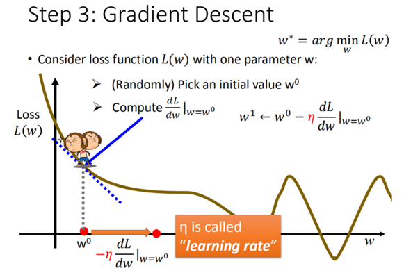
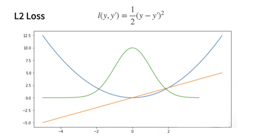

# 03线性神经网络

## 3.1回归

### 3.1.1概念理解

按照数学上的定义来看，回归分析指研究一组随机变量(Y~1~ ，Y~2~ ，…，Y~i~)和另一组(X~1~，X~2~，…，X~k~)变量之间关系的统计分析方法，又称多重回归分析。通常Y~1~，Y~2~，…，Y~i~是因变量，X~1~、X~2~，…，X~k~是自变量。

### 3.1.2回归种类

- 线性回归
	- 定义: 通过线性组合输入特征预测连续值
	- 应用: 房价预测、销量预测等
- 多项式回归
	- 定义: 通过多项式函数拟合非线性数据
	- 应用: 经济趋势预测、生物生长模型等
- 岭回归（Ridge Regression）
	- 定义: 在线性回归中加入L2正则化，防止过拟合
	- 应用: 高维数据回归
- Lasso回归
	- 定义: 加入L1正则化，适用于特征选择
	- 应用: 高维数据回归与特征选择
- 弹性网络回归（Elastic Net Regression）
	- 定义: 结合L1和L2正则化，平衡岭回归和Lasso回归
	- 应用: 高维数据回归与特征选择
- 支持向量回归（SVR）
	- 定义: 使用支持向量机进行回归，适用于非线性数据
	- 应用: 金融时间序列预测、生物信息学等
- 决策树回归
	- 定义: 通过树结构进行回归预测
	- 应用: 客户价值预测、风险评估等
- 随机森林回归
	- 定义: 集成多个决策树进行回归
	- 应用: 生态学、医学等领域
- 梯度提升回归（GBR）
	- 定义: 通过逐步优化残差进行回归
	- 应用: 点击率预测、推荐系统等
- 神经网络回归
	- 定义: 使用神经网络进行回归预测
	- 应用: 图像处理、自然语言处理等
- 贝叶斯回归
	- 定义: 基于贝叶斯定理进行回归
	- 应用: 医学诊断、金融风险评估等
- 分位数回归
	- 定义: 预测条件分位数，适用于非对称分布数据
	- 应用: 经济学、医学等领域
- 逻辑回归
	- 定义: 虽然主要用于分类，但也可用于概率预测
	- 应用: 信用评分、疾病预测等
- 非线性回归
	- 定义: 使用非线性模型拟合数据
	- 应用: 化学动力学、生物学等领域


## 3.2线性回归

### 3.2.1线性回归基本元素

- 线性模型：建模输入特征与目标变量之间的线性关系

	- 给定n维输入x=[x~1~,x~2~,…,x~n~]^T^

	- 线性模型有一个n维的权重w=[w~1~,w~2~,…,w~n~]^T^ 和一个标量偏差b

	- 输出为输入的加权和
		$$
		\hat{y} = w_1x_1 + \ldots + w_dx_d + b
		$$
		
	- 向量表示：y=<w,x>+b
	
- 损失函数：衡量模型预测值与实际值之间的差异

$$
l^{(i)}(\mathbf{w}, b) = \frac{1}{2} \left( \hat{y}^{(i)} - y^{(i)} \right)^2
$$

​		其中y^^^为预测值，y为真实值

- 解析解：通过数学推导得到的模型参数的闭式解

$$
w^* = (X^\top X)^{-1} X^\top y
$$

​	像线性回归这样的简单问题存在解析解，但并不是所有的问题都存在解析解。 解析解可	以进行很好的数学分析，但解析解对问题的限制很严格，导致它无法广泛应用在深度学习	里。

- 梯度下降：通过最小化损失函数来找到模型参数w、b的最优值

	- $$
		(\mathbf{w}, b) \leftarrow (\mathbf{w}, b) - \frac{\eta}{|\mathcal{B}|} \sum_{i \in \mathcal{B}} \partial_{(\mathbf{w}, b)} \ell^{(i)}(\mathbf{w}, b)
		$$

		

	- 

	- 步骤1：随机选取一个 w0

	- 步骤2：计算微分，也就是当前的斜率，根据斜率来判定移动的方向

		- 大于0向右移动（增加w）
		- 小于0向左移动（减少w）

	- 步骤3：根据学习率移动

	- 重复步骤2和步骤3，直到找到最低点

	- 学习率：步长的超参数

		- 选择学习率不能太小，否则步长很有限，需要非常多步，计算梯度很贵
		- 同时也不能太大，太大会迈过下降的地方，导致震荡
		- Adagrad算法调整学习率

- 小批量随机梯度下降

	- 在整个训练集上算梯度太贵，所以随机采样b个样本来近似损失

	- $$
		\frac{1}{b} \sum_{i \in I_b} \ell(\mathbf{x}_i, \mathbf{y}_i, \mathbf{w})
		$$

	- 若每次计算量太小，不适合并行来最大利用计算资源

	- 若每次计算量太大，内存消耗增加，浪费计算，例如如果所有样本都是相同的

### 3.2.2矢量化加速

- 同时处理整个小批量的样本

## 3.3线性回归代码实现

### 3.3.1生成数据集

- 使用线性模型参数w=[2,-3.4]^T^,b=4.2和噪声项ε

```python
def synthetic_data(w, b, num_examples):  #@save
    """生成y=Xw+b+噪声"""
    X = torch.normal(0, 1, (num_examples, len(w))) 
    #torch.normal用于生成服从正态分布（高斯分布）随机数
    #num_examples为数据样本数量
    
    y = torch.matmul(X, w) + b  
    #计算矩阵X和向量w的乘积，再加上偏置项b。
    #torch.matmul()用于执行矩阵乘法或张量乘法。
    
    y += torch.normal(0, 0.01, y.shape)  
    #向y添加一个从均值为 0、标准差为 0.01 的正态分布中随机采样的噪声。
    #torch.normal用于从正态分布（也称为高斯分布）中生成随机数。
    
    return X, y.reshape((-1, 1))

true_w = torch.tensor([2, -3.4])
#创建一个 PyTorch 张量

true_b = 4.2
features, labels = synthetic_data(true_w, true_b, 1000)
#synthetic_data() 函数生成合成数据
```

- 简洁实现

```python
import numpy as np
import torch
from torch.utils import data
from d2l import torch as d2l

true_w = torch.tensor([2, -3.4])
true_b = 4.2
features, labels = d2l.synthetic_data(true_w, true_b, 1000)
```

### 3.3.2读取数据集

- 定义一个`data_iter`函数， 该函数接收批量大小、特征矩阵和标签向量作为输入，生成大小为`batch_size`的小批量。 每个小批量包含一组特征和标签。

```python
def data_iter(batch_size, features, labels):
    num_examples = len(features)  #样本数量
    
    indices = list(range(num_examples))
    # 生成一个包含从0到num_examples-1的整数列表，并将其赋值给变量indices
    
    random.shuffle(indices)
    #将列表indices中的元素随机打乱顺序，该函数直接修改传入的列表而不会创建新的列表。
    
    for i in range(0, num_examples, batch_size):
        batch_indices = torch.tensor(
            indices[i: min(i + batch_size, num_examples)])
            #从indices列表中提取一个子列表，表示当前批次的样本索引。起始索引为i，结              束索引为min(i + batch_size,num_examples)，确保即使在数据集的末尾              也不会超出范围。
            
        yield features[batch_indices], labels[batch_indices]
        #使用 batch_indices 来索引 features，从而获取当前批次的特征数据。
        #使用 batch_indices 来索引 labels，从而获取当前批次的标签数据。
        #yield 语句使得这个函数成为一个生成器函数。每次调用生成器时，它会返回当前批次          的特征和标签，然后暂停，直到下一次调用时继续执行。
```

- 简洁实现：调用框架中现有的API来读取数据，将`features`和`labels`作为API的参数传递，并通过数据迭代器指定`batch_size`。 此外，布尔值`is_train`表示是否希望数据迭代器对象在每个迭代周期内打乱数据。

```python
def load_array(data_arrays, batch_size, is_train=True):  #@save
    """构造一个PyTorch数据迭代器"""
    dataset = data.TensorDataset(*data_arrays)
    return data.DataLoader(dataset, batch_size, shuffle=is_train)

batch_size = 10
data_iter = load_array((features, labels), batch_size)
```

### 3.3.3初始化模型参数

- 通过从均值为0、标准差为0.01的正态分布中采样随机数来初始化权重， 并将偏置初始化为0。

```python
w = torch.normal(0, 0.01, size=(2,1), requires_grad=True)
#torch.normal：用于生成正态分布随机数的函数
#0为正态分布的均值，0.01为正态分布的标准差，size=(2,1)用于指定生成的张量的形状，这通   常用于初始化连接输入层和隐藏层（或输出层）的权重。
#requires_grad=True表示需要计算梯度

b = torch.zeros(1, requires_grad=True)
```

- 简洁实现：深度学习框架通常有预定义的方法来初始化参数。 在这里指定每个权重参数应该从均值为0、标准差为0.01的正态分布中随机采样， 偏置参数将初始化为零。

```python
net[0].weight.data.normal_(0, 0.01)
net[0].bias.data.fill_(0)
```


### 3.3.4定义模型

- 将模型的输入和参数同模型的输出关联起来。要计算线性模型的输出，只需计算输入特征X和模型权重w的矩阵-向量乘法后加上偏置b。

```python
def linreg(X, w, b):  #@save
    """线性回归模型"""
    return torch.matmul(X, w) + b
```

- 简洁实现：对于标准深度学习模型，可以使用框架的预定义好的层。只需关注使用哪些层来构造模型，而不必关注层的实现细节。

```python
# nn是神经网络的缩写
from torch import nn

net = nn.Sequential(nn.Linear(2, 1))
```

-  Sequential类将多个层串联在一起。 当给定输入数据时，Sequential实例将数据传入到第一层， 然后将第一层的输出作为第二层的输入，以此类推。

### 3.3.5定义损失函数

```python
def squared_loss(y_hat, y):  #@save
    """均方损失"""
    return (y_hat - y.reshape(y_hat.shape)) ** 2 / 2
```

- 计算均方误差使用的是MSELoss类，也称为平方L2范数。 默认情况下，它返回所有样本损失的平均值。

```python
loss = nn.MSELoss()
```

### 3.3.6定义优化算法

- 接受模型参数集合、学习速率和批量大小作为输入。每 一步更新的大小由学习速率lr决定。

```python
def sgd(params, lr, batch_size):  #@save
    """小批量随机梯度下降"""
    with torch.no_grad(): #临时关闭梯度计算
        for param in params:
            param -= lr * param.grad / batch_size  
            #将归一化后的梯度乘以学习率，得到参数更新的量
            param.grad.zero_()
            #将参数的梯度清零
```

- 简洁实现：小批量随机梯度下降算法， PyTorch在`optim`模块中实现了该算法的许多变种。 当实例化一个`SGD`实例时，我们要指定优化的参数 （可通过`net.parameters()`从模型中获得）以及优化算法所需的超参数字典。 小批量随机梯度下降只需要设置`lr`值，这里设置为0.03。

```python
trainer = torch.optim.SGD(net.parameters(), lr=0.03)
```

### 3.3.7训练

```python
lr = 0.03
num_epochs = 3
net = linreg
loss = squared_loss

for epoch in range(num_epochs):
    for X, y in data_iter(batch_size, features, labels):
        l = loss(net(X, w, b), y)  # X和y的小批量损失
        # 因为l形状是(batch_size,1)，而不是一个标量。l中的所有元素被加到一起，
        # 并以此计算关于[w,b]的梯度
        l.sum().backward()
        sgd([w, b], lr, batch_size)  # 使用参数的梯度更新参数
    with torch.no_grad():
        train_l = loss(net(features, w, b), labels)
        print(f'epoch {epoch + 1}, loss {float(train_l.mean()):f}')
```

- 简洁实现：通过深度学习框架的高级API来实现模型只需要相对较少的代码。不必单独分配参数、不必定义损失函数，也不必手动实现小批量随机梯度下降。 当需要更复杂的模型时，高级API的优势将大大增加。

- 在每个迭代周期里，将完整遍历一次数据集（`train_data`）， 不停地从中获取一个小批量的输入和相应的标签。 对于每一个小批量会进行以下步骤:
	- 通过调用`net(X)`生成预测并计算损失`l`（前向传播）。
	- 通过进行反向传播来计算梯度。
	- 通过调用优化器来更新模型参数。

```python
num_epochs = 3
for epoch in range(num_epochs):
    for X, y in data_iter:
        l = loss(net(X) ,y)
        trainer.zero_grad()
        l.backward()
        trainer.step()
    l = loss(net(features), labels)
    print(f'epoch {epoch + 1}, loss {l:f}')
    
w = net[0].weight.data
print('w的估计误差：', true_w - w.reshape(true_w.shape))
b = net[0].bias.data
print('b的估计误差：', true_b - b)
```

## 3.4softmax回归

### 3.4.1分类问题

- 独热编码：将离散分类特征转换为二进制向量，每个类别对应一个唯一的高维稀疏向量表示。

### 3.4.2网络架构

- softmax回归也是一个单层神经网络，softmax回归的输出层也是全连接层。


### 3.4.3全连接层的参数开销

- 全连接层的特点是输入层每个神经元都与输出层每个神经元相连，参数数量为O(dq)。为减少参数，可以通过某种方式将输入转换为输出的成本降低到O(dq/n)，其中n为可调节的超参数，用于平衡参数节约和模型有效性。

### 3.4.4 softmax运算

- 将一组实数转换为概率分布，常用于多分类问题的输出层。

$$
\text{Softmax}(z_i) = \frac{e^{z_i}}{\sum_{j=1}^{K} e^{z_j}}
$$

### 3.4.5小批量样本的矢量化

- 为了提高计算速度，通常会一次性处理多个样本，而不是一个接一个地处理。这种方法被称为小批量样本处理，而矢量化则是将多个样本的数据和权重转换为矩阵形式，以便进行高效的矩阵运算。
	- 矢量化的softmax回归计算首先通过矩阵乘法 XW 和加法 +*b* 得到未规范化的预测结果 *O*。
	- 对 O 应用softmax函数，将每个样本的预测结果转换为概率分布 Y^^^。
	- 在计算 XW+b 时，广播机制将偏置项 *b* 自动扩展到与 *O* 相同的形状，从而进行逐元素的加法运算。

### 3.4.6损失函数

- 量化模型预测结果与实际结果之间的差异，通过计算损失值可以评估模型在训练数据上的表现。损失函数值越小，表示模型的预测结果与实际结果越接近，模型的性能越好。

- 均方损失
	- 
	- 其中y为真实值，y’为预测值。
	- 蓝色：当y=0时，变换预测值y’的函数
	- 绿色：似然函数，1^-1^，高斯分布
	- 橙色：损失函数的梯度，穿过原点的一次函数
	- 当预测值y’与真实值y隔的比较远时，梯度比较大，参数更新比较多，随着预测值靠近真实值时，梯度的绝对值会越来越小，参数更新的幅度也越来越小。

- 绝对值损失函数
	- 
	- 蓝色：损失函数
	- 绿色：似然函数
	- 橙色：梯度
	- 当预测值y’与真实值y隔的比较远时，梯度永远为常数，权重更新不会特别大，稳定性高，缺点为零点处不可导，影响不平滑性（-1和1的剧烈变化），即当预测值y’与真实值y隔的比较近时（优化末期）会不太稳定。
- 鲁棒损失
	- 
	- 当预测值和真实值差的比较大时，为绝对值误差，当比较近时为平方误差。

## 3.5softmax回归实现

```python
import torch
from torch import nn
from d2l import torch as d2l

batch_size = 256
train_iter, test_iter = d2l.load_data_fashion_mnist(batch_size)
```

### 3.5.1初始化模型参数

```python
# PyTorch不会隐式地调整输入的形状。因此，在线性层前定义了展平层（flatten），来调整网络输入的形状
net = nn.Sequential(nn.Flatten(), nn.Linear(784, 10))

def init_weights(m):
    if type(m) == nn.Linear:
        nn.init.normal_(m.weight, std=0.01)

net.apply(init_weights);
```

### 3.5.2定义softmax操作

```python
loss = nn.CrossEntropyLoss(reduction='none')
```

### 3.5.3优化算法

- 使用学习率为0.1的小批量随机梯度下降作为优化算法

```python
trainer = torch.optim.SGD(net.parameters(), lr=0.1)
```

### 3.5.4训练

```python
class Animator:  #@save
    """在动画中绘制数据"""
    def __init__(self, xlabel=None, ylabel=None, legend=None, xlim=None,
                 ylim=None, xscale='linear', yscale='linear',
                 fmts=('-', 'm--', 'g-.', 'r:'), nrows=1, ncols=1,
                 figsize=(3.5, 2.5)):
        # 增量地绘制多条线
        if legend is None:
            legend = []
        d2l.use_svg_display()
        self.fig, self.axes = d2l.plt.subplots(nrows, ncols, figsize=figsize)
        if nrows * ncols == 1:
            self.axes = [self.axes, ]
        # 使用lambda函数捕获参数
        self.config_axes = lambda: d2l.set_axes(
            self.axes[0], xlabel, ylabel, xlim, ylim, xscale, yscale, legend)
        self.X, self.Y, self.fmts = None, None, fmts

    def add(self, x, y):
        # 向图表中添加多个数据点
        if not hasattr(y, "__len__"):
            y = [y]
        n = len(y)
        if not hasattr(x, "__len__"):
            x = [x] * n
        if not self.X:
            self.X = [[] for _ in range(n)]
        if not self.Y:
            self.Y = [[] for _ in range(n)]
        for i, (a, b) in enumerate(zip(x, y)):
            if a is not None and b is not None:
                self.X[i].append(a)
                self.Y[i].append(b)
        self.axes[0].cla()
        for x, y, fmt in zip(self.X, self.Y, self.fmts):
            self.axes[0].plot(x, y, fmt)
        self.config_axes()
        display.display(self.fig)
        display.clear_output(wait=True)

def train_epoch_ch3(net, train_iter, loss, updater):  #@save
    """训练模型一个迭代周期（定义见第3章）"""
    # 将模型设置为训练模式
    if isinstance(net, torch.nn.Module):
        net.train()
    # 训练损失总和、训练准确度总和、样本数
    metric = Accumulator(3)
    for X, y in train_iter:
        # 计算梯度并更新参数
        y_hat = net(X)
        l = loss(y_hat, y)
        if isinstance(updater, torch.optim.Optimizer):
            # 使用PyTorch内置的优化器和损失函数
            updater.zero_grad()
            l.mean().backward()
            updater.step()
        else:
            # 使用定制的优化器和损失函数
            l.sum().backward()
            updater(X.shape[0])
        metric.add(float(l.sum()), accuracy(y_hat, y), y.numel())
    # 返回训练损失和训练精度
    return metric[0] / metric[2], metric[1] / metric[2]

def train_ch3(net, train_iter, test_iter, loss, num_epochs, updater):  #@save
 
    animator = Animator(xlabel='epoch', xlim=[1, num_epochs], ylim=[0.3, 0.9],
                        legend=['train loss', 'train acc', 'test acc'])
    for epoch in range(num_epochs):
        train_metrics = train_epoch_ch3(net, train_iter, loss, updater)
        test_acc = evaluate_accuracy(net, test_iter)
        animator.add(epoch + 1, train_metrics + (test_acc,))
    train_loss, train_acc = train_metrics
    assert train_loss < 0.5, train_loss
    assert train_acc <= 1 and train_acc > 0.7, train_acc
    assert test_acc <= 1 and test_acc > 0.7, test_acc
    

num_epochs = 10
d2l.train_ch3(net, train_iter, test_iter, loss, num_epochs, trainer)
```

