# 04MLP实验记录

## 4.1实验环境

RTX 3060

5核E5-2680 v4

Python v3.11.8

PyTorch v2.2.2

## 4.2实验初始代码

```python
#下载数据集
%matplotlib inline
import torch
import torchvision
from torch.utils import data
from torchvision import transforms
from d2l import torch as d2l

d2l.use_svg_display()


# 通过ToTensor实例将图像数据从PIL类型变换成32位浮点数格式，
# 并除以255使得所有像素的数值均在0～1之间
trans = transforms.ToTensor()
mnist_train = torchvision.datasets.FashionMNIST(
    root="./data", train=True, transform=trans, download=True)
mnist_test = torchvision.datasets.FashionMNIST(
    root="./data", train=False, transform=trans, download=True)
```

```python
#实验代码
import torch
from torch import nn
from d2l import torch as d2l

net = nn.Sequential(
    				nn.Flatten(),
           # 将输入展平，例如 (batch_size, 1, 28, 28) -> (batch_size, 784)
                    nn.Linear(784, 256),
                    # 输入 784 维（28×28），隐藏层 256 维
                    nn.ReLU(),
                    # 激活函数
                    nn.Linear(256, 10))
					# 输出层，10 个类别

def init_weights(m):
    if type(m) == nn.Linear:
        nn.init.normal_(m.weight, std=0.01)
        #以均值 0，标准差 0.01 进行随机初始化权重

net.apply(init_weights);
#对网络中的所有层应用init_weights

batch_size, lr, num_epochs = 256, 0.1, 10
loss = nn.CrossEntropyLoss(reduction='none')
trainer = torch.optim.SGD(net.parameters(), lr=lr)

train_iter, test_iter = d2l.load_data_fashion_mnist(batch_size)
d2l.train_ch3(net, train_iter, test_iter, loss, num_epochs, trainer)
```

## 4.3实验过程报错

### 4.3.1 模型d2l没有train_ch3

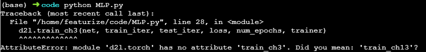

#### 1.报错原因

- 实验环境d2l=1.0.3，只支持train_ch6，train_ch11和train_ch13  

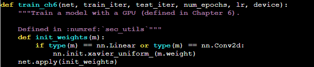 

 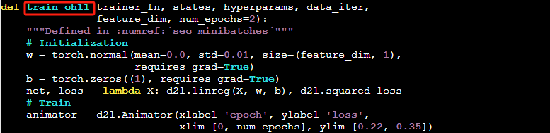

 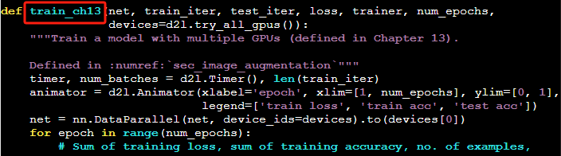

- d2l==0.17.6支持train_ch3，但安装出现版本不兼容问题

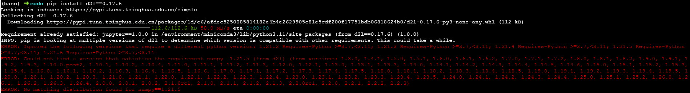 

#### 2.解决方案

[module ‘d2l.torch‘ has no attribute ‘train_ch3 ‘解决方法_d2l 1.0.3-CSDN博客](https://blog.csdn.net/m0_65252751/article/details/136609208)

- 在/environment/miniconda3/lib/python3.11/site-packages/d2l/torch.py下增加train_ch3定义代码 

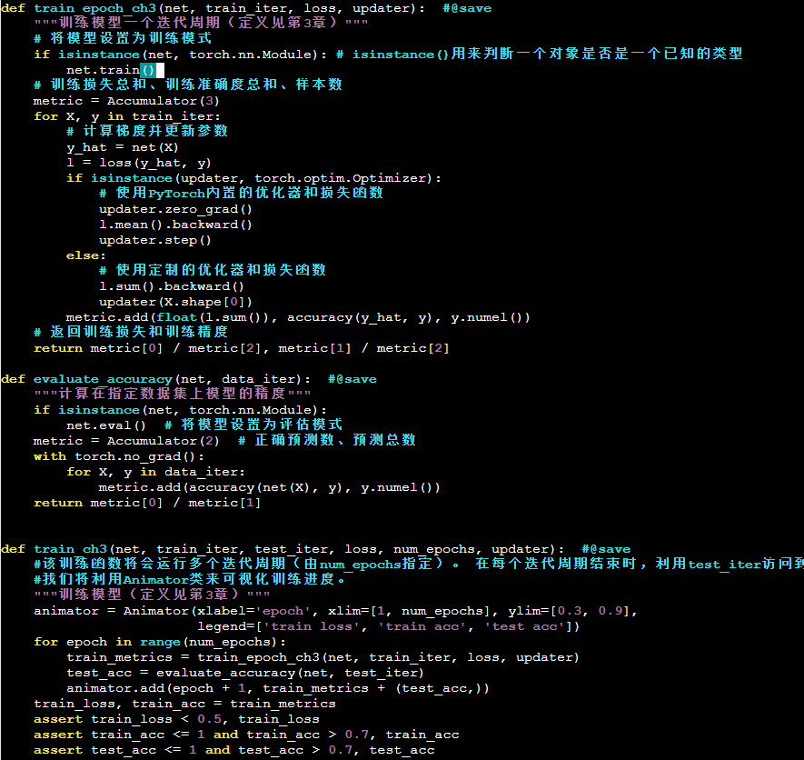 

### 4.3.2模型训练结束不输出正确率等信息

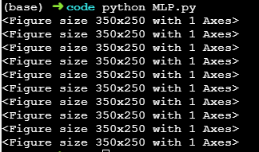 

#### 1.解决方案

- 修改代码，增加对应输出代码

```python
import torch
from torch import nn
from d2l import torch as d2l
import matplotlib.pyplot as plt

# 设置随机种子以确保可重复性
torch.manual_seed(42)

# 定义网络结构
net = nn.Sequential(
    nn.Flatten(),  # 将输入展平，例如 (batch_size, 1, 28, 28) -> (batch_size, 784)
    nn.Linear(784, 256),  # 输入 784 维（28×28），隐藏层 256 维
    nn.ReLU(),  # 激活函数
    nn.Linear(256, 10)  # 输出层，10 个类别
)

# 初始化权重
def init_weights(m):
    if type(m) == nn.Linear:
        nn.init.normal_(m.weight, std=0.01)  # 以均值 0，标准差 0.01 进行随机初始化权重

net.apply(init_weights)

# 超参数
batch_size, lr, num_epochs = 256, 0.1, 30
loss = nn.CrossEntropyLoss(reduction='none')
trainer = torch.optim.SGD(net.parameters(), lr=lr)

# 加载数据
train_iter, test_iter = d2l.load_data_fashion_mnist(batch_size)

# 自定义训练函数
def custom_train_ch3(net, train_iter, test_iter, loss, num_epochs, updater):
    """自定义训练函数，输出训练损失、训练准确率和测试准确率，并保存图表为图片"""
    train_losses, train_accs, test_accs = [], [], []
    for epoch in range(num_epochs):
        # 训练一个 epoch
        train_loss, train_acc = d2l.train_epoch_ch3(net, train_iter, loss, updater)
        # 计算测试准确率
        test_acc = d2l.evaluate_accuracy(net, test_iter)
        # 保存结果
        train_losses.append(train_loss)
        train_accs.append(train_acc)
        test_accs.append(test_acc)
        # 打印结果
        print(f"Epoch {epoch + 1}: Train Loss: {train_loss:.4f}, Train Acc: {train_acc:.4f}, Test Acc: {test_acc:.4f}")

    # 绘制图表
    plt.figure(figsize=(12, 4))
    
    # 绘制训练损失
    plt.subplot(1, 2, 1)
    plt.plot(range(1, num_epochs + 1), train_losses, label='Train Loss')
    plt.xlabel('Epoch')
    plt.ylabel('Loss')
    plt.title('Training Loss')
    plt.legend()

    # 绘制训练准确率和测试准确率
    plt.subplot(1, 2, 2)
    plt.plot(range(1, num_epochs + 1), train_accs, label='Train Acc')
    plt.plot(range(1, num_epochs + 1), test_accs, label='Test Acc')
    plt.xlabel('Epoch')
    plt.ylabel('Accuracy')
    plt.title('Training and Test Accuracy')
    plt.legend()

    # 保存图表为图片
    plt.savefig('training_plot.png')
    plt.close()  # 关闭图表，避免在非交互式环境中显示

# 调用自定义训练函数
custom_train_ch3(net, train_iter, test_iter, loss, num_epochs, trainer)
```

## 4.4实验结果

### 4.4.1 批次为10

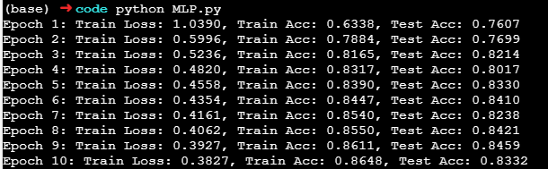 

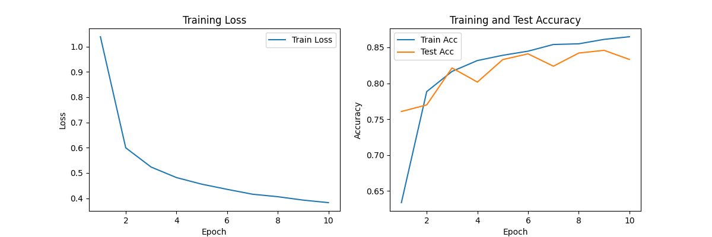 

### 4.4.2 批次为30

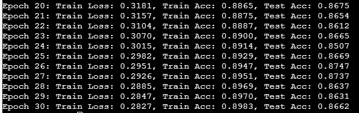 

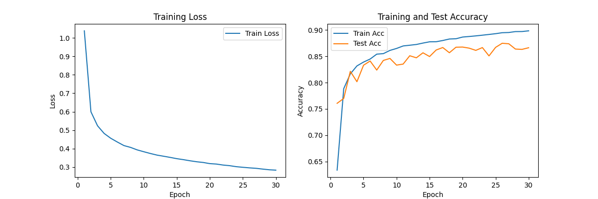 

### 4.4.3 批次为50

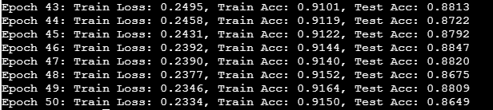 

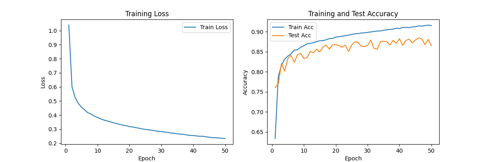 