# 04多层感知机

## 4.1多层感知机

### 4.1.1隐藏层

- 意义：若只用一个简单的神经网络（只有输入和输出）处理不了复杂问题，加入隐藏层可以学习到更复杂的模式
- 用法：把多个神经元（小计算单元）叠加起来，形成隐藏层。每一层的输出会变成下一层的输入，最终得到最后的结果。

- 全链接：每一层的每个神经元都会连接到上一层的所有神经元。

#### 4.1.1.1线性到非线性

1.线性模型的表达：O=XW+b

2.增加隐藏层

- 引入一个隐藏层，计算方式是：

$$
H = XW^{(1)} + b^{(1)},O = HW^{(2)} + b^{(2)}
$$


- 这里 HHH 是隐藏层的输出，相当于模型的中间状态。

3.为什么单纯增加隐藏层没用？

- 假设有一个两层的神经网络（但没有激活函数），计算过程是：

$$
H = XW^{(1)} + b^{(1)},O = HW^{(2)} + b^{(2)}
$$

- 把H代入O的公式，展开后得到：

$$
O = \mathbf{X} (W^{(1)} W^{(2)}) + b^{(1)} W^{(2)} + b^{(2)}
$$

- 若定义W=W(1)W(2)，b=b(1)W(2)+b(2)，最后公式变成O=XW+b，与原来一样，整体上没有映入非线性变换

4.引入非线性激活函数
$$
\begin{align*}
H &= \sigma(XW^{(1)} + b^{(1)}) \\
O &= HW^{(2)} + b^{(2)}
\end{align*}
$$

- 其中σ为激活函数，使得隐藏层的输出变得非线性

5.多层神经网络

- 如果继续叠加更多的隐藏层，每一层都加上激活函数，模型就能逐步学到更复杂的特征。例如：

$$
\begin{align*}
    H^{(1)} &= \sigma_1 (X W^{(1)} + b^{(1)}) \\
    H^{(2)} &= \sigma_2 (H^{(1)} W^{(2)} + b^{(2)})
\end{align*}
$$

- 这里的 σ1和 σ2是不同层的激活函数，确保每一层都能提供新的信息，而不是单纯的线性变换。

#### 4.1.1.2通用近似定理

- 多层神经网络的作用：多层神经网络能够通过多个“隐藏层”来学习输入之间复杂的相互关系。每一层都会处理输入的某些特征，并且逐层将信息提炼和转化，让模型能够学习到复杂的模式。
- 网络近似能力：即使一个神经网络只有一层隐藏层，它也能通过合适的设计（比如权重和偏置的调整），近似任何函数。简单来说，神经网络具备很强的近似能力，可以通过学习来近似任何复杂的数学关系。
- 函数近似：神经网络的本质就是一个函数，它通过一系列的计算将输入映射到输出。网络能够近似各种复杂函数，因此可以用来解决许多实际问题。
- 简化问题：在实际应用中，神经网络可以简化复杂问题的解决过程，就像通过编程语言解决问题一样，神经网络通过学习数据，能够自动处理复杂的任务。

### 4.1.2激活函数

①ReLU函数

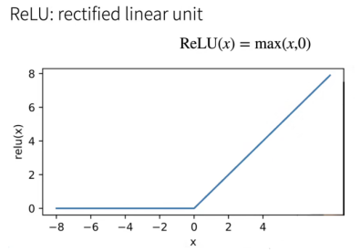

- 优点：
	- 求导表现得特别好：要么让参数消失，要么让参数通过。 这使得优化表现得更好，并且ReLU减轻了困扰以往神经网络的梯度消失问题
	- 计算速度快，不需要指数运算，CPU上一次指数运算≈100次乘法运算，成本低
- 缺点：0点不可导，“如果微妙的边界条件很重要，我们很可能是在研究数学而非工程”

②sigmoid函数

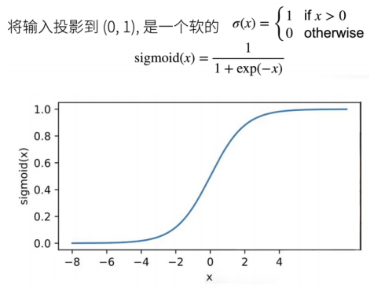

- 优点：适用于二分类问题，因为输出值可以解释为概率（输出值越接近 1 表示类别 1 的概率越大，越接近 0 则表示类别 0 的概率越大）
- 缺点：
	- 梯度消失问题：当输入值很大或很小（比如x 很接近正负无穷时）,Sigmoid 函数的梯度接近 0，导致神经网络的反向传播时梯度更新非常缓慢。
	- 输出不是零均值：输出总是非负的（0到1之间），这可能会导致一些学习不稳定。相比之下，像 tanh 函数的输出范围是 -1 到 1，更有利于加速收敛。

③tanh函数

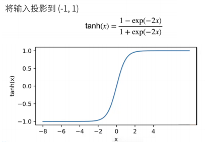


- 优点：
	- 比 Sigmoid 更适合隐藏层（因为输出在 -1 到 1 之间，零均值有利于梯度传播）。
	- 适用于数据分布有负数的情况（不像 Sigmoid 只输出正值）。
	- 平滑可导，适用于梯度下降。
- 缺点：
	- 仍然有梯度消失问题（当 x 过大或过小时，梯度趋近于 0，训练变慢）。
	- 计算稍微复杂（比 ReLU 多了一些指数运算）。

## 4.2多层感知机实现

```python
import torch
from torch import nn
from d2l import torch as d2l
```

### 4.2.1模型

- 第一层是隐藏层，它包含256个隐藏单元，并使用了ReLU激活函数。 第二层是输出层。

```python
net = nn.Sequential(
    				nn.Flatten(),
           # 将输入展平，例如 (batch_size, 1, 28, 28) -> (batch_size, 784)
                    nn.Linear(784, 256),
                    # 输入 784 维（28×28），隐藏层 256 维
                    nn.ReLU(),
                    # 激活函数
                    nn.Linear(256, 10))
					# 输出层，10 个类别

def init_weights(m):
    if type(m) == nn.Linear:
        nn.init.normal_(m.weight, std=0.01)
        #以均值 0，标准差 0.01 进行随机初始化权重

net.apply(init_weights);
#对网络中的所有层应用init_weights
```

```python
batch_size, lr, num_epochs = 256, 0.1, 10
loss = nn.CrossEntropyLoss(reduction='none')
trainer = torch.optim.SGD(net.parameters(), lr=lr)

train_iter, test_iter = d2l.load_data_fashion_mnist(batch_size)
d2l.train_ch3(net, train_iter, test_iter, loss, num_epochs, trainer)
```

- 用mlp而不是svm：nlp可以转卷积、RNN、transformer，svm麻烦

## 4.3模型选择、欠拟合和过拟合

- 机器学习目标：发现模式
- 泛化能力：模型应该能够推广到未见过的数据，而不仅仅是记住训练数据。
- 数据局限性：训练数据可能只是更大数据分布中的一个小子集，可能无法完全代表整体。
- 过拟合问题：如果模型过于复杂，可能会过度拟合训练数据，导致泛化能力下降。
- 正则化：应对过拟合

### 4.3.1训练误差和泛化误差

1.训练误差与泛化误差

- 训练误差：模型在训练数据上的误差。
- 泛化误差：模型在新数据上的误差

2.泛化误差的计算难点

- 由于数据样本无限，泛化误差无法被精确计算，通常使用测试数据集来估计。
- 测试集需要与训练集分布相似，才能合理评估泛化能力。

3.模型复杂度

- 简单模型+大量数据 → 训练误差和泛化误差接近。
- 复杂模型+少量数据 → 训练误差降低，但泛化误差可能增加（即过拟合）。
- 导致过拟合的因素：参数多、参数取值范围大、数据集规模小

### 4.3.2模型选择

1.验证数据集：评估模型好坏

- 例如拿出50%的训练数据
- 常犯错误：和训练数据混合一起
- 验证数据集不参与训练

2.测试数据集：只用一次的数据集

- 未来的考试
- 买的房子实际成交价

3.K折交叉验证

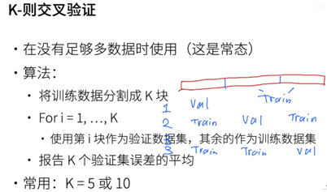

### 4.3.3欠拟合、过拟合

1.欠拟合（underfitting）

- 特征：训练误差和泛化误差（验证误差）都很高，模型无法降低训练误差。
- 原因：模型太简单，无法学习到数据的模式
- 解决方案：增加模型复杂度（如增加神经元数量、层数、使用更复杂的模型）。

2.过拟合（overfitting）

- 特征：训练误差明显低于泛化误差（验证误差），即在训练集上表现很好，但泛化能力差。
- 原因：模型太复杂，过度记住训练数据中的噪声，而无法泛化到新数据。
- 解决方案：使用正则化（L1/L2 正则化、dropout）、增加训练数据、使用早停（early stopping）。

3.模型复杂度

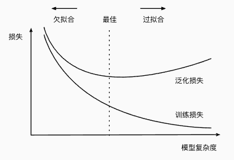

- 左侧（欠拟合）：模型太简单，无法捕捉数据的真实模式，训练误差和泛化误差都很高
- 中间（最佳）：找到合适的复杂度，训练误差较低，泛化误差也较低
- 右侧（过拟合）：模型太复杂，训练误差极低，但泛化误差增大，导致模型在新数据上表现不佳

### 4.3.4多项式回归

```python
import math
from mxnet import gluon, np, npx
from mxnet.gluon import nn
from d2l import mxnet as d2l

npx.set_np()
```

1.生成数据集

- 使用以下三阶多项式来生成训练和测试数据的标签

$$
y = 5 + 1.2x - 3.4 \frac{x^2}{2!} + 5.6 \frac{x^3}{3!} + \epsilon \quad \text{where} \quad \epsilon \sim \mathcal{N}(0, 0.1^2).
$$

```python
max_degree = 20  # 多项式的最大阶数
n_train, n_test = 100, 100  # 训练和测试数据集大小
true_w = np.zeros(max_degree)  # 分配大量的空间
true_w[0:4] = np.array([5, 1.2, -3.4, 5.6])

features = np.random.normal(size=(n_train + n_test, 1))
np.random.shuffle(features)
poly_features = np.power(features, np.arange(max_degree).reshape(1, -1))
for i in range(max_degree):
    poly_features[:, i] /= math.gamma(i + 1)  # gamma(n)=(n-1)!
# labels的维度:(n_train+n_test,)
labels = np.dot(poly_features, true_w)
labels += np.random.normal(scale=0.1, size=labels.shape)

features[:2], poly_features[:2, :], labels[:2]
```

```python
(array([[-0.03716067],
        [-1.1468065 ]]),
 array([[ 1.0000000e+00,-3.7160669e-02, 6.9045764e-04,-8.5526226e-06,
          7.9455290e-08,-5.9052235e-10, 3.6573678e-12,-1.9415747e-14,
          9.0187767e-17,-3.7238198e-19, 1.3837963e-21,-4.6747996e-24,
          1.4476556e-26,-4.1381425e-29, 1.0984010e-31,-2.7211542e-34,
          6.3199942e-37,-1.3815009e-39,2.8516424e-42,-5.6051939e-45],
        [ 1.0000000e+00,-1.1468065e+00,6.5758252e-01,-2.5137332e-01,
          7.2069131e-02,-1.6529869e-02,3.1594271e-03,-5.1760738e-04,
          7.4199430e-05,-9.4547095e-06,1.0842723e-06,-1.1304095e-07,
          1.0803007e-08,-9.5299690e-10,7.8064499e-11,-5.9683248e-12,
          4.2778208e-13,-2.8857840e-14,1.8385754e-15,-1.1097317e-16]]),
 array([ 5.1432443 , -0.06415121]))
```

2.训练模型、测试

```python
def evaluate_loss(net, data_iter, loss):  #@save
    """评估给定数据集上模型的损失"""
    metric = d2l.Accumulator(2)  # 损失的总和,样本数量
    for X, y in data_iter:
        l = loss(net(X), y)
        metric.add(l.sum(), d2l.size(l))
    return metric[0] / metric[1]
```

```python
def train(train_features, test_features, train_labels, test_labels,
          num_epochs=400):
    loss = gluon.loss.L2Loss()
    net = nn.Sequential()
    # 不设置偏置，因为我们已经在多项式中实现了它
    net.add(nn.Dense(1, use_bias=False))
    net.initialize()
    batch_size = min(10, train_labels.shape[0])
    train_iter = d2l.load_array((train_features, train_labels), batch_size)
    test_iter = d2l.load_array((test_features, test_labels), batch_size, is_train=False)
    trainer = gluon.Trainer(net.collect_params(), 'sgd',
                            {'learning_rate': 0.01})
    animator = d2l.Animator(xlabel='epoch', ylabel='loss',yscale='log',
                            xlim=[1, num_epochs], ylim=[1e-3, 1e2],
                            legend=['train', 'test'])
    for epoch in range(num_epochs):
        d2l.train_epoch_ch3(net, train_iter, loss, trainer)
        if epoch == 0 or (epoch + 1) % 20 == 0:
            animator.add(epoch + 1, (evaluate_loss(net, train_iter, loss),evaluate_loss(net, test_iter, loss)))
    print('weight:', net[0].weight.data().asnumpy())
```

3.三阶多项式函数拟合(正常)

```Python
# 从多项式特征中选择前4个维度，即1,x,x^2/2!,x^3/3!
train(poly_features[:n_train, :4], poly_features[n_train:, :4],
      labels[:n_train], labels[n_train:])
```

```python
weight: [[ 5.019143   1.2220006 -3.4235666  5.571755 ]]
```

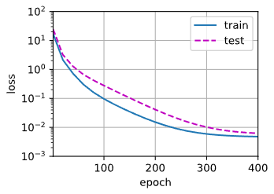

4.线性函数拟合(欠拟合)

```Python
# 从多项式特征中选择前2个维度，即1和x
train(poly_features[:n_train, :2], poly_features[n_train:, :2],
      labels[:n_train], labels[n_train:])
```

```python
weight: [[2.6972198 4.2307568]]
```

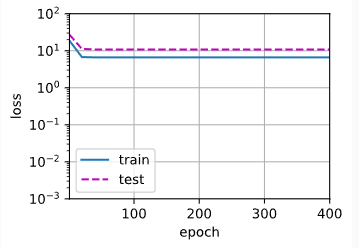

5.高阶多项式函数拟合(过拟合)

```Python
# 从多项式特征中选取所有维度
train(poly_features[:n_train, :], poly_features[n_train:, :],
      labels[:n_train], labels[n_train:], num_epochs=1500)
```

```Python
weight: [[4.992059  1.3058902 -3.3531423 5.1164446 -0.1114100 1.3032119
0.12679203  0.16655836  0.05129979 -0.02275036  0.0080622  -0.05167824
-0.02426303 -0.01502204 -0.04941358  0.06389866 -0.04761846 -0.04380165
-0.05188227  0.05655775]]
```

## 4.4权重衰减

防止模型过拟合的方法：L1正则化、L2正则化

- L1正则化：让部分权重变成 0，起到特征选择的作用
- L2正则化：让权重变小，降低模型复杂度，减少过拟合

### 4.4.1高维线性回归

```python
%matplotlib inline
import torch
from torch import nn
from d2l import torch as d2l
```

- 根据下列公式生成数据，这些标签被均值为0，标准差为0.01高斯噪声破坏：

$$
y = 0.05 + \sum_{i=1}^{d} 0.01x_i + \epsilon \quad \text{where} \quad \epsilon \sim \mathcal{N}(0, 0.01^2)
$$

```python
n_train, n_test, num_inputs, batch_size = 20, 100, 200, 5
true_w, true_b = torch.ones((num_inputs, 1)) * 0.01, 0.05
train_data = d2l.synthetic_data(true_w, true_b, n_train)
train_iter = d2l.load_array(train_data, batch_size)
test_data = d2l.synthetic_data(true_w, true_b, n_test)
test_iter = d2l.load_array(test_data, batch_size, is_train=False)
```

### 4.4.2实现

1.初始化模型参数

```python
def init_params():
    w = torch.normal(0, 1, size=(num_inputs, 1), requires_grad=True)
    b = torch.zeros(1, requires_grad=True)
    return [w, b]
```

2.定义训练代码

```python
def train(lambd):
    w, b = init_params()
    net, loss = lambda X: d2l.linreg(X, w, b), d2l.squared_loss
    num_epochs, lr = 100, 0.003
    animator = d2l.Animator(xlabel='epochs', ylabel='loss', yscale='log',xlim=[5, num_epochs], legend=['train', 'test'])
    for epoch in range(num_epochs):
        for X, y in train_iter:
            # 增加了L2范数惩罚项，
            # 广播机制使l2_penalty(w)成为一个长度为batch_size的向量
            l = loss(net(X), y) + lambd * l2_penalty(w)
            l.sum().backward()
            d2l.sgd([w, b], lr, batch_size)
        if (epoch + 1) % 5 == 0:
            animator.add(epoch + 1, (d2l.evaluate_loss(net, train_iter, loss),d2l.evaluate_loss(net, test_iter, loss)))
    print('w的L2范数是：', torch.norm(w).item())
```

3.忽略正则化直接训练

- 使用lambd=0禁用权重衰减，这里训练误差有了减少，但测试误差没有减少， 这意味着出现了严重的过拟合。

```python
train(lambd=0)
```

```python
w的L2范数是： 12.963241577148438
```

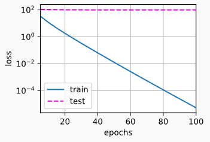

4.使用权重衰减

```python
train(lambd=3)
```

```python
w的L2范数是： 0.3556520938873291
```

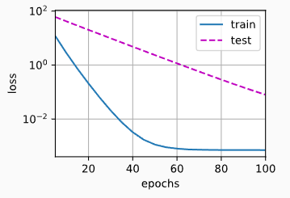

### 4.4.3简介实现

深度学习框架将权重衰减集成到优化算法，以便与任何损失结合使用。

```python
def train_concise(wd):
    net = nn.Sequential(nn.Linear(num_inputs, 1))
    for param in net.parameters():
        param.data.normal_()
    loss = nn.MSELoss(reduction='none')
    num_epochs, lr = 100, 0.003
    # 偏置参数没有衰减
    trainer = torch.optim.SGD([
        {"params":net[0].weight,'weight_decay': wd},
        {"params":net[0].bias}], lr=lr)
    animator = d2l.Animator(xlabel='epochs', ylabel='loss', yscale='log',
                            xlim=[5, num_epochs], legend=['train', 'test'])
    for epoch in range(num_epochs):
        for X, y in train_iter:
            trainer.zero_grad()
            l = loss(net(X), y)
            l.mean().backward()
            trainer.step()
        if (epoch + 1) % 5 == 0:
            animator.add(epoch + 1,
                         (d2l.evaluate_loss(net, train_iter, loss),
                          d2l.evaluate_loss(net, test_iter, loss)))
    print('w的L2范数：', net[0].weight.norm().item())
```

```python
train_concise(0)
```

```python
w的L2范数： 13.727912902832031
```

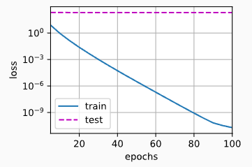

```python
train_concise(3)
```

```python
w的L2范数： 0.3890590965747833
```

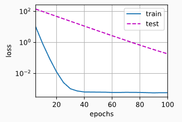

## 4.5 dropout

- Dropout 正则化通过随机丢弃神经元来降低过拟合，提高模型的泛化能力


### 4.5.1简介实现

- 在每个全连接层之后添加一个dropout层，将暂退概率作为唯一地参数传递给其构造函数。在训练时，Dropout层将根据指定的暂退概率随机丢弃上一层的输出（相当于下一层的输入）。 在测试时，Dropout层仅传递数据。

```python
net = nn.Sequential(nn.Flatten(),
        nn.Linear(784, 256),
        nn.ReLU(),
        # 在第一个全连接层之后添加一个dropout层
        nn.Dropout(dropout1),
        nn.Linear(256, 256),
        nn.ReLU(),
        # 在第二个全连接层之后添加一个dropout层
        nn.Dropout(dropout2),
        nn.Linear(256, 10))

def init_weights(m):
    if type(m) == nn.Linear:
        nn.init.normal_(m.weight, std=0.01)

net.apply(init_weights);
```

```python
trainer = torch.optim.SGD(net.parameters(), lr=lr)
d2l.train_ch3(net, train_iter, test_iter, loss, num_epochs, trainer)
```

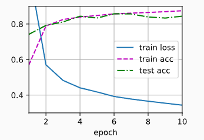

## 4.6前向传播、反向传播

### 4.6.1前向传播

- 前向传播是神经网络中从输入层到输出层依次计算每层结果的过程，用于生成预测并计算损失，为后续的参数优化提供基础。

### 4.6.2反向传播

- 链式法则计算损失函数对所有参数的梯度，反向更新参数

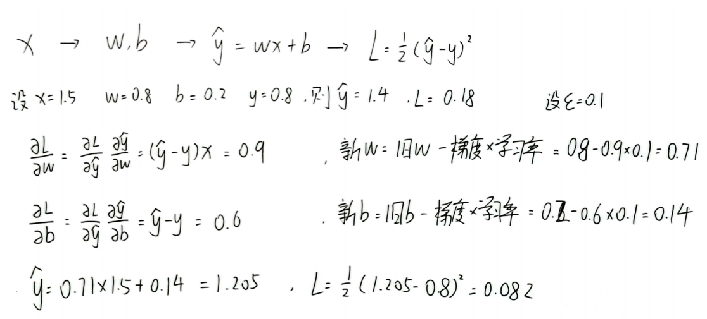

## 4.7梯度消失和梯度爆炸

### 4.7.1梯度消失

- 在反向传播过程中，梯度（即损失函数对权重的导数）在逐层相乘时，数值变得越来越小，最终接近于零。
- 结果是前面层（靠近输入层）几乎得不到有效的更新，导致网络难以学习复杂的特征。 
- 主要发生在使用Sigmoid或Tanh激活函数的深层网络，因为这些函数的导数在极端值时接近零。

```python
%matplotlib inline
import torch
from d2l import torch as d2l

x = torch.arange(-8.0, 8.0, 0.1, requires_grad=True)
y = torch.sigmoid(x)
y.backward(torch.ones_like(x))

d2l.plot(x.detach().numpy(), [y.detach().numpy(), x.grad.numpy()],
         legend=['sigmoid', 'gradient'], figsize=(4.5, 2.5))
```

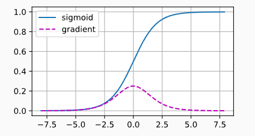

如上图所示，当sigmoid函数的输入很大或很小时，其梯度都会消失。因此默认选择ReLU系列函数。

### 4.7.2梯度爆炸

- 在反向传播过程中，梯度在逐层相乘时，数值变得越来越大，可能会达到极端值甚至无穷大。
- 结果是权重更新幅度过大，训练过程变得不稳定，甚至无法收敛。
- 主要发生在初始化权重过大或者网络层数过深的情况下。

```python
M = torch.normal(0, 1, size=(4,4))
print('一个矩阵 \n',M)
for i in range(100):
    M = torch.mm(M,torch.normal(0, 1, size=(4, 4)))

print('乘以100个矩阵后\n', M)
```

```python
一个矩阵
 tensor([[-0.7872,  2.7090,  0.5996, -1.3191],
        [-1.8260, -0.7130, -0.5521,  0.1051],
        [ 1.1213,  1.0472, -0.3991, -0.3802],
        [ 0.5552,  0.4517, -0.3218,  0.5214]])
乘以100个矩阵后
 tensor([[-2.1897e+26,  8.8308e+26,  1.9813e+26,  1.7019e+26],
        [ 1.3110e+26, -5.2870e+26, -1.1862e+26, -1.0189e+26],
        [-1.6008e+26,  6.4559e+26,  1.4485e+26,  1.2442e+26],
        [ 3.0943e+25, -1.2479e+26, -2.7998e+25, -2.4050e+25]])
```

### 4.7.3对称性

对称性：互换隐藏单元的位置，获得函数相同

若两个隐藏单元参数一样，前向传播结果相同，反向传播结果也相同，两个单元并无区别，限制了网络的表达能力—>暂退法正则化

## 4.8参数初始化

减轻上述问题的方法之一。

### 4.8.1默认初始化

不指定初始化方法，框架将使用默认的随机初始化方法。

### 4.8.2Xavier初始化

Xavier初始化的目标是让每层输入和输出的方差相等，即：
$$
Var[o 
_i
​
 ]=Var[x 
_j
​
 ]
$$
从数学推导可得，保持方差稳定需要满足：
$$
\sigma^2 = \frac{2}{n_{\text{in}} + n_{\text{out}}}
$$
权重初始化一般使用正态分布（高斯分布）或均匀分布。

