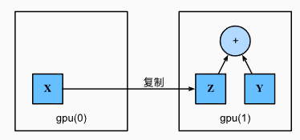

# 05深度学习计算

## 5.1层和块

1.单层神经网络

- 接受输入
- 生成相应标量输出
- 具有相关参数，更新参数可以优化某目标函数

2.多层神经网络（层的作用）

- 每一层都像是一个小的神经网络单元，它可以接收输入、计算输出，并传递给下一层
- 这种层层传递信息的方式，让神经网络能够处理更复杂的数据和任务

3.块（block）的概念

- 为了更方便地构建复杂的网络，可以把多个层组合成一个“块” 。
- 块是一个可以将输入转换为输出的组件，必须包含前向传播（forward）函数，并能存储必要的参数。
- nn.Sequential是一种特殊的块，可以像列表一样按顺序存放多个层（块）。

```python
import torch
from torch import nn
from torch.nn import functional as F

net = nn.Sequential(nn.Linear(20, 256), nn.ReLU(), nn.Linear(256, 10))

X = torch.rand(2, 20)
net(X)
```

```python
tensor([[ 0.0343,  0.0264,  0.2505, -0.0243,  0.0945,  0.0012, -0.0141,  0.0666,
         -0.0547, -0.0667],
        [ 0.0772, -0.0274,  0.2638, -0.0191,  0.0394, -0.0324,  0.0102,  0.0707,
         -0.1481, -0.1031]], grad_fn=<AddmmBackward0>)
```

这里创建了一个两层的神经网络：

- 第一层： 接受一个20维的输入，输出一个256维的，使用 ReLU 激活函数。
- 第二层：接受256维输入，输出10维

nn.Sequential 可以用来按顺序组织多个层（块），让构建神经网络更方便，而每个 block 负责处理输入并传递给下一层。

### 5.1.1自定义块

1.功能：

- 将输入数据作为其前向传播函数的参数。

- 通过前向传播函数来生成输出。请注意，输出的形状可能与输入的形状不同。例如，我们上面模型中的第一个全连接的层接收一个20维的输入，但是返回一个维度为256的输出。

- 计算其输出关于输入的梯度，可通过其反向传播函数进行访问。通常这是自动发生的。

- 存储和访问前向传播计算所需的参数。

- 根据需要初始化模型参数。

2.编写自定义块

- 继承nn.module可以灵活地进行模型构造
- 只需定义_init_和前向计算

```python
class MLP(nn.Module):
    # 用模型参数声明层。这里，我们声明两个全连接的层
    def __init__(self):
        # 调用MLP的父类Module的构造函数来执行必要的初始化。
        # 这样，在类实例化时也可以指定其他函数参数，例如模型参数params（稍后将介绍）
        super().__init__()
        self.hidden = nn.Linear(20, 256)  # 隐藏层
        self.out = nn.Linear(256, 10)  # 输出层

    # 定义模型的前向传播，即如何根据输入X返回所需的模型输出
    def forward(self, X):
        # 注意，这里我们使用ReLU的函数版本，其在nn.functional模块中定义。
        return self.out(F.relu(self.hidden(X)))
```

### 5.1.2顺序块（Sequential类）

Sequential类的设计是为了把其他模块串起来，为了简化MySequential，只需要定义两个关键函数：

1.一种将块逐个追加到列表中的函数；

2.一种前向传播函数，用于将输入按追加块的顺序传递给块组成的“链条”。

```python
class MySequential(nn.Module):
    def __init__(self, *args):
        super().__init__()
        for idx, module in enumerate(args):
            # 这里，module是Module子类的一个实例。我们把它保存在'Module'类的成员
            # 变量_modules中。_module的类型是OrderedDict
            self._modules[str(idx)] = module
            #_modules的主要优点是： 在模块的参数初始化过程中， 系统知道在_modules字典中查找需要初始化参数的子块。

    def forward(self, X):
        # OrderedDict保证了按照成员添加的顺序遍历它们
        for block in self._modules.values():
            X = block(X)
        return X
```

```python
net = MySequential(nn.Linear(20, 256), nn.ReLU(), nn.Linear(256, 10))
net(X)
```

```python
tensor([[ 2.2759e-01, -4.7003e-02,  4.2846e-01, -1.2546e-01,  1.5296e-01,
          1.8972e-01,  9.7048e-02,  4.5479e-04, -3.7986e-02,  6.4842e-02],
        [ 2.7825e-01, -9.7517e-02,  4.8541e-01, -2.4519e-01, -8.4580e-02,
          2.8538e-01,  3.6861e-02,  2.9411e-02, -1.0612e-01,  1.2620e-01]],
       grad_fn=<AddmmBackward0>)
```

### 5.1.3在前向传播函数中执行代码

- 通常情况下可以使用现成的Sequential类来简单构造模型，但是在某些情况下需要更多的灵活性，比如在模型的前向传播中加入python的控制流或进行特定的数学运算

```python
class FixedHiddenMLP(nn.Module):
    def __init__(self):
        super().__init__()
        # 不计算梯度的随机权重参数。因此其在训练期间保持不变
        self.rand_weight = torch.rand((20, 20), requires_grad=False)
        self.linear = nn.Linear(20, 20)

    def forward(self, X):
        X = self.linear(X)
        # 使用创建的常量参数以及relu和mm函数
        X = F.relu(torch.mm(X, self.rand_weight) + 1)
        # 复用全连接层。这相当于两个全连接层共享参数
        X = self.linear(X)
        # 控制流
        while X.abs().sum() > 1:
            X /= 2
        return X.sum()
```

在这个FiexedHiddenMLP类中，权重在实例化时被随机初始化，之后为常量。

```python
net = FixedHiddenMLP()
net(X)
```

```python
tensor(0.1862, grad_fn=<SumBackward0>)
```

并且可以混合带配各种组合块方法：

```python
class NestMLP(nn.Module):
    def __init__(self):
        super().__init__()
        self.net = nn.Sequential(nn.Linear(20, 64), nn.ReLU(),
                                 nn.Linear(64, 32), nn.ReLU())
        self.linear = nn.Linear(32, 16)

    def forward(self, X):
        return self.linear(self.net(X))

chimera = nn.Sequential(NestMLP(), nn.Linear(16, 20), FixedHiddenMLP())
chimera(X)
```

```python
tensor(0.2183, grad_fn=<SumBackward0>)
```

## 5.2参数管理

选择架构并设置超参数后进入训练阶段，此时的目标为找到使损失函数最小化的参数模型。

这是一个具有单隐藏层的多层感知机：

```python
from mxnet import init, np, npx
from mxnet.gluon import nn

npx.set_np()

net = nn.Sequential()
net.add(nn.Dense(8, activation='relu'))
net.add(nn.Dense(1))
net.initialize()  # 使用默认初始化方法

X = np.random.uniform(size=(2, 4))
net(X)  # 正向传播
```

```python
[07:11:54] ../src/storage/storage.cc:196: Using Pooled (Naive) StorageManager for CPU
array([[0.0054572 ],
       [0.00488594]])        

```

### 5.2.1 参数访问

当通过sequential类定义模型时，可通过索引访问模型的任意层。模型像一个列表一样，每层的参数都在其属性中。

```python
print(net[1].params)
```

```python
dense1_ (
  Parameter dense1_weight (shape=(1, 8), dtype=float32)
  Parameter dense1_bias (shape=(1,), dtype=float32)
)
#这个全连接层包含两个参数，分别是该层的权重和偏置。 两者都存储为单精度浮点数（float32）。
#注意，参数名称允许唯一标识每个参数，即使在包含数百个层的网络中也是如此。
```

#### 5.2.1.1目标参数

每个参数都表示为参数类的一个实例，要对参数执行参数，首先要访问底层的数值。

```python
#该从第二个全连接层（即第三个神经网络层）提取偏置， 提取后返回的是一个参数类实例，并进一步访问该参数的值。
print(type(net[2].bias))
print(net[2].bias)
print(net[2].bias.data)
```

```python
<class 'torch.nn.parameter.Parameter'>
Parameter containing:
tensor([0.0887], requires_grad=True)
tensor([0.0887])
```

参数是复合的对象，包含值、梯度和额外信息。除了值之外，我们还可以访问每个参数的梯度。

```python
net[2].weight.grad == None
```

```python
True
```

#### 5.2.1.2一次性访问所有参数

当需要对所有参数执行操作时，逐个访问会很麻烦，并且是处理更复杂的块时，需要递归整个树来提取每个子块的参数。

通过访问第一个全连接层的参数和访问所有层：

```python
print(*[(name, param.shape) for name, param in net[0].named_parameters()])
print(*[(name, param.shape) for name, param in net.named_parameters()])
```

```python
('weight', torch.Size([8, 4])) ('bias', torch.Size([8]))
('0.weight', torch.Size([8, 4])) ('0.bias', torch.Size([8])) ('2.weight', torch.Size([1, 8])) ('2.bias', torch.Size([1]))
```

另一种访问网络参数的方式：

```python
net.state_dict()['2.bias'].data
```

```python
tensor([0.0887])
```

#### 5.2.1.3从嵌套块收集参数

若多个块相互嵌套，参数命名约定如何工作？
首先定义一个生成块的函数，再将这些块组合到更大的块中：

```python
def block1():
    return nn.Sequential(nn.Linear(4, 8), nn.ReLU(),
                         nn.Linear(8, 4), nn.ReLU())

def block2():
    net = nn.Sequential()
    for i in range(4):
        # 在这里嵌套
        net.add_module(f'block {i}', block1())
    return net

rgnet = nn.Sequential(block2(), nn.Linear(4, 1))
rgnet(X)
```

```python
tensor([[0.2596],
        [0.2596]], grad_fn=<AddmmBackward0>)
```

查看网络如何工作：

```python
print(rgnet)
```

```python
Sequential(
  (0): Sequential(
    (block 0): Sequential(
      (0): Linear(in_features=4, out_features=8, bias=True)
      (1): ReLU()
      (2): Linear(in_features=8, out_features=4, bias=True)
      (3): ReLU()
    )
    (block 1): Sequential(
      (0): Linear(in_features=4, out_features=8, bias=True)
      (1): ReLU()
      (2): Linear(in_features=8, out_features=4, bias=True)
      (3): ReLU()
    )
    (block 2): Sequential(
      (0): Linear(in_features=4, out_features=8, bias=True)
      (1): ReLU()
      (2): Linear(in_features=8, out_features=4, bias=True)
      (3): ReLU()
    )
    (block 3): Sequential(
      (0): Linear(in_features=4, out_features=8, bias=True)
      (1): ReLU()
      (2): Linear(in_features=8, out_features=4, bias=True)
      (3): ReLU()
    )
  )
  (1): Linear(in_features=4, out_features=1, bias=True)
)
```

由于层是分层嵌套的，所以可以通过嵌套列表索引来访问

访问第一个主要块中、第二个字块的第一层的偏置项：

```python
rgnet[0][1][0].bias.data
```

```python
tensor([ 0.1999, -0.4073, -0.1200, -0.2033, -0.1573,  0.3546, -0.2141, -0.2483])
```

### 5.2.2参数初始化

深度学习框架提供默认随机初始化，也允许创建自定义初始化方法。默认情况下，pytorch会根据一个范围均匀地初始化权重和偏置矩阵，这个范围是根据输入和输出维度计算出的。 PyTorch的nn.init模块提供了多种预置初始化方法。

#### 5.2.2.1内置初始化

将所有权重参数初始化为标准差为0.01的高斯随机变量， 且将偏置参数设置为0。

```python
def init_normal(m):
    if type(m) == nn.Linear:
        nn.init.normal_(m.weight, mean=0, std=0.01)
        nn.init.zeros_(m.bias)
net.apply(init_normal)
net[0].weight.data[0], net[0].bias.data[0]
```

```python
(tensor([-0.0214, -0.0015, -0.0100, -0.0058]), tensor(0.))
```

同时也可以将所有参数初始化为给定的常数，比如为1

```python
def init_constant(m):
    if type(m) == nn.Linear:
        nn.init.constant_(m.weight, 1)
        nn.init.zeros_(m.bias)
net.apply(init_constant)
net[0].weight.data[0], net[0].bias.data[0]
```

```python
(tensor([1., 1., 1., 1.]), tensor(0.))
```

也可以对某些块应用不同的初始化方法。例如使用Xavier初始化方法初始化第一个神经网络层，然后将第三个神经网络层初始化为常量42：

```python
def init_xavier(m):
    if type(m) == nn.Linear:
        nn.init.xavier_uniform_(m.weight)
def init_42(m):
    if type(m) == nn.Linear:
        nn.init.constant_(m.weight, 42)

net[0].apply(init_xavier)
net[2].apply(init_42)
print(net[0].weight.data[0])
print(net[2].weight.data)
```

```python
tensor([ 0.5236,  0.0516, -0.3236,  0.3794])
tensor([[42., 42., 42., 42., 42., 42., 42., 42.]])
```

#### 5.2.2.2自定义初始化

若深度学习框架没有提供需要的初始化方法，可以自定义初始化方法：
$$
w \sim \begin{cases} 
U(5, 10) & \text{可能性} \, \frac{1}{4} \\
0 & \text{可能性} \, \frac{1}{2} \\
U(-10, -5) & \text{可能性} \, \frac{1}{4}
\end{cases}
$$

```python
def my_init(m):
    if type(m) == nn.Linear:
        print("Init", *[(name, param.shape)
                        for name, param in m.named_parameters()][0])
        nn.init.uniform_(m.weight, -10, 10)
        m.weight.data *= m.weight.data.abs() >= 5

net.apply(my_init)
net[0].weight[:2]
```

```python
Init weight torch.Size([8, 4])
Init weight torch.Size([1, 8])
```

```python
tensor([[5.4079, 9.3334, 5.0616, 8.3095],
        [0.0000, 7.2788, -0.0000, -0.0000]], grad_fn=<SliceBackward0>)
```

并且始终可以直接设置参数：

```python
net[0].weight.data[:] += 1
net[0].weight.data[0, 0] = 42
net[0].weight.data[0]
```

```python
tensor([42.0000, 10.3334,  6.0616,  9.3095])
```

### 5.2.3参数绑定

若希望在多个层间共享参数，可以定义一个稠密层，然后使用他的参数来设置另一个层的参数。

```python
# 我们需要给共享层一个名称，以便可以引用它的参数
shared = nn.Linear(8, 8)
net = nn.Sequential(nn.Linear(4, 8), nn.ReLU(),
                    shared, nn.ReLU(),
                    shared, nn.ReLU(),
                    nn.Linear(8, 1))
net(X)
# 检查参数是否相同
print(net[2].weight.data[0] == net[4].weight.data[0])
net[2].weight.data[0, 0] = 100
# 确保它们实际上是同一个对象，而不只是有相同的值
print(net[2].weight.data[0] == net[4].weight.data[0])
```

```python
tensor([True, True, True, True, True, True, True, True])
tensor([True, True, True, True, True, True, True, True])
```

## 5.3延后初始化

建立模型时还需要：

- 定义网络框架并指定输入维度
- 添加层时指定前一层的输出维度
- 初始化参数时，提供足够信息来确定模型应该包含多少参数

深度学习框架无法判断网络的输入维度是什么，知道数据第一次通过模型传递时，框架才会动态地推断出每个层的大小。

## 5.4自定义层

深度学习 成功背后的一个因素是神经网络的灵活性，可以用创造性的方式组合不同的层，从而设计出适用于各种任务的架构。有时会需要自己创建一个现深度学习框架中不存在的层，这时就需要自定义层。

### 5.4.1不带参数的层

要构造一个centeredlayer类，从其输入中减去均值（中心化处理），只需要继承基础层类并实现前向传播功能。

```python
import torch
import torch.nn.functional as F
from torch import nn


class CenteredLayer(nn.Module):
    def __init__(self):
        super().__init__()

    def forward(self, X):
        return X - X.mean()
```

测试：

```python
layer = CenteredLayer()
layer(torch.FloatTensor([1, 2, 3, 4, 5]))
```

```python
tensor([-2., -1.,  0.,  1.,  2.])
```

将层作为组件合并到更复杂的模型中：

```python
net = nn.Sequential(nn.Linear(8, 128), CenteredLayer())
```

健全性检查：向该网络发送随机数据后检查均值是否为0，由于我们处理的是浮点数，因为存储精度仍可能得到一个非常小的非零数。（因为是中心化，所以应该接近0）

```python
Y = net(torch.rand(4, 8))
Y.mean()
```

```python
tensor(7.4506e-09, grad_fn=<MeanBackward0>)
```

### 5.4.2带参数的层

内置函数提供了一些基本管理功能，比如管理访问、初始化、共享、保存和加载模型参数，这样我们就不需要为每个自定义层编写自定义序列化程序。

实现自定义版本的全连接层：需要权重w和偏置项b，使用relu，输入数和输出数。

```python
class MyLinear(nn.Module):
    def __init__(self, in_units, units):
        super().__init__()
        self.weight = nn.Parameter(torch.randn(in_units, units))
        self.bias = nn.Parameter(torch.randn(units,))
    def forward(self, X):
        linear = torch.matmul(X, self.weight.data) + self.bias.data
        return F.relu(linear)
```

实例化MyLinear类并访问其模型参数：

```python
linear = MyLinear(5, 3)
linear.weight
```

```python
Parameter containing:
tensor([[ 0.1775, -1.4539,  0.3972],
        [-0.1339,  0.5273,  1.3041],
        [-0.3327, -0.2337, -0.6334],
        [ 1.2076, -0.3937,  0.6851],
        [-0.4716,  0.0894, -0.9195]], requires_grad=True)
```

使用自定义层直接执行前向传播计算：

```python
linear(torch.rand(2, 5))
```

```python
tensor([[0., 0., 0.],
        [0., 0., 0.]])
```

或者使用自定义层构建模型，就像使用内置的全连接层一样使用自定义层：

```python
net = nn.Sequential(MyLinear(64, 8), MyLinear(8, 1))
net(torch.rand(2, 64)  #生成随机张量的函数，它返回一个 2×64 形状的张量，里面的值是均匀分布在 [0, 1) 之间的随机数。
```

```python
tensor([[0.],
        [0.]])
```

## 5.5读写文件

当运行一个耗时较长的训练过程时， 最佳的做法是定期保存中间结果， 以确保在服务器电源被不小心断掉时，不会损失几天的计算结果。

### 5.5.1加载和保存张量

对于单个向量，直接调用load和save函数读写，这两个函数都要提供一个名称，其中save要求将需要保存的变量作为输入。

```python
import torch
from torch import nn
from torch.nn import functional as F

x = torch.arange(4)
torch.save(x, 'x-file')
```

可以将存储在文件中的数据读回内存：

```python
x2 = torch.load('x-file')
x2
```

```python
tensor([0, 1, 2, 3])
```

写入或读取从字符串映射到张量的字典：

```python
mydict = {'x': x, 'y': y}
torch.save(mydict, 'mydict')
mydict2 = torch.load('mydict')
mydict2
```

```python
{'x': tensor([0, 1, 2, 3]), 'y': tensor([0., 0., 0., 0.])}
```

### 5.5.2加载和保存模型参数

深度学习框架提供了内置函数来保存和加载整个网络，但是这是保存模型的参数而不是保存整个模型。若要恢复模型，需要用代码生成架构，然后从磁盘加载参数。

```python
class MLP(nn.Module):
    def __init__(self):
        super().__init__()
        self.hidden = nn.Linear(20, 256)
        self.output = nn.Linear(256, 10)

    def forward(self, x):
        return self.output(F.relu(self.hidden(x)))

net = MLP()
X = torch.randn(size=(2, 20))
Y = net(X)
```

将模型的参数存储在文件“mlp.params”中：

```python
torch.save(net.state_dict(), 'mlp.params')
```

为了恢复模型，实例化原始多层感知机模型的一个备份，这在不需要随机初始化模型参数，而是直接读取文件中存储的参数：

```python
clone = MLP()
clone.load_state_dict(torch.load('mlp.params'))
clone.eval()
```

```python
MLP(
  (hidden): Linear(in_features=20, out_features=256, bias=True)
  (output): Linear(in_features=256, out_features=10, bias=True)
)
```

由于两个实例具有相同的模型参数，再输入相同的X时，两个实例的计算结果：

```python
Y_clone = clone(X)
Y_clone == Y
```

```python
tensor([[True, True, True, True, True, True, True, True, True, True],
        [True, True, True, True, True, True, True, True, True, True]])
```

## 5.6GPU

### 5.6.1计算设备

CPU：torch.device('cpu')

GPU：torch.device('cuda')

如果有多个GPU，`torch.device(f'cuda:{i}')` 来表示第i块GPU{i}从0开始，cuda:0和cuda是等价的。

```python
import torch
from torch import nn

torch.device('cpu'), torch.device('cuda'), torch.device('cuda:1')
```

```python
(device(type='cpu'), device(type='cuda'), device(type='cuda', index=1))
```

查询GPU数量：

```python
torch.cuda.device_count()
```

```python
2
```

定义两个函数，允许在不存在所需GPU的情况下允许代码：

```python
def try_gpu(i=0):  #@save
    """如果存在，则返回gpu(i)，否则返回cpu()"""
    if torch.cuda.device_count() >= i + 1:
        return torch.device(f'cuda:{i}')
    return torch.device('cpu')

def try_all_gpus():  #@save
    """返回所有可用的GPU，如果没有GPU，则返回[cpu(),]"""
    devices = [torch.device(f'cuda:{i}')
             for i in range(torch.cuda.device_count())]
    return devices if devices else [torch.device('cpu')]

try_gpu(), try_gpu(10), try_all_gpus()
```

```python
(device(type='cuda', index=0),
 device(type='cpu'),
 [device(type='cuda', index=0), device(type='cuda', index=1)])
```

### 5.6.2张量与GPU

默认情况下，张量是在CPU上创建的，查询张量所在设备：

```python
x = torch.tensor([1, 2, 3])
x.device
```

```python
device(type='cpu')
```

注：操作的多个项都必须在同一个设备上，否则框架不知道在哪执行计算、存储结果。

#### 5.6.2.1在GPU上存储

可以在创建张量的时候指定存储设备为GPU：

```python
X = torch.ones(2, 3, device=try_gpu())
X
```

```python
tensor([[1., 1., 1.],
        [1., 1., 1.]], device='cuda:0')
```

假设有两个GPU，第二个GPU可以用try_gpu(1)表示

```python
Y = torch.rand(2, 3, device=try_gpu(1))
Y
```

```python
tensor([[0.4860, 0.1285, 0.0440],
        [0.9743, 0.4159, 0.9979]], device='cuda:1')
```

#### 5.6.2.2复制

若要计算X+Y，必须指定在哪里执行这个操作。可以将X传到第二个GPU执行操作而不能简单地直接X+Y，否则引擎会找不到数据。



```python
Z = X.cuda(1)
print(X)
print(Z)
```

```python
tensor([[1., 1., 1.],
        [1., 1., 1.]], device='cuda:0')
tensor([[1., 1., 1.],
        [1., 1., 1.]], device='cuda:1')
```

此时Z和Y都在同一个GPU上，可以执行相加操作：

```python
Y + Z
```

```python
tensor([[1.4860, 1.1285, 1.0440],
        [1.9743, 1.4159, 1.9979]], device='cuda:1')
```

### 5.6.3神经网络与GPU

将模型参数放在GPU上：

```python
net = nn.Sequential(nn.Linear(3, 1))
net = net.to(device=try_gpu())
```

当输入为GPU上的张量时，模型将在同一GPU上计算结果：

```python
net(X)
```

```python
tensor([[-0.4275],
        [-0.4275]], device='cuda:0', grad_fn=<AddmmBackward0>)
```

确认模型参数存储在同一个GPU上：

```python
net[0].weight.data.device
```

```python
device(type='cuda', index=0)
```

- 在 GPU 上计算损失后，尝试直接在命令行中打印日志（例如，损失值）或将结果记录到 NumPy 数组时，可能需要将数据从 GPU 移动到 CPU。这种操作会触发 GIL，从而导致所有 GPU 任务阻塞，直到日志操作完成。
- 如果每个小批量都触发一次从 GPU 到 CPU 的数据传输，性能会大幅下降。GPU 和 CPU 之间的数据传输是相对较慢的操作，尤其是在小批量或频繁同步的情况下。
- 将日志输出到命令行或者将其频繁写入 NumPy 数组，也可能成为瓶颈，尤其是对于大规模训练任务。