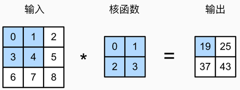

# 06卷积神经网络

## 6.1从全连接层到卷积层

- 全连接层适合处理表格数据，但不适合高维数据，因为需要过多的参数和计算资源。例如，处理百万像素的图像需要数十亿个参数，训练这样的模型不切实际。

- 卷积神经网络（CNN）能够利用图像中的结构信息，是处理高维数据的更有效方法。

### 6.1.1不变性

- 平移不变性：当输入图像在空间中发生平移时，神经网络的输出保持不变。
	- 意义：允许模型专注于学习图像中的特征，而不是特征在图像中的具体位置。
- 局部性：神经网络在处理图像时，其前面几层（通常是卷积层）主要关注图像中的局部特征或模式。
	- 意义：使得神经网络能够更有效地处理高维图像数据。通过关注局部特征，网络能够减少需要处理的参数数量，降低计算复杂度，并提高模型的泛化能力。

### 6.1.2多层感知机的限制

​        设多层感知机输出的二维图像为X，其隐藏层输出为H，X与H具有相同的形状。X~i,j~和H~i,j~表示输入图像和隐藏表示中位置（i， j）处的像素。为了保持空间结构的信息，将二维权重矩阵替换为四阶权重张量W。设U包含偏置参数，可将全连接层表示为：
$$
\begin{align*}
\mathbf{H}_{i,j} &= \mathbf{U}_{i,j}+\sum_{k}\sum_{l}\mathbf{W}_{i,j,k,l}\mathbf{X}_{k,l}\\
&= \mathbf{U}_{i,j}+\sum_{a}\sum_{b}\mathbf{V}_{i,j,a,b}\mathbf{X}_{i + a,j + b}
\end{align*}
$$
​        其中，i,j是输出的宽高维度，k,l是输入的宽高维度。对下标进行变化，k=i+a，l=j+b，V是对W的重新索引V~i,j,a,b~=W~i,j,i+a,j+b~，索引a和b通过在正偏移和负偏移之间移动覆盖了整个图像，对于隐藏表示中任意给定位置（i，j）处的像素值H~i,j~，通过对x中以（i，j）为中心的像素进行加权求和得到，权重为 V~i,j,a,b~

​        核心思想：与其在整个输入上使用绝对位置（k，l）的索引，不如用相对偏移（a，b）来表示卷积核作用的区域。这样就更类似于常规卷积的形式，即在输出的每个位置都考虑其相对邻域。

**Q：为什么将W转换为V？**

**A**：上面带W的公式表示在每个位置（i，j）上都有一组特定的权重W~i,j,k,l~与输入图像X~k,l~的对应元素相乘并求和，这是全连接层对每个空间位置都单独学习一组卷积核的做法，称为局部连接层（locally connected layer），非常不利于计算和参数共享。


**Q：为什么局部连接层不利于计算和参数共享？**

A：局部连接层对于每一个输出位置（i，j）对应一套独立的权重W~i,j,k,l~，参数总数为：（输出高 X 输出宽）X （卷积核高 X 卷积核宽）  卷积层所有位置共享同一个卷积核，参数总数为：卷积核高 X 卷积核宽

例：输入图像32 X 32，使用5 X 5 感受野，输出为28 X 28，每个输出位置有 5 X 5=25个参数，对于局部连接层有28 X 28 X 25 =19600，而对于卷积层只有25个参数。


**Q：卷积层中所有位置共享同一个卷积核，而局部连接层每个位置会有特定的权重，不会导致卷积层准确率低于局部连接层吗？**

A：理论上局部连接层准确率更高，但是实际上卷积层表现更好，原因如下：

①参数共享减少过拟合：卷积层共享参数，大大减少了模型参数数量，因此在训练样本有限时更不容易过拟合。局部连接层拥有更多自由度，容易在训练集 上“死记硬背”，泛化到新样本时效果反而差。

②平移不变性是有用的归纳偏置：现实世界中的图像具有大量重复结构和模式（例如边缘、角点、纹理），不依赖于特定位置。卷积层利用这一特性，能在不同位置识别相同特征，更有效地学习数据分布。

③训练效率与资源消耗：卷积层不仅计算快、显存占用低，而且可扩展性好。局部连接层训练慢、占用资源多，尤其在深层网络中难以推广。

**Q：k和l的作用？为什么重新索引为a和b？**

A：k和l表示输入图像中被访问的位置（绝对坐标）。但是由于卷积操作通常是局部的，即输出位置 （i，j）的值由输入图像中其附近的像素决定，因此可以将 k=i+a，l=j+b，即用相对于当前位置（i，j）的偏移（a，b）来重写卷积操作。


**Q：如果令k=i+a,l=j+b，为什么X~k,l~变成了X~i+a,j+b~，但是W~i,j,k,l~变成了V~i,j,a,b~而不是V~i,j,i+a,j+b~?**

A：V~i,j,a,b~表示的是在输出位置（i，j），卷积核中第（a，b）个位置的权重。需要的是卷积核坐标上的参数。如果写成V~i,j,i+a,j+b~则又把变量写回了图像坐标。


- **引用平移不变性**

​        检测对象在输入X中的平移，应该仅导致隐藏表示H中的平移。即V和U实际上不依赖 i 和 j 的值，即 V~i,j,a,b~ = V~a,b~ ，并且U=u，u为常数。由此简化H的定义为：
$$
\mathbf{H}_{i,j}=u+\sum_{a}\sum_{b}\mathbf{V}_{a,b}\mathbf{X}_{i + a,j + b}
$$
​        其中，该公式使用V~a,b~对位置为（i，j）附近的像素（i+a，j+b）进行加权得到H~i,j~，值得一提的是，V~a,b~的系数比V~i,j,a,b~少很多，前者不再依赖于图像的位置。

- 引用局部性

​        为了收集用来训练参数H~i,j~的相关信息，不应偏离距（i，j）过远的地方，这意味着在|a|>Δ或|b|>Δ的范围外，可以将V~a,b~设置为0：
$$
\mathbf{H}_{i,j}=u+\sum_{a = -\Delta}^{\Delta}\sum_{b = -\Delta}^{\Delta}\mathbf{V}_{a,b}\mathbf{X}_{i + a,j + b}
$$
​         上述公式是一个卷积层，卷积神经网络是包含卷积层的一类特殊神经网络。V为卷积核或滤波器，或该卷积层的权重，通常该权重是可学习的参数。

**总结**

1.多层感知机的问题

- 传统的 MLP 处理图像时，每个像素都要有对应的权重参数，计算量巨大。
- MLP 的参数对图像位置敏感，如果图像稍微平移一下，网络的输出可能就会完全不同，这就是平移不变性的问题。

2.引入卷积的改进

- 平移不变性：通过共享权重（卷积核），让网络对图像的位置变化更加鲁棒（不敏感）。
- 局部性：只关注局部区域的信息，而不是整个图像，从而减少计算量，提高训练效率。

3.卷积的本质

- 卷积层通过一个小的卷积核（滤波器）在图像上滑动，对局部区域进行加权求和，从而提取特征。
- 这样，每个神经元只与局部像素连接，而不是整个图像，极大减少了参数数量，提高了模型的泛化能力。

### 6.1.3卷积

1.卷积的概念

- 将一个函数翻转后，与另一个函数在不同位置上进行“重叠求和”，用来衡量它们的匹配程度。
- 将函数翻转：输入取反，例如f(x) –> f(-x)  , f(x,y) –>f(-x,-y)
- 类比：想象拿着一个模板（滤波器）在图像上滑动，每次停下时，计算模板和图像局部区域的“加权和”。

2.一维卷积

- 对于一维数据，卷积的计算方式为：

$$
(f * g)(i) = \sum_{a} f(a) g(i - a)
$$

- 解释：将 g 翻转并平移到位置 i，然后计算重叠部分的加权和。

3.二维卷积

- 对于图像（二位数据），卷积的计算方式为：

$$
(f \ast g)(i,j) = \sum_a \sum_b f(a,b) g(i-a,j-b)
$$

- 解释：滤波器在图像上滑动，每次停下计算局部区域的加权和。

4.与互相关的区别

- 卷积公式中使用的是减法 ( i−a , j−b) ( i - a ,  j - b )( i−a , j−b )，意味着卷积时滤波器要翻转
- 互相关（cross-correlation）使用的是加法 ( i+a , j+b ) ( i + a , j + b ) ( i+a , j+b)，不进行翻转。
- 在深度学习中，习惯上叫“卷积”，但实际上计算的是互相关，因为没有翻转滤波器，翻转与否对效果影响不大。

### 6.1.4找沃尔多游戏

1.图像类似多层拼图

- 彩色图片其实是由红、绿、蓝三层颜色叠起来的，就像三张透明玻璃纸叠在一起。每层玻璃纸记录一种颜色的亮度（比如红色层里，越亮的地方沃尔多的红衣服越明显）。
- 所以，图片不是平面的，而是一个“三维方块”（高度 × 宽度 × 颜色层）。

2.卷积层：拿放大镜找沃尔多

- 放大镜（卷积核）：假设拿一个3×3的小放大镜，在图片上滑动，检查每个小窗口里有没有沃尔多的特征（比如红白条纹、帽子）。

- 问题：如果放大镜只能看黑白图，但沃尔多藏在彩色图里怎么办？
	- 改进：给放大镜也加上“颜色层”，让它能同时看红、绿、蓝三层。这时放大镜变成“三维的”（比如3×3×3）。

3.多通道的隐藏线索

- 输入通道：原始图片的3层颜色（红、绿、蓝）就是3个输入通道。
- 输出通道：网络会生成多个“新线索层”，比如：
	- 第1层专门找红色区域
	- 第2层专门找横条纹
	- 第3层专门找圆形（比如帽子）

4.公式的作用

- 假设沃尔多的红帽子在图片的右上角（位置i=5, j=5）。
- 放大镜（卷积核）在这个位置时，会：
	- 看红绿蓝三层，分别计算每层是否有红帽子；
	- 加权求和：红色层的权重高（因为帽子是红的），绿色层权重低；
	- 输出结果：如果总和很大，就说明这里可能是沃尔多的帽子！

5.设计原因

- 模仿人眼：人脑也是先看边缘、颜色，再组合成复杂图案（比如先看到红色，再认出帽子）。
- 节省计算：不用一次性分析整张图，而是用小放大镜逐步扫描，效率更高

6.未解决问题

- 沃尔多会躲在哪里？如果沃尔多可能出现在任何角落，网络需要更大或更多的放大镜。
- 怎么更快计算？ 比如用更聪明的扫描方式（类似快速翻书找页码）。
- 选什么工具？ 不同的“放大镜材质”（激活函数）会影响找沃尔多的准确度。

## 6.2图像卷积

### 6.2.1互相关运算

- 互相关运算就像用一个“小滤镜”在图片上滑动，每次计算局部区域的特征，得到一个更小的输出图。这个过程的本质是局部特征提取，是神经网络识别图像的关键步骤。



```python
import torch
from torch import nn
from d2l import torch as d2l

def corr2d(X, K):  #@save
    """计算二维互相关运算"""
    h, w = K.shape
    Y = torch.zeros((X.shape[0] - h + 1, X.shape[1] - w + 1))
    for i in range(Y.shape[0]):
        for j in range(Y.shape[1]):
            Y[i, j] = (X[i:i + h, j:j + w] * K).sum()
    return Y
```

验证：

```python
X = torch.tensor([[0.0, 1.0, 2.0], [3.0, 4.0, 5.0], [6.0, 7.0, 8.0]])
K = torch.tensor([[0.0, 1.0], [2.0, 3.0]])
corr2d(X, K)
```

```python
tensor([[19., 25.],
        [37., 43.]])
```

### 6.2.2卷积层

1.卷积层的核心组成

- 卷积核权重（“小窗口”里的数值）
- 标量偏置（一个单独的数字，类似“整体偏移量”）

2.初始化参数

和全连接层一样，训练开始时，卷积核的权重是随机初始化的（比如随机设置小窗口里的数值），偏置也初始化为一个随机值。随着训练，这两个参数会逐步调整到最佳值。

3.前向传播的过程

- 先用互相关运算（滑动窗口乘加计算）处理输入数据和卷积核权重，得到一个初步结果矩阵。
- 然后给这个结果矩阵每个位置都加上同一个偏置值。例如：如果互相关运算得到一个 [[19, 25], [37, 43]]，偏置是 1，最终输出就是 [[20, 26], [38, 44]]。

4.需要偏置的原因

偏置让模型更灵活。比如，即使互相关运算的结果全是0，加上偏置后也能输出非零值，帮助模型更好地拟合数据。


​        基于上面定义的corr2d函数实现二维卷积层。在__init__构造函数中，将weight和bias声明为两个模型参数。前向传播函数调用corr2d函数并添加偏置。

```python
class Conv2D(nn.Module):
    def __init__(self, kernel_size):
        super().__init__()
        self.weight = nn.Parameter(torch.rand(kernel_size))
        self.bias = nn.Parameter(torch.zeros(1))

    def forward(self, x):
        return corr2d(x, self.weight) + self.bias
```

​        高度和宽度分别为h和w的卷积核可以被称为h×w卷积或h×w卷积核。 也将带有h×w卷积核的卷积层称为h×w卷积层。

#### 6.2.3 图像中目标的边缘检测

​        卷积层的一个简单应用为通过找到像素变化的位置来检测图像中不同颜色的边缘。首先构建一个6 X 8像素的黑白图像：

```python
X = torch.ones((6, 8))
X[:, 2:6] = 0
X
```

```python
tensor([[1., 1., 0., 0., 0., 0., 1., 1.],
        [1., 1., 0., 0., 0., 0., 1., 1.],
        [1., 1., 0., 0., 0., 0., 1., 1.],
        [1., 1., 0., 0., 0., 0., 1., 1.],
        [1., 1., 0., 0., 0., 0., 1., 1.],
        [1., 1., 0., 0., 0., 0., 1., 1.]])
```

​        构造一个高度为1，宽度为2的卷积核K，当进行互相关运算时，如果水平相邻的两元素相同，则输出为零，否则输出为非零。

```python
K = torch.tensor([[1.0, -1.0]])
```

​        对参数X（输入）和K（卷积核）执行互相关运算。 如下所示，输出Y中的1代表从白色到黑色的边缘，-1代表从黑色到白色的边缘，其他情况的输出为0。

```python
Y = corr2d(X, K)
Y
```

```python
tensor([[ 0.,  1.,  0.,  0.,  0., -1.,  0.],
        [ 0.,  1.,  0.,  0.,  0., -1.,  0.],
        [ 0.,  1.,  0.,  0.,  0., -1.,  0.],
        [ 0.,  1.,  0.,  0.,  0., -1.,  0.],
        [ 0.,  1.,  0.,  0.,  0., -1.,  0.],
        [ 0.,  1.,  0.,  0.,  0., -1.,  0.]])
```

​        将输入的二维图像转置，再进行如上的互相关运算。 其输出如下，之前检测到的垂直边缘消失了。这个卷积核`K`只可以检测垂直边缘，无法检测水平边缘。

```python
corr2d(X.t(), K)
```

```python
tensor([[0., 0., 0., 0., 0.],
        [0., 0., 0., 0., 0.],
        [0., 0., 0., 0., 0.],
        [0., 0., 0., 0., 0.],
        [0., 0., 0., 0., 0.],
        [0., 0., 0., 0., 0.],
        [0., 0., 0., 0., 0.],
        [0., 0., 0., 0., 0.]])
```

### 6.2.4学习卷积核

​        构建学习由X生成Y的卷积核：先构造一个卷积层，将其卷积核初始化为随机张量。在每次迭代中，比较Y与卷积层输出的平方误差，然后计算梯度来更新卷积核。为了简单起见，使用内置的二维卷积层，并忽略偏置。

```python
# 构造一个二维卷积层，它具有1个输出通道和形状为（1，2）的卷积核
conv2d = nn.Conv2d(1,1, kernel_size=(1, 2), bias=False)

# 这个二维卷积层使用四维输入和输出格式（批量大小、通道、高度、宽度），
# 其中批量大小和通道数都为1
X = X.reshape((1, 1, 6, 8))
Y = Y.reshape((1, 1, 6, 7))
lr = 3e-2  # 学习率

for i in range(10):
    Y_hat = conv2d(X)
    l = (Y_hat - Y) ** 2
    conv2d.zero_grad()
    l.sum().backward()
    # 迭代卷积核
    conv2d.weight.data[:] -= lr * conv2d.weight.grad
    if (i + 1) % 2 == 0:
        print(f'epoch {i+1}, loss {l.sum():.3f}')
```

```python
epoch 2, loss 6.422
epoch 4, loss 1.225
epoch 6, loss 0.266
epoch 8, loss 0.070
epoch 10, loss 0.022
```

在10次迭代之后，误差已经降到足够低。查看所学的卷积核的权重张量。

```python
conv2d.weight.data.reshape((1, 2))
```

```python
tensor([[ 1.0010, -0.9739]])
```

## 6.3填充和步幅

​        假设输入形状为n~h~ X n~w~，卷积核形状为k~h~ X k~w~，则输出形状为（n~h~-k~h~ +1）X （n~w~-k~w~+1），卷积的输出形状取决于输入形状和卷积核的形状。除此之外，输出图像大小还收到填充（padding）和步幅（stride）影响。

### 6.3.1填充

​        在应用时，一般的卷积核高度宽度大于1，因此卷积核不能遍历边缘，丢失边缘像素。可以采用填充的方式，在输入图像的边界填充元素（通常填充0）。


​        如果添加p~h~行和p~w~列填充（上下左右各一半），输出形状则变为（n~h~ - k~h~ + p~h~ + 1）X （n~w~ - k~w~ + p~w~ + 1） ，输出宽度和高度分别增加p~h~和p~w~。通常情况下，k~h~和k~w~都为奇数，设置p~h~=k~h~-1，p~w~=k~w~-1，这样可以使输入和输出具有相同的高度和宽度。在下面的例子中，创建了一个3X3的二维卷积层，并在所有侧边填充了1个像素，输入图像为8X8，得到的输出也是8X8：

```python
import torch
from torch import nn


# 为了方便起见，我们定义了一个计算卷积层的函数。
# 此函数初始化卷积层权重，并对输入和输出提高和缩减相应的维数
def comp_conv2d(conv2d, X):
    # 这里的（1，1）表示批量大小和通道数都是1
    X = X.reshape((1, 1) + X.shape)
    Y = conv2d(X)
    # 省略前两个维度：批量大小和通道
    return Y.reshape(Y.shape[2:])

# 请注意，这里每边都填充了1行或1列，因此总共添加了2行或2列
conv2d = nn.Conv2d(1, 1, kernel_size=3, padding=1)
X = torch.rand(size=(8, 8))
comp_conv2d(conv2d, X).shape
```

```python
torch.Size([8, 8])
```

​        当卷积核的高度和宽度不同时，可以填充不同的高度和宽度，使输出和输入具有相同的高度和宽度。在如下示例中，使用高度为5X3的卷积核，高度和宽度两边的填充分别为2和1。

```python
conv2d = nn.Conv2d(1, 1, kernel_size=(5, 3), padding=(2, 1))
comp_conv2d(conv2d, X).shape
```

```python
torch.Size([8, 8])
```

### 6.3.2步幅

​        计算互相关时，卷积窗口从输入张量的左上角开始，向下、向右滑动，默认每次滑动一个元素，但有时为了高效计算或缩减采样次数，卷积窗口可以每次滑动多个元素，每次滑动元素的数量称为步幅。


​        通常，当垂直步幅为s~h~、水平步幅为s~w~时，输出形状为 ⌊(n~h~-k~h~+p~h~+s~h~)/s~h~⌋ X ⌊(n~w~-k~w~+p~w~+s~w~)/s~w~⌋ 。若已经设置了p~h~=k~h~-1，p~w~=k~w~-1，则输出形状简化为 ⌊(n~h~+s~h~-1)/s~h~⌋ X ⌊(n~w~+s~w~-1)/s~w~⌋ ，如果输入的高度和宽度可以被垂直和水平步幅整除，则输出形状可以变成（n~h~/s~h~）X（n~w~/s~w~）。

​        将高度和宽度的步幅设置为2，从而将输入的高度和宽度减半。

```python
conv2d = nn.Conv2d(1, 1, kernel_size=3, padding=1, stride=2)
comp_conv2d(conv2d, X).shape
```

```python
torch.Size([4, 4])
```

```python
conv2d = nn.Conv2d(1, 1, kernel_size=(3, 5), padding=(0, 1), stride=(3, 4))
comp_conv2d(conv2d, X).shape
```

```python
torch.Size([2, 2])
```

​        一般情况下，很少使用不一致的步幅或填充。

## 6.4多输入多输出通道

### 6.4.1多输入通道

​        当输入包含多个通道时，卷积核需要包含相同通道数。


```python
import torch
from d2l import torch as d2l

def corr2d_multi_in(X, K):
    # 先遍历“X”和“K”的第0个维度（通道维度），再把它们加在一起
    return sum(d2l.corr2d(x, k) for x, k in zip(X, K))
```

```python
X = torch.tensor([[[0.0, 1.0, 2.0], [3.0, 4.0, 5.0], [6.0, 7.0, 8.0]],
               [[1.0, 2.0, 3.0], [4.0, 5.0, 6.0], [7.0, 8.0, 9.0]]])
K = torch.tensor([[[0.0, 1.0], [2.0, 3.0]], [[1.0, 2.0], [3.0, 4.0]]])

corr2d_multi_in(X, K)
```

```python
tensor([[ 56.,  72.],
        [104., 120.]])
```

### 6.4.2多输出通道

​        随着神经网络层数的加深，输出通道的维数也会增加，通过减少空间分辨率获得更大的通道深度。设输入和输出通道的数目为c~i~和c~o~，卷积核为k~h~ X k~w~。为了获得多个通道的输出，为每个输出通道创建一个形状为c~i~ X k~h~ X k~w~的卷积核张量。在互相关运算中，每个输出通道先获取所有输入通道，再以对应该输出通道的卷积核计算出结果。

```python
def corr2d_multi_in_out(X, K):
    # 迭代“K”的第0个维度，每次都对输入“X”执行互相关运算。
    # 最后将所有结果都叠加在一起
    return torch.stack([corr2d_multi_in(X, k) for k in K], 0)
```

​        通过将核张量K与K+1（`K`中每个元素加1）和K+2连接起来，构造了一个具有3个输出通道的卷积核。

```python
K = torch.stack((K, K + 1, K + 2), 0)
K.shape
```

```python
torch.Size([3, 2, 2, 2])
```

​        对输入张量X与卷积核张量K执行互相关运算。现在的输出包含3个通道，第一个通道的结果与先前输入张量X和多输入单输出通道的结果一致。

```python
corr2d_multi_in_out(X, K)
```

```python
tensor([[[ 56.,  72.],
         [104., 120.]],

        [[ 76., 100.],
         [148., 172.]],

        [[ 96., 128.],
         [192., 224.]]])
```

### 6.4.3 1x1卷积层

1×1卷积层通常用于调整网络层的通道数量和控制模型复杂性。

## 6.5汇聚层

- 作用：降低卷积层对位置的敏感性，同时降低对空间降采样表示的敏感性。

### 6.5.1最大汇聚层和平均汇聚层

与卷积层类似，汇聚层运算符由一个固定形状的窗口组成，该窗口根据其步幅大小在输入的所有区域上滑动，汇聚层不包含参数。

- 最大汇聚层：计算汇聚窗口中所有元素的最大值
- 平均汇聚层：计算汇聚窗口中所有元素的平均值

​        汇聚窗口从输入张量的左上角开始，从左往右、从上往下的在输入张量内滑动。在汇聚窗口到达的每个位置，它计算该窗口中输入子张量的最大值或平均值。计算最大值或平均值是取决于使用了最大汇聚层还是平均汇聚层。


汇聚窗口形状为p×q的汇聚层称为pxq汇聚层，汇聚操作称为p×q汇聚。

```python
import torch
from torch import nn
from d2l import torch as d2l

def pool2d(X, pool_size, mode='max'):
    p_h, p_w = pool_size
    Y = torch.zeros((X.shape[0] - p_h + 1, X.shape[1] - p_w + 1))
    for i in range(Y.shape[0]):
        for j in range(Y.shape[1]):
            if mode == 'max':
                Y[i, j] = X[i: i + p_h, j: j + p_w].max()
            elif mode == 'avg':
                Y[i, j] = X[i: i + p_h, j: j + p_w].mean()
    return Y
```

```python
X = torch.tensor([[0.0, 1.0, 2.0], [3.0, 4.0, 5.0], [6.0, 7.0, 8.0]])
pool2d(X, (2, 2))
```

```python
tensor([[4., 5.],
        [7., 8.]])
```

```python
pool2d(X, (2, 2), 'avg')
```

```python
tensor([[2., 3.],
        [5., 6.]])
```

### 6.5.2填充和步幅

​        与卷积层一样，汇聚层也可以改变输出形状。使用深度学习框架中内置的二维最大汇聚层，来演示汇聚层中填充和步幅的使用。 首先构造了一个输入张量X，其有四个维度，其中样本数和通道数都是1。

```python
X = torch.arange(16, dtype=torch.float32).reshape((1, 1, 4, 4))
X
```

```python
tensor([[[[ 0.,  1.,  2.,  3.],
          [ 4.,  5.,  6.,  7.],
          [ 8.,  9., 10., 11.],
          [12., 13., 14., 15.]]]])
```

​        默认情况下，深度学习框架中的步幅与汇聚窗口的大小相同。 因此，如果使用形状为(3, 3)的汇聚窗口，那么默认情况下，得到的步幅形状为(3, 3)。

```python
pool2d = nn.MaxPool2d(3)
pool2d(X)
```

```python
tensor([[[[10.]]]])
```

​        填充和步幅也可以手动设定。

```python
pool2d = nn.MaxPool2d(3, padding=1, stride=2)
pool2d(X)
```

```python
tensor([[[[ 5.,  7.],
          [13., 15.]]]])
```

​        设定一个任意大小的矩形汇聚窗口，并分别设定填充和步幅的高度和宽度。

```python
pool2d = nn.MaxPool2d((2, 3), stride=(2, 3), padding=(0, 1))
pool2d(X)
```

```python
tensor([[[[ 5.,  7.],
          [13., 15.]]]])
```

### 6.5.3 多个通道

​      在处理多通道输入数据时，汇聚层在每个输入通道上单独运算，而不是像卷积层一样在通道上对输入进行汇总。 这意味着汇聚层的输出通道数与输入通道数相同。 在通道维度上连结张量X和X + 1，以构建具有2个通道的输入。

```python
X = torch.cat((X, X + 1), 1)
X
```

```python
tensor([[[[ 0.,  1.,  2.,  3.],
          [ 4.,  5.,  6.,  7.],
          [ 8.,  9., 10., 11.],
          [12., 13., 14., 15.]],

         [[ 1.,  2.,  3.,  4.],
          [ 5.,  6.,  7.,  8.],
          [ 9., 10., 11., 12.],
          [13., 14., 15., 16.]]]])
```

​        如下所示，汇聚后输出通道的数量仍然是2。

```python
pool2d = nn.MaxPool2d(3, padding=1, stride=2)
pool2d(X)
```

```python
tensor([[[[ 5.,  7.],
          [13., 15.]],

         [[ 6.,  8.],
          [14., 16.]]]])
```

## 6.6 卷积神经网络

### 6.6.1 LeNet

LeNet由两个部分组成：

- 卷积编码器：由两个卷积层组成
- 全连接层密集块：由三个全连接层组成


每个卷积块中的基本单元是一个卷积层、一个sigmoid激活函数和平均汇聚层。每个卷积层使用5×5卷积核和一个sigmoid激活函数。这些层将输入映射到多个二维特征输出，通常同时增加通道的数量。第一卷积层有6个输出通道，而第二个卷积层有16个输出通道。每个2×2池操作（步幅2）通过空间下采样将维数减少4倍。卷积的输出形状由批量大小、通道数、高度、宽度决定。

LeNet的稠密块有三个全连接层，分别有120、84和10个输出。因为我们在执行分类任务，所以输出层的10维对应于最后输出结果的数量。

```python
import torch
from torch import nn
from d2l import torch as d2l

net = nn.Sequential(
    nn.Conv2d(1, 6, kernel_size=5, padding=2), nn.Sigmoid(),
    nn.AvgPool2d(kernel_size=2, stride=2),
    nn.Conv2d(6, 16, kernel_size=5), nn.Sigmoid(),
    nn.AvgPool2d(kernel_size=2, stride=2),
    nn.Flatten(),
    nn.Linear(16 * 5 * 5, 120), nn.Sigmoid(),
    nn.Linear(120, 84), nn.Sigmoid(),
    nn.Linear(84, 10))
```


```python
X = torch.rand(size=(1, 1, 28, 28), dtype=torch.float32)
for layer in net:
    X = layer(X)
    print(layer.__class__.__name__,'output shape: \t',X.shape)
```

```python
Conv2d output shape:         torch.Size([1, 6, 28, 28])
Sigmoid output shape:        torch.Size([1, 6, 28, 28])
AvgPool2d output shape:      torch.Size([1, 6, 14, 14])
Conv2d output shape:         torch.Size([1, 16, 10, 10])
Sigmoid output shape:        torch.Size([1, 16, 10, 10])
AvgPool2d output shape:      torch.Size([1, 16, 5, 5])
Flatten output shape:        torch.Size([1, 400])
Linear output shape:         torch.Size([1, 120])
Sigmoid output shape:        torch.Size([1, 120])
Linear output shape:         torch.Size([1, 84])
Sigmoid output shape:        torch.Size([1, 84])
Linear output shape:         torch.Size([1, 10])
```

​        与上一层相比，每一层特征的高度和宽度都减小了。 第一个卷积层使用2个像素的填充，来补偿5×5卷积核导致的特征减少。 相反，第二个卷积层没有填充，因此高度和宽度都减少了4个像素。 随着层叠的上升，通道的数量从输入时的1个，增加到第一个卷积层之后的6个，再到第二个卷积层之后的16个。 同时，每个汇聚层的高度和宽度都减半。最后，每个全连接层减少维数，最终输出一个维数与结果分类数相匹配的输出。

### 6.6.2模型训练

```python
batch_size = 256
train_iter, test_iter = d2l.load_data_fashion_mnist(batch_size=batch_size)
```

```python
def evaluate_accuracy_gpu(net, data_iter, device=None): #@save
    """使用GPU计算模型在数据集上的精度"""
    if isinstance(net, nn.Module):
        net.eval()  # 设置为评估模式
        if not device:
            device = next(iter(net.parameters())).device
    # 正确预测的数量，总预测的数量
    metric = d2l.Accumulator(2)
    with torch.no_grad():
        for X, y in data_iter:
            if isinstance(X, list):
                # BERT微调所需的（之后将介绍）
                X = [x.to(device) for x in X]
            else:
                X = X.to(device)
            y = y.to(device)
            metric.add(d2l.accuracy(net(X), y), y.numel())
    return metric[0] / metric[1]
```

```python
#@save
def train_ch6(net, train_iter, test_iter, num_epochs, lr, device):
    """用GPU训练模型(在第六章定义)"""
    def init_weights(m):
        if type(m) == nn.Linear or type(m) == nn.Conv2d:
            nn.init.xavier_uniform_(m.weight)
    net.apply(init_weights)
    print('training on', device)
    net.to(device)
    optimizer = torch.optim.SGD(net.parameters(), lr=lr)
    loss = nn.CrossEntropyLoss()
    animator = d2l.Animator(xlabel='epoch', xlim=[1, num_epochs],
                            legend=['train loss', 'train acc', 'test acc'])
    timer, num_batches = d2l.Timer(), len(train_iter)
    for epoch in range(num_epochs):
        # 训练损失之和，训练准确率之和，样本数
        metric = d2l.Accumulator(3)
        net.train()
        for i, (X, y) in enumerate(train_iter):
            timer.start()
            optimizer.zero_grad()
            X, y = X.to(device), y.to(device)
            y_hat = net(X)
            l = loss(y_hat, y)
            l.backward()
            optimizer.step()
            with torch.no_grad():
                metric.add(l * X.shape[0], d2l.accuracy(y_hat, y), X.shape[0])
            timer.stop()
            train_l = metric[0] / metric[2]
            train_acc = metric[1] / metric[2]
            if (i + 1) % (num_batches // 5) == 0 or i == num_batches - 1:
                animator.add(epoch + (i + 1) / num_batches,
                             (train_l, train_acc, None))
        test_acc = evaluate_accuracy_gpu(net, test_iter)
        animator.add(epoch + 1, (None, None, test_acc))
    print(f'loss {train_l:.3f}, train acc {train_acc:.3f}, '
          f'test acc {test_acc:.3f}')
    print(f'{metric[2] * num_epochs / timer.sum():.1f} examples/sec '
          f'on {str(device)}')
```

```python
lr, num_epochs = 0.9, 10
train_ch6(net, train_iter, test_iter, num_epochs, lr, d2l.try_gpu())
```

```python
loss 0.469, train acc 0.823, test acc 0.779
55296.6 examples/sec on cuda:0
```

