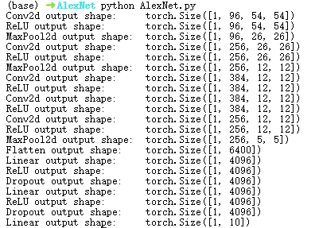
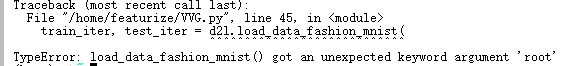
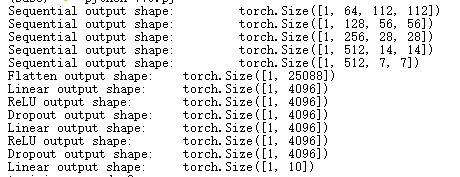
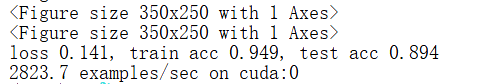

# 07 现代卷积神经网络

## 7.1 深度卷积神经网络（AlexNet）

### 7.1.1模型架构


**第一层：使用 96 个 11×11 的卷积核，步长为 4，快速缩小空间维度并提取粗特征。**输出：54×54×96

- 11×11卷积核相较于3×3或5×5有更大的感受野，可以在网络最开始捕捉图像中更粗粒度的空间特征，有助于识别边缘、颜色对比、纹理块等局部结构
- 使用较大的步长4，直接讲图像宽高缩小为原来的1/4，非常适合大图输入。
- 使用96个卷积核，即输出96个特征图，可以从不同角度提取图像的多种低层次特征（如边缘方向、颜色对比等）。

Q：如何确定96个卷积核的参数？

A：自动学习获得，流程：随机初始化、前向传播、计算损失、反向传播、梯度下降更新参数


**第二层：使用3 × 3 最大池化层，步幅 2。**输出：26×26×96

- 保留显著特征：最大池化选择局部区域中的最大值，可以突出特征响应强烈的区域，有助于保留边缘、纹理等显著特征。
- 增强平移不变性：即使图像发生轻微的移动，池化后提取的最大值不会有太大变化，从而使模型具有更好的鲁棒性。
- 3×3 是一种平衡了信息提取能力与计算效率的常用配置。
- 步幅为 2 可以快速压缩特征图，每次池化操作将特征图的宽高缩小一半，显著减少后续层的计算量。

Q：为什么卷积层后要接池化层？

- 降低尺寸图尺寸，减少计算量
- 每次池化操作，下一层看到的区域会更大，逐层扩大感受野
- 最大池化能保留最强的激活（最明显的特征），使模型对平移、旋转、小变化更不敏感（提高平移不变性）。

Q：感受野是什么？为什么池化操作能扩大感受野？

- 感受野指的是某一层的一个神经元在原始输入图像上所能“看到”的区域。
- 第二层卷积卷的是第一层的特征图，以此类推，越往后的神经元，感受到的原始图像区域就越大，即感受野变大。
- 池化虽然不增加特征数量，但它通过“跳跃”式的下采样扩大了单位的步距，从而在结构上增加了感受野。例如，一个2×2的池化，步幅为2，得到的每一个输出单元都代表了前一层2×2的区域。


**第三层：5 × 5 卷积层 (256)，填充 2。**输出：26×26×256

- 使用 256 个 5×5 卷积核，填充 2 保持特征图大小，提取更复杂的特征。


**第四层：3 × 3 最大池化层，步幅 2。**输出：12×12×256


**第五层：3 × 3 卷积层 (384)，填充 1。**输出：12×12×384

**第六层：3 × 3 卷积层 (384)，填充 1。**输出：12×12×384

**第七层：3 × 3 卷积层 (256)，填充 1。**输出：12×12×256

Q：为什么连用三层3 × 3卷积层？

A：用多层3 × 3卷积代替大卷积核，如5 × 5、7 × 7


**第八层：3 × 3 最大池化层，步幅 2。**输出：5×5×256


**第九层：全连接层（4096）**

- 将卷积提取到的特征展开为一维，进行第一次非线性组合。

**第十层：全连接层（4096）**

- 进一步处理，增强模型的非线性表达能力。

**第十一层：全连接层（1000）**

- 最终输出层，对应 1000 个类别。

Q：为什么是4096？

A：全连接层是参数最多的部分，节点越多，模型容量越大。4096 这个数字可以提供足够的表达能力，使模型在大规模图像数据（如 ImageNet）上有良好的学习和分类能力（经验选择）。


### 7.1.2 AlexNet实验报告

- **实验环境**

RTX 3080、6核 Xeon Gold 6142、Python v3.11.8、PyTorch v2.2.2

- **实验代码**

```python
import torch
from torch import nn
from d2l import torch as d2l

net = nn.Sequential(
    # 这里使用一个11*11的更大窗口来捕捉对象。
    # 同时，步幅为4，以减少输出的高度和宽度。
    # 另外，输出通道的数目远大于LeNet
    nn.Conv2d(1, 96, kernel_size=11, stride=4, padding=1), nn.ReLU(),
    nn.MaxPool2d(kernel_size=3, stride=2),
    # 减小卷积窗口，使用填充为2来使得输入与输出的高和宽一致，且增大输出通道数
    nn.Conv2d(96, 256, kernel_size=5, padding=2), nn.ReLU(),
    nn.MaxPool2d(kernel_size=3, stride=2),
    # 使用三个连续的卷积层和较小的卷积窗口。
    # 除了最后的卷积层，输出通道的数量进一步增加。
    # 在前两个卷积层之后，汇聚层不用于减少输入的高度和宽度
    nn.Conv2d(256, 384, kernel_size=3, padding=1), nn.ReLU(),
    nn.Conv2d(384, 384, kernel_size=3, padding=1), nn.ReLU(),
    nn.Conv2d(384, 256, kernel_size=3, padding=1), nn.ReLU(),
    nn.MaxPool2d(kernel_size=3, stride=2),
    nn.Flatten(),
    # 这里，全连接层的输出数量是LeNet中的好几倍。使用dropout层来减轻过拟合
    nn.Linear(6400, 4096), nn.ReLU(),
    nn.Dropout(p=0.5),
    nn.Linear(4096, 4096), nn.ReLU(),
    nn.Dropout(p=0.5),
    # 最后是输出层。由于这里使用Fashion-MNIST，所以用类别数为10，而非论文中的1000
    nn.Linear(4096, 10))

X = torch.randn(1, 1, 224, 224)
for layer in net:
    X=layer(X)
    print(layer.__class__.__name__,'output shape:\t',X.shape)

batch_size = 128
train_iter, test_iter = d2l.load_data_fashion_mnist(batch_size, resize=224)

lr, num_epochs = 0.01, 10
d2l.train_ch6(net, train_iter, test_iter, num_epochs, lr, d2l.try_gpu())
```

- **实验结果**

   

##  7.2. 使用块的网络（VGG）

 AlexNet证明深层神经网络卓有成效，但是没有提供通用模板来指导后续研究人员设计新的网络。

### 7.2.1 VGG块

经典卷积神经网络的基本组成：带填充以保持分辨率的卷积层、非线性激活函数（如RuLU）、汇聚层（如最大汇聚层）。而一个VGG块与之类似，由一系列卷积层组成，后面再加上用于空间下采样的最大汇聚层。

```python
import torch
from torch import nn
from d2l import torch as d2l


def vgg_block(num_convs, in_channels, out_channels):
    layers = []
    for _ in range(num_convs):
        layers.append(nn.Conv2d(in_channels, out_channels,
                                kernel_size=3, padding=1))
        layers.append(nn.ReLU())
        in_channels = out_channels
    layers.append(nn.MaxPool2d(kernel_size=2,stride=2))
    return nn.Sequential(*layers)
```

vgg_block函数有三个参数，分别对应于卷积层的数量num_convs、输入通道的数量in_channels 和输出通道的数量out_channels。

### 7.2.2 VGG网络

VGG网络可以分为两部分：第一部分主要由卷积层和汇聚层组成，第二部分由全连接层组成。全连接模块则与AlexNet中的相同。


VVG中超参数变量conv_arch，该变量指定每个VVG块里卷积层的个数和输出通道数。

```python
conv_arch = ((1, 64), (1, 128), (2, 256), (2, 512), (2, 512))
```

原始VGG网络有5个卷积块，其中前两个块各有一个卷积层，后三个块各包含两个卷积层。 第一个模块有64个输出通道，每个后续模块将输出通道数量翻倍，直到该数字达到512。由于该网络使用8个卷积层和3个全连接层，因此它通常被称为VGG-11。

```python
def vgg(conv_arch):
    conv_blks = []
    in_channels = 1
    # 卷积层部分
    for (num_convs, out_channels) in conv_arch:
        conv_blks.append(vgg_block(num_convs, in_channels, out_channels))
        in_channels = out_channels

    return nn.Sequential(
        *conv_blks, nn.Flatten(),
        # 全连接层部分
        nn.Linear(out_channels * 7 * 7, 4096), nn.ReLU(), nn.Dropout(0.5),
        nn.Linear(4096, 4096), nn.ReLU(), nn.Dropout(0.5),
        nn.Linear(4096, 10))

net = vgg(conv_arch)
```

构建一个高度和宽度为224的单通道数据样本，以观察每个层输出的形状。

```python
X = torch.randn(size=(1, 1, 224, 224))
for blk in net:
    X = blk(X)
    print(blk.__class__.__name__,'output shape:\t',X.shape)
```

每个块的高度和宽度减半，最终高度和宽度都为7。最后再展平表示，送入全连接层处理。

### 7.2.3 VGG实验报告

- **实验环境**

RTX 3080、6核 Xeon Gold 6142、Python v3.11.8、PyTorch v2.2.2

- **实验代码**

```python
ratio = 4
small_conv_arch = [(pair[0], pair[1] // ratio) for pair in conv_arch]
net = vgg(small_conv_arch)

lr, num_epochs, batch_size = 0.05, 10, 128
train_iter, test_iter = d2l.load_data_fashion_mnist(batch_size, resize=224)
d2l.train_ch6(net, train_iter, test_iter, num_epochs, lr, d2l.try_gpu())
```

- **实验报错**



错误原因： d2l 版本的 load_data_fashion_mnist 函数不支持 root 参数。

解决方法：用 torchvision.datasets.FashionMNIST 和 DataLoader 自己加载数据。

```python
import torch
from torch import nn
from d2l import torch as d2l
from torchvision import datasets, transforms
from torch.utils.data import DataLoader


def vgg_block(num_convs, in_channels, out_channels):
    layers = []
    for _ in range(num_convs):
        layers.append(nn.Conv2d(in_channels, out_channels,
                                kernel_size=3, padding=1))
        layers.append(nn.ReLU())
        in_channels = out_channels
    layers.append(nn.MaxPool2d(kernel_size=2,stride=2))
    return nn.Sequential(*layers)

conv_arch = ((1, 64), (1, 128), (2, 256), (2, 512), (2, 512))

def vgg(conv_arch):
    conv_blks = []
    in_channels = 1
    # 卷积层部分
    for (num_convs, out_channels) in conv_arch:
        conv_blks.append(vgg_block(num_convs, in_channels, out_channels))
        in_channels = out_channels

    return nn.Sequential(
        *conv_blks, nn.Flatten(),
        # 全连接层部分
        nn.Linear(out_channels * 7 * 7, 4096), nn.ReLU(), nn.Dropout(0.5),
        nn.Linear(4096, 4096), nn.ReLU(), nn.Dropout(0.5),
        nn.Linear(4096, 10))

net = vgg(conv_arch)

X = torch.randn(size=(1, 1, 224, 224))
for blk in net:
    X = blk(X)
    print(blk.__class__.__name__,'output shape:\t',X.shape)

ratio = 4
small_conv_arch = [(pair[0], pair[1] // ratio) for pair in conv_arch]
net = vgg(small_conv_arch)

batch_size = 128
trans = transforms.Compose([
    transforms.Resize(224),
    transforms.ToTensor()
])

train_data = datasets.FashionMNIST(root='./data', train=True, download=True, transform=trans)
test_data = datasets.FashionMNIST(root='./data', train=False, download=True, transform=trans)

train_iter = DataLoader(train_data, batch_size=batch_size, shuffle=True)
test_iter = DataLoader(test_data, batch_size=batch_size, shuffle=False)

lr, num_epochs = 0.05, 10
d2l.train_ch6(net, train_iter, test_iter, num_epochs, lr, d2l.try_gpu())
```

- **实验结果**

 

 

## 7.3网络中的网络（NiN）

LeNet、AlexNet和VGG的共同设计模式：通过一系列的卷积层与汇聚层来提取空间结构特征，然后通过全连接层对特征的表征进行处理。

如果在早期使用全连接层，可能会完全放弃表征的空间结构。NiN的解决方案为在每个像素的通道上分别使用多层感知机。

### 7.3.1 NiN块

卷积层的输入和输出由四维张量组成，张量的每个轴分别对应样本、通道、高度和宽度。 全连接层的输入和输出通常是分别对应于样本和特征的二维张量。 NiN使用1×1卷积（相当于局部全连接层）在每个像素位置上对通道维度的特征进行更复杂的组合，使网络具有更强的表达能力。

NiN块以一个普通卷积层开始，后面是两个1×1的卷积层。这两个1×1卷积层充当带有ReLU激活函数的逐像素全连接层。 第一层的卷积窗口形状通常由用户设置。 随后的卷积窗口形状固定为1×1。


### 7.3.2 NiN模型

NiN使用窗口形状为11×11、5×5和3×3的卷积层，输出通道数量与AlexNet中的相同。 每个NiN块后有一个最大汇聚层，汇聚窗口形状为3×3，步幅为2。

NiN和AlexNet的显著区别是NiN完全取消了全连接层。 相反，NiN使用一个NiN块，其输出通道数等于标签类别的数量。最后放一个全局平均汇聚层，生成一个对数几率，输入给 softmax 层进行分类。NiN通过取消全连接层显著减少了模型所需参数的数量。

**Q：为什么NiN的输入输出维度是四维的，但是AlexNet和VVG才三维？**

A：一个标准的卷积神经网络输入/输出维度都是形如 (batch_size, channels, height, width)，有时会省略 batch_size维度。

**Q：为什么train代码指定的batch_size为128，打印的batch_size为1？**

A：很多模型调试代码默认用一张图（batch_size=1）来通一下模型，便于打印 shape

### 7.3.3 NiN实验报告

- **实验环境**

RTX 3060、6 核 E5-2680 v4、Python v3.11.8、PyTorch v2.2.2

- **实验代码**

```python
import torch
from torch import nn
from torch.utils.data import DataLoader
from torchvision import datasets, transforms
import matplotlib.pyplot as plt
from d2l import torch as d2l


def nin_block(in_channels, out_channels, kernel_size, strides, padding):
    return nn.Sequential(
        nn.Conv2d(in_channels, out_channels, kernel_size, strides, padding),
        nn.ReLU(),
        nn.Conv2d(out_channels, out_channels, kernel_size=1), nn.ReLU(),
        nn.Conv2d(out_channels, out_channels, kernel_size=1), nn.ReLU())


net = nn.Sequential(
    nin_block(1, 96, kernel_size=11, strides=4, padding=0),
    nn.MaxPool2d(3, stride=2),
    nin_block(96, 256, kernel_size=5, strides=1, padding=2),
    nn.MaxPool2d(3, stride=2),
    nin_block(256, 384, kernel_size=3, strides=1, padding=1),
    nn.MaxPool2d(3, stride=2),
    nn.Dropout(0.5),
    # 标签类别数是10
    nin_block(384, 10, kernel_size=3, strides=1, padding=1),
    nn.AdaptiveAvgPool2d((1, 1)),
    # 将四维的输出转成二维的输出，其形状为(批量大小,10)
    nn.Flatten())

X = torch.rand(size=(1, 1, 224, 224))
for layer in net:
    X = layer(X)
    print(layer.__class__.__name__,'output shape:\t', X.shape)

# 数据加载部分
transform = transforms.Compose([
    transforms.Resize(224),
    transforms.ToTensor()
])

batch_size = 128
train_dataset = datasets.FashionMNIST(
    root='./data', train=True, download=True, transform=transform)
test_dataset = datasets.FashionMNIST(
    root='./data', train=False, download=True, transform=transform)

train_iter = DataLoader(train_dataset, batch_size=batch_size, shuffle=True)
test_iter = DataLoader(test_dataset, batch_size=batch_size, shuffle=False)

lr, num_epochs = 0.1, 10
# 训练
# 如果你有d2l.train_ch6可以直接用，否则可以自定义训练循环
# 这里假设你继续用d2l.train_ch6

d2l.train_ch6(net, train_iter, test_iter, num_epochs, lr, d2l.try_gpu())
plt.savefig('train_curve.png')
```

- **实验结果**

 

 

## 7.4 含并行连结的网络（GoogLeNet）

### 7.4.1 Inception块

在GoogLeNet中，基本的卷积块被称为Inception块，Inception块由四条并行路径组成，前三条路径使用1×1、3×3和5×5的卷积层，从不同大小中提取信息。中间两条路径在输入上执行1×1卷积来减少通道数，降低模型复杂度。第四条路径使用3×3最大汇聚层，然后使用1×1卷积层来改变通道数。

 这四条路径都使用合适的填充来使输入与输出的高和宽一致，最后将每条线路的输出在通道维度上连结，并构成Inception块的输出。在Inception块中，通常调整的超参数是每层输出通道数。


Q：为什么执行1×1卷积可以降低通道数？

A：1×1 卷积通过对每个空间位置上的通道向量做线性变换，实现对通道数的压缩，从而达到降维的目的。不是在空间维度（高度、宽度）上的，而是操作在“通道维度”上的

### 7.4.2 GoogLeNet模型

GoogLeNet一共使用9个Inception块和全局平均汇聚层的堆叠来生成其估计值。Inception块之间的最大汇聚层可降低维度。 第一个模块类似于AlexNet和LeNet，Inception块的组合从VGG继承，全局平均汇聚层避免了在最后使用全连接层。


GoogLeNet第一个模块使用64个通道、7×7卷积层。

第二个模块使用两个卷积层：第一个卷积层是64个通道、1×1卷积层；第二个卷积层使用将通道数量增加三倍的3×3卷积层。 这对应于Inception块中的第二条路径。

第三个模块串联两个完整的Inception块。 第一个Inception块的输出通道数为64+128+32+32=256，四个路径之间的输出通道数量比为2:4:1:1。第二个和第三个路径首先将输入通道的数量分别减少到1/2和11/12，然后连接第二个卷积层。第二个Inception块的输出通道数增加到128+192+96+64=480，四个路径之间的输出通道数量比为4:6:3:2。 第二条和第三条路径将输入通道的数量分别减少到1/2和1/8。

第四模块串联了5个Inception块，其输出通道数分别是192+208+48+64=512、160+224+64+64=512、128+256+64+64=512、112+288+64+64=528和256+320+128+128=832。 这些路径的通道数分配和第三模块中的类似，首先是含3×3卷积层的第二条路径输出最多通道，其次是仅含1×1卷积层的第一条路径，之后是含5×5卷积层的第三条路径和含3×3最大汇聚层的第四条路径。 其中第二、第三条路径都会先按比例减小通道数。 

第五模块包含输出通道数为256+320+128+128=832和384+384+128+128=1024的两个Inception块。 其中每条路径通道数的分配思路和第三、第四模块中的一致，只是在具体数值上有所不同。第五模块的后面紧跟输出层，该模块同NiN一样使用全局平均汇聚层，将每个通道的高和宽变成1。 最后将输出变成二维数组，再接上一个输出个数为标签类别数的全连接层。

### 7.4.3 GoogLeNet实验报告

- **实验环境**

RTX 3080、6核 Xeon Gold 6142、Python v3.11.8、PyTorch v2.2.2

- 实验代码

```python
import torch
from torch import nn
from torch.nn import functional as F
from d2l import torch as d2l
import matplotlib.pyplot as plt
from torchvision import datasets, transforms
from torch.utils.data import DataLoader


class Inception(nn.Module):
    # c1--c4是每条路径的输出通道数
    def __init__(self, in_channels, c1, c2, c3, c4, **kwargs):
        super(Inception, self).__init__(**kwargs)
        # 线路1，单1x1卷积层
        self.p1_1 = nn.Conv2d(in_channels, c1, kernel_size=1)
        # 线路2，1x1卷积层后接3x3卷积层
        self.p2_1 = nn.Conv2d(in_channels, c2[0], kernel_size=1)
        self.p2_2 = nn.Conv2d(c2[0], c2[1], kernel_size=3, padding=1)
        # 线路3，1x1卷积层后接5x5卷积层
        self.p3_1 = nn.Conv2d(in_channels, c3[0], kernel_size=1)
        self.p3_2 = nn.Conv2d(c3[0], c3[1], kernel_size=5, padding=2)
        # 线路4，3x3最大汇聚层后接1x1卷积层
        self.p4_1 = nn.MaxPool2d(kernel_size=3, stride=1, padding=1)
        self.p4_2 = nn.Conv2d(in_channels, c4, kernel_size=1)

    def forward(self, x):
        p1 = F.relu(self.p1_1(x))
        p2 = F.relu(self.p2_2(F.relu(self.p2_1(x))))
        p3 = F.relu(self.p3_2(F.relu(self.p3_1(x))))
        p4 = F.relu(self.p4_2(self.p4_1(x)))
        # 在通道维度上连结输出
        return torch.cat((p1, p2, p3, p4), dim=1)

b1 = nn.Sequential(nn.Conv2d(1, 64, kernel_size=7, stride=2, padding=3),
                   nn.ReLU(),
                   nn.MaxPool2d(kernel_size=3, stride=2, padding=1))

b2 = nn.Sequential(nn.Conv2d(64, 64, kernel_size=1),
                   nn.ReLU(),
                   nn.Conv2d(64, 192, kernel_size=3, padding=1),
                   nn.ReLU(),
                   nn.MaxPool2d(kernel_size=3, stride=2, padding=1))

b3 = nn.Sequential(Inception(192, 64, (96, 128), (16, 32), 32),
                   Inception(256, 128, (128, 192), (32, 96), 64),
                   nn.MaxPool2d(kernel_size=3, stride=2, padding=1))


b4 = nn.Sequential(Inception(480, 192, (96, 208), (16, 48), 64),
                   Inception(512, 160, (112, 224), (24, 64), 64),
                   Inception(512, 128, (128, 256), (24, 64), 64),
                   Inception(512, 112, (144, 288), (32, 64), 64),
                   Inception(528, 256, (160, 320), (32, 128), 128),
                   nn.MaxPool2d(kernel_size=3, stride=2, padding=1))

b5 = nn.Sequential(Inception(832, 256, (160, 320), (32, 128), 128),
                   Inception(832, 384, (192, 384), (48, 128), 128),
                   nn.AdaptiveAvgPool2d((1,1)),
                   nn.Flatten())

net = nn.Sequential(b1, b2, b3, b4, b5, nn.Linear(1024, 10))

X = torch.rand(size=(1, 1, 96, 96))
for layer in net:
    X = layer(X)
    print(layer.__class__.__name__,'output shape:\t', X.shape)

transform = transforms.Compose([
    transforms.Resize(96),
    transforms.ToTensor()
])

train_dataset = datasets.FashionMNIST(root='./data', train=True, download=True, transform=transform)
test_dataset = datasets.FashionMNIST(root='./data', train=False, download=True, transform=transform)

batch_size = 128
train_iter = DataLoader(train_dataset, batch_size=batch_size, shuffle=True, num_workers=2)
test_iter = DataLoader(test_dataset, batch_size=batch_size, shuffle=False, num_workers=2)

lr, num_epochs = 0.1, 10
d2l.train_ch6(net, train_iter, test_iter, num_epochs, lr, d2l.try_gpu())

plt.savefig('train_curve.png')
```

- 实验结果

 

 

## 7.5 批量规范化

### 7.5.1 训练深层网络

训练神经网络时的问题：

- backward上面往下传，梯度在上面大，越到下面越小，梯度小权重更新慢，导致上面收敛快，下面收敛慢，底层信息变化大，顶层需要重新拟合。
- 网络越深，越容易过拟合

**批量规范化原理**：在每次训练迭代中对小批量数据进行标准化，通过对输入减去均值、除以标准差，并加入可学习的缩放和平移参数，从而提高模型训练的稳定性和效率。
$$
x_{i+1} = \gamma \frac{x_i - \mu_B}{\sigma_B} + \beta
$$

- x~i~为第i个样本在当前小批量的输入特征值；
- μ~B~为该小批量中所有样本在该特征纬度上的均值；
- σB为该小批量在该特征维度上的标准差；
- γ为可学习的缩放参数，作用是让网络在标准化之后仍然可以调整数值范围；
- β为可学习的偏移参数，用于平移标准化后的值。
- x~i+1~：标准化并经过缩放和偏移处理后的输出，即将输入 xix_ixi 批量规范化后的结果

### 7.5.2 批量规范化层

- 全连接层

将批量规范化层置于全连接层中的仿射变换和激活函数之间：
$$
\mathbf{h} = \phi(\text{BN}(\mathbf{W}\mathbf{x} + \mathbf{b})).
$$
其中，x为全连接层的输入，W和b分别为权重参数和偏置参数，ϕ为激活函数，BN为批量规范化运算符。

- 卷积层

首先计算均值μ和标准差σ，然后对该通道所有值进行标准化（对所有样本所有空间位置）：
$$
\hat{x} = \frac{x - \mu}{\sqrt{\sigma + \epsilon}}
$$
再逐通道进行缩放和平移：
$$
y = \gamma \cdot \hat{x} + \beta
$$

### 7.5.3 批量规范化层实验报告

- 实验环境

RTX 3060、6 核 E5-2680 v4、Python v3.11.8、PyTorch v2.2.2

- 实验代码

```python
import torch
from torch import nn
from torchvision import datasets, transforms
from torch.utils.data import DataLoader
import matplotlib.pyplot as plt
from d2l import torch as d2l


def batch_norm(X, gamma, beta, moving_mean, moving_var, eps, momentum):
    # 通过is_grad_enabled来判断当前模式是训练模式还是预测模式
    if not torch.is_grad_enabled():
        # 如果是在预测模式下，直接使用传入的移动平均所得的均值和方差
        X_hat = (X - moving_mean) / torch.sqrt(moving_var + eps)
    else:
        assert len(X.shape) in (2, 4)
        if len(X.shape) == 2:
            # 使用全连接层的情况，计算特征维上的均值和方差
            mean = X.mean(dim=0)
            var = ((X - mean) ** 2).mean(dim=0)
        else:
            # 使用二维卷积层的情况，计算通道维上（axis=1）的均值和方差。
            # 这里我们需要保持X的形状以便后面可以做广播运算
            mean = X.mean(dim=(0, 2, 3), keepdim=True)
            var = ((X - mean) ** 2).mean(dim=(0, 2, 3), keepdim=True)
        # 训练模式下，用当前的均值和方差做标准化
        X_hat = (X - mean) / torch.sqrt(var + eps)
        # 更新移动平均的均值和方差
        moving_mean = momentum * moving_mean + (1.0 - momentum) * mean
        moving_var = momentum * moving_var + (1.0 - momentum) * var
    Y = gamma * X_hat + beta  # 缩放和移位
    return Y, moving_mean.data, moving_var.data

# 数据加载
batch_size = 256
transform = transforms.ToTensor()
train_dataset = datasets.FashionMNIST(root='./data', train=True, download=True, transform=transform)
test_dataset = datasets.FashionMNIST(root='./data', train=False, download=True, transform=transform)
train_iter = DataLoader(train_dataset, batch_size=batch_size, shuffle=True)
test_iter = DataLoader(test_dataset, batch_size=batch_size, shuffle=False)

# 网络结构
net = nn.Sequential(
    nn.Conv2d(1, 6, kernel_size=5), nn.BatchNorm2d(6), nn.Sigmoid(),
    nn.AvgPool2d(kernel_size=2, stride=2),
    nn.Conv2d(6, 16, kernel_size=5), nn.BatchNorm2d(16), nn.Sigmoid(),
    nn.AvgPool2d(kernel_size=2, stride=2), nn.Flatten(),
    nn.Linear(256, 120), nn.BatchNorm1d(120), nn.Sigmoid(),
    nn.Linear(120, 84), nn.BatchNorm1d(84), nn.Sigmoid(),
    nn.Linear(84, 10)
)

# 训练
lr, num_epochs = 1.0, 10
d2l.train_ch6(net, train_iter, test_iter, num_epochs, lr, d2l.try_gpu())

# 保存训练曲线
plt.savefig('train_result.png', dpi=300)
plt.close()  
```

- 实验结果

 

 

## 7.6.残差网络（ResNet）

### 7.6.1 函数类

- 传统神经网络依赖于逐层处理，随着层数加深，信息逐渐丢失，导致训练困难。
- 残差网络通过引入跳跃连接，保持信息流动，帮助深层网络更容易训练。


### 7.6.2 残差块

假设原始输入为x，学习出理想的映射为f(x)。

- 左图中，输入 x经过若干个层级（包括权重层和激活函数层），直接得到变换后的输出f(x)，每一层的输出依赖于前一层的变换，信息逐层传递。
- 右图中，输入 x 经过一系列的权重层和激活函数得到变换后的输出f(x)，再加上x，最终的输出是 f(x)+x。引入跳跃连接，允许信息直接通过加法传递，避免信息丢失，有助于训练更深层次的网络。


ResNet采用了与VGG相同的3x3卷积结构， 残差块里首先有2个有相同输出通道数的3×3卷积层。每个卷积后接批量归一化和ReLU激活函数。残差连接通过跳过部分卷积层，将输入直接加在最后的ReLU激活函数前。该要求2个卷积层的输出与输入形状一样，从而使它们可以相加。 如果想改变通道数，就需要引入一个额外的1×1卷积层来将输入变换成需要的形状后再做相加运算。


左图是标准残差块，适用于输入和输出通道数相同的情况；右图输出通过一个1×1卷积层来调整通道数，确保输入和输出通道数一致，以便它们能够加在一起。即1×1卷积的作用是改变输入的通道数，使得输入和输出在残差连接时可以进行相加。

###  7.6.3 ResNet模型

ResNet-18 架构


### 7.6.4 ResNet实验报告

- 实验环境

RTX 3080、6核 Xeon Gold 6142、Python v3.11.8、PyTorch v2.2.2

- 实验代码

```python
import torch
from torch import nn
from torch.nn import functional as F
from d2l import torch as d2l
import torchvision
from torch.utils.data import DataLoader
import matplotlib.pyplot as plt


class Residual(nn.Module):  #@save
    def __init__(self, input_channels, num_channels,
                 use_1x1conv=False, strides=1):
        super().__init__()
        self.conv1 = nn.Conv2d(input_channels, num_channels,
                               kernel_size=3, padding=1, stride=strides)
        self.conv2 = nn.Conv2d(num_channels, num_channels,
                               kernel_size=3, padding=1)
        if use_1x1conv:
            self.conv3 = nn.Conv2d(input_channels, num_channels,
                                   kernel_size=1, stride=strides)
        else:
            self.conv3 = None
        self.bn1 = nn.BatchNorm2d(num_channels)
        self.bn2 = nn.BatchNorm2d(num_channels)

    def forward(self, X):
        Y = F.relu(self.bn1(self.conv1(X)))
        Y = self.bn2(self.conv2(Y))
        if self.conv3:
            X = self.conv3(X)
        Y += X
        return F.relu(Y)

blk = Residual(3,3)
X = torch.rand(4, 3, 6, 6)
Y = blk(X)
Y.shape

b1 = nn.Sequential(nn.Conv2d(1, 64, kernel_size=7, stride=2, padding=3),
                   nn.BatchNorm2d(64), nn.ReLU(),
                   nn.MaxPool2d(kernel_size=3, stride=2, padding=1))

def resnet_block(input_channels, num_channels, num_residuals,
                 first_block=False):
    blk = []
    for i in range(num_residuals):
        if i == 0 and not first_block:
            blk.append(Residual(input_channels, num_channels,
                                use_1x1conv=True, strides=2))
        else:
            blk.append(Residual(num_channels, num_channels))
    return blk

b2 = nn.Sequential(*resnet_block(64, 64, 2, first_block=True))
b3 = nn.Sequential(*resnet_block(64, 128, 2))
b4 = nn.Sequential(*resnet_block(128, 256, 2))
b5 = nn.Sequential(*resnet_block(256, 512, 2))

net = nn.Sequential(b1, b2, b3, b4, b5,
                    nn.AdaptiveAvgPool2d((1,1)),
                    nn.Flatten(), nn.Linear(512, 10))

X = torch.rand(size=(1, 1, 224, 224))
for layer in net:
    X = layer(X)
    print(layer.__class__.__name__,'output shape:\t', X.shape)

lr, num_epochs, batch_size = 0.05, 10, 256

# 手动加载FashionMNIST数据集
transform = torchvision.transforms.Compose([
    torchvision.transforms.Resize(96),
    torchvision.transforms.ToTensor()
])

train_dataset = torchvision.datasets.FashionMNIST(
    root='c:/Users/Lenovo/Desktop/.md/DL_limu/data', train=True, download=True, transform=transform)
test_dataset = torchvision.datasets.FashionMNIST(
    root='c:/Users/Lenovo/Desktop/.md/DL_limu/data', train=False, download=True, transform=transform)

train_iter = DataLoader(train_dataset, batch_size=batch_size, shuffle=True, num_workers=0)
test_iter = DataLoader(test_dataset, batch_size=batch_size, shuffle=False, num_workers=0)

d2l.train_ch6(net, train_iter, test_iter, num_epochs, lr, d2l.try_gpu())

plt.savefig('train_curve.jpg')

```

- 实验结果

 

 

## 7.7 稠密连接网络（DenseNet）

### 7.7.1 从ResNet到DenseNet

- ResNet(左)：直接相加
- DenseNet(右)：连接（用[，]表示）


在应用越来越复杂的函数序列后，得到从x到其展开式的映射：
$$
\mathbf{x} \to [\mathbf{x}, f_1(\mathbf{x}), f_2([\mathbf{x}, f_1(\mathbf{x})]), f_3([\mathbf{x}, f_1(\mathbf{x}), f_2([\mathbf{x}, f_1(\mathbf{x})])]), \ldots]
$$
最后，将这些展开式结合到多层感知机中，再次减少特征的数量。 稠密连接如下图所示：


稠密网络主要由两部分构成：稠密块和过渡层。 前者定义如何连接输入和输出，而后者则控制通道数量，使其不会太复杂。

### 7.7.2 DenseNet模型

DenseNet模型在构筑上与ResNet相似，把ResNet中的残差块换成了稠密块。其主要构建模块是稠密块和过渡层，通过添加过渡层来控制网络的维数，从而再次减少通道的数量。

### 7.7.3 DenseNet实验报告

- 实验环境

RTX 3060、6 核 E5-2680 v4、Python v3.11.8、PyTorch v2.2.2

- 实验代码

```python
import torch
from torch import nn
from d2l import torch as d2l
import matplotlib.pyplot as plt
import torchvision
from torch.utils.data import DataLoader
import torchvision.transforms as transforms


def conv_block(input_channels, num_channels):
    return nn.Sequential(
        nn.BatchNorm2d(input_channels), nn.ReLU(),
        nn.Conv2d(input_channels, num_channels, kernel_size=3, padding=1))

class DenseBlock(nn.Module):
    def __init__(self, num_convs, input_channels, num_channels):
        super(DenseBlock, self).__init__()
        layer = []
        for i in range(num_convs):
            layer.append(conv_block(
                num_channels * i + input_channels, num_channels))
        self.net = nn.Sequential(*layer)

    def forward(self, X):
        for blk in self.net:
            Y = blk(X)
            # 连接通道维度上每个块的输入和输出
            X = torch.cat((X, Y), dim=1)
        return X

blk = DenseBlock(2, 3, 10)
X = torch.randn(4, 3, 8, 8)
Y = blk(X)
Y.shape

def transition_block(input_channels, num_channels):
    return nn.Sequential(
        nn.BatchNorm2d(input_channels), nn.ReLU(),
        nn.Conv2d(input_channels, num_channels, kernel_size=1),
        nn.AvgPool2d(kernel_size=2, stride=2))

blk = transition_block(23, 10)
blk(Y).shape

b1 = nn.Sequential(
    nn.Conv2d(1, 64, kernel_size=7, stride=2, padding=3),
    nn.BatchNorm2d(64), nn.ReLU(),
    nn.MaxPool2d(kernel_size=3, stride=2, padding=1))

# num_channels为当前的通道数
num_channels, growth_rate = 64, 32
num_convs_in_dense_blocks = [4, 4, 4, 4]
blks = []
for i, num_convs in enumerate(num_convs_in_dense_blocks):
    blks.append(DenseBlock(num_convs, num_channels, growth_rate))
    # 上一个稠密块的输出通道数
    num_channels += num_convs * growth_rate
    # 在稠密块之间添加一个转换层，使通道数量减半
    if i != len(num_convs_in_dense_blocks) - 1:
        blks.append(transition_block(num_channels, num_channels // 2))
        num_channels = num_channels // 2

net = nn.Sequential(
    b1, *blks,
    nn.BatchNorm2d(num_channels), nn.ReLU(),
    nn.AdaptiveAvgPool2d((1, 1)),
    nn.Flatten(),
    nn.Linear(num_channels, 10))

# 数据预处理
transform = transforms.Compose([
    transforms.Resize(96),
    transforms.ToTensor()
])

# 下载并加载数据集，root可以指定为你有权限的目录
train_dataset = torchvision.datasets.FashionMNIST(
    root='./data', train=True, download=True, transform=transform)
test_dataset = torchvision.datasets.FashionMNIST(
    root='./data', train=False, download=True, transform=transform)

batch_size = 256
train_iter = DataLoader(train_dataset, batch_size=batch_size, shuffle=True, num_workers=2)
test_iter = DataLoader(test_dataset, batch_size=batch_size, shuffle=False, num_workers=2)

lr, num_epochs = 0.1, 10
d2l.train_ch6(net, train_iter, test_iter, num_epochs, lr, d2l.try_gpu())
plt.savefig('result.png')
```

- 实验结果

 

 