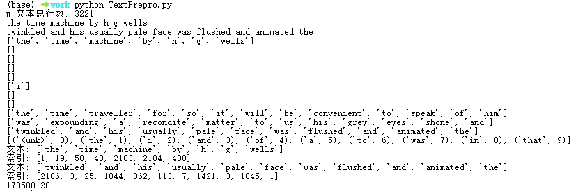

# 08循环神经网络

## 8.1 序列模型

### 8.1.1统计工具

在时间t观察到x~t~，得到T个不独立的随机变量（x~1~，…，x~T~）~ p(X)，使用条件概率展开：
$$
p(a, b) = p(a)p(b | a) = p(b)p(a | b)
$$
 

### 8.1.2自回归模型（AR）

核心思想：当前时刻的值x~t~是过去时刻值的线性组合，对条件概率建模：
$$
p(x_t | x_1, \dots, x_{t-1}) = p(x_t | f(x_1, \dots, x_{t-1}))
$$

### 8.1.3马尔科夫模型

核心思想：假设当前数据只跟τ个过去数据点相关


$$
p(x_t | x_1, \dots, x_{t-1}) = p(x_t | x_{t-\tau}, \dots, x_{t-1}) = p(x_t | f(x_{t-\tau}, \dots, x_{t-1}))
$$

### 8.1.4潜变量模型

核心思想：通过潜变量h~t~来表示过去信息h~t~=f（x~1~，…，x~t-1~）


$$
x_t = p(x_t | h_t)
$$
总结：

- 时序模型中，当前数据与之前观察到的数据相关
- 自回归模型使用自身过去数据来预测未来
- 马尔科夫模型假设当前数据只跟最近少数数据相关，从而简化模型
- 潜变量模型使用潜变量来概括历史信息

Q：AR和潜变量模型的区别？

A：AR的f（x~1~，…，x~t-1~）直接描述的是过去数据对当前数据的影响，假设所有变量都可以观测。潜变量的h~t~不是直接观测到的，这是隐藏的或不可直接测量的变量，通常需要通过其他推断算法推测。

### 8.1.5实验报告

- 实验环境

A4000、6核E5-2680 v4、Python v3.11.8、PyTorch v 2.2.2

- 实验代码

```python
import torch
from torch import nn
from d2l import torch as d2l
import matplotlib.pyplot as plt

T = 1000  # 总共产生1000个点
time = torch.arange(1, T + 1, dtype=torch.float32)
x = torch.sin(0.01 * time) + torch.normal(0, 0.2, (T,))
d2l.plot(time, [x], 'time', 'x', xlim=[1, 1000], figsize=(6, 3))
plt.savefig('fig1_raw_data.png', dpi=300, bbox_inches='tight')
plt.close()

tau = 4
features = torch.zeros((T - tau, tau))
for i in range(tau):
    features[:, i] = x[i: T - tau + i]
labels = x[tau:].reshape((-1, 1))

batch_size, n_train = 16, 600
# 只有前n_train个样本用于训练
train_iter = d2l.load_array((features[:n_train], labels[:n_train]),
                            batch_size, is_train=True)

# 初始化网络权重的函数
def init_weights(m):
    if type(m) == nn.Linear:
        nn.init.xavier_uniform_(m.weight)

# 一个简单的多层感知机
def get_net():
    net = nn.Sequential(nn.Linear(4, 10),
                        nn.ReLU(),
                        nn.Linear(10, 1))
    net.apply(init_weights)
    return net

# 平方损失。注意：MSELoss计算平方误差时不带系数1/2
loss = nn.MSELoss(reduction='none')


def train(net, train_iter, loss, epochs, lr):
    trainer = torch.optim.Adam(net.parameters(), lr)
    for epoch in range(epochs):
        for X, y in train_iter:
            trainer.zero_grad()
            l = loss(net(X), y)
            l.sum().backward()
            trainer.step()
        print(f'epoch {epoch + 1}, '
              f'loss: {d2l.evaluate_loss(net, train_iter, loss):f}')

net = get_net()
train(net, train_iter, loss, 5, 0.01)

onestep_preds = net(features)
d2l.plot([time, time[tau:]],
         [x.detach().numpy(), onestep_preds.detach().numpy()], 'time',
         'x', legend=['data', '1-step preds'], xlim=[1, 1000],
         figsize=(6, 3))
plt.savefig('fig2_onestep_preds.png', dpi=300, bbox_inches='tight')
plt.close()


multistep_preds = torch.zeros(T)
multistep_preds[: n_train + tau] = x[: n_train + tau]
for i in range(n_train + tau, T):
    multistep_preds[i] = net(
        multistep_preds[i - tau:i].reshape((1, -1)))

d2l.plot([time, time[tau:], time[n_train + tau:]],
         [x.detach().numpy(), onestep_preds.detach().numpy(),
          multistep_preds[n_train + tau:].detach().numpy()], 'time',
         'x', legend=['data', '1-step preds', 'multistep preds'],
         xlim=[1, 1000], figsize=(6, 3))
plt.savefig('fig3_multistep_preds.png', dpi=300, bbox_inches='tight')
plt.close()

max_steps = 64

features = torch.zeros((T - tau - max_steps + 1, tau + max_steps))
# 列i（i<tau）是来自x的观测，其时间步从（i）到（i+T-tau-max_steps+1）
for i in range(tau):
    features[:, i] = x[i: i + T - tau - max_steps + 1]

# 列i（i>=tau）是来自（i-tau+1）步的预测，其时间步从（i）到（i+T-tau-max_steps+1）
for i in range(tau, tau + max_steps):
    features[:, i] = net(features[:, i - tau:i]).reshape(-1)

steps = (1, 4, 16, 64)
d2l.plot([time[tau + i - 1: T - max_steps + i] for i in steps],
         [features[:, (tau + i - 1)].detach().numpy() for i in steps], 'time', 'x',
         legend=[f'{i}-step preds' for i in steps], xlim=[5, 1000],
         figsize=(6, 3))
plt.savefig('fig4_steps_preds.png', dpi=300, bbox_inches='tight')
plt.close()
```

- 实验结果

 

 

 

## 8.2文本预处理

解析文本的常见预处理步骤：

1. 将文本作为字符串加载到内存中。
2. 将字符串拆分为词元（如单词和字符）。
3. 建立一个词表，将拆分的词元映射到数字索引。
4. 将文本转换为数字索引序列，方便模型操作。

### 8.2.1读取数据集

从H.G.Well的时光机器中加载文本，忽略大小写。

### 8.2.2词元化

tokenize函数将文本行列表（lines）作为输入， 列表中的每个元素是一个文本序列（如一条文本行）。 每个文本序列又被拆分成一个词元列表，词元（token）是文本的基本单位。 最后，返回一个由词元列表组成的列表，其中的每个词元都是一个字符串（string）。

### 8.2.3词表

词元的类型是字符串，而模型需要的输入是数字，因此这种类型不方便模型使用。词表用来将字符串类型的词元映射到从0开始的数字索引中。首先将训练集中所有的文档合并在一起，统计其唯一词元，得到的统计结果为语料。再根据每个唯一词元的出现频率为其分配一个数字索引，删除很少出现的词元以降低复杂度。语料库中不存在或已删除的任何词元都将映射到一个特定的未知词元<unk>。可以选择增加一个列表，用于保存那些被保留的词元， 例如：填充词元（“<pad>”）； 序列开始词元（“<bos>”）； 序列结束词元（“<eos>”）。

### 8.2.4实验报告

- 实验环境

A4000、6核E5-2680 v4、Python v3.11.8、PyTorch v 2.2.2

- 实验代码

```python
import collections
import re
from d2l import torch as d2l

#@save
d2l.DATA_HUB['time_machine'] = (d2l.DATA_URL + 'timemachine.txt',
                                '090b5e7e70c295757f55df93cb0a180b9691891a')

def read_time_machine():  #@save
    """将时间机器数据集加载到文本行的列表中"""
    with open(d2l.download('time_machine'), 'r') as f:
        lines = f.readlines()
    return [re.sub('[^A-Za-z]+', ' ', line).strip().lower() for line in lines]

lines = read_time_machine()
print(f'# 文本总行数: {len(lines)}')
print(lines[0])
print(lines[10])

def tokenize(lines, token='word'):  #@save
    """将文本行拆分为单词或字符词元"""
    if token == 'word':
        return [line.split() for line in lines]
    elif token == 'char':
        return [list(line) for line in lines]
    else:
        print('错误：未知词元类型：' + token)

tokens = tokenize(lines)
for i in range(11):
    print(tokens[i])

class Vocab:  #@save
    """文本词表"""
    def __init__(self, tokens=None, min_freq=0, reserved_tokens=None):
        if tokens is None:
            tokens = []
        if reserved_tokens is None:
            reserved_tokens = []
        # 按出现频率排序
        counter = count_corpus(tokens)
        self._token_freqs = sorted(counter.items(), key=lambda x: x[1],
                                   reverse=True)
        # 未知词元的索引为0
        self.idx_to_token = ['<unk>'] + reserved_tokens
        self.token_to_idx = {token: idx
                             for idx, token in enumerate(self.idx_to_token)}
        for token, freq in self._token_freqs:
            if freq < min_freq:
                break
            if token not in self.token_to_idx:
                self.idx_to_token.append(token)
                self.token_to_idx[token] = len(self.idx_to_token) - 1

    def __len__(self):
        return len(self.idx_to_token)

    def __getitem__(self, tokens):
        if not isinstance(tokens, (list, tuple)):
            return self.token_to_idx.get(tokens, self.unk)
        return [self.__getitem__(token) for token in tokens]

    def to_tokens(self, indices):
        if not isinstance(indices, (list, tuple)):
            return self.idx_to_token[indices]
        return [self.idx_to_token[index] for index in indices]

    @property
    def unk(self):  # 未知词元的索引为0
        return 0

    @property
    def token_freqs(self):
        return self._token_freqs

def count_corpus(tokens):  #@save
    """统计词元的频率"""
    # 这里的tokens是1D列表或2D列表
    if len(tokens) == 0 or isinstance(tokens[0], list):
        # 将词元列表展平成一个列表
        tokens = [token for line in tokens for token in line]
    return collections.Counter(tokens)

class Vocab:  #@save
    """文本词表"""
    def __init__(self, tokens=None, min_freq=0, reserved_tokens=None):
        if tokens is None:
            tokens = []
        if reserved_tokens is None:
            reserved_tokens = []
        # 按出现频率排序
        counter = count_corpus(tokens)
        self._token_freqs = sorted(counter.items(), key=lambda x: x[1],
                                   reverse=True)
        # 未知词元的索引为0
        self.idx_to_token = ['<unk>'] + reserved_tokens
        self.token_to_idx = {token: idx
                             for idx, token in enumerate(self.idx_to_token)}
        for token, freq in self._token_freqs:
            if freq < min_freq:
                break
            if token not in self.token_to_idx:
                self.idx_to_token.append(token)
                self.token_to_idx[token] = len(self.idx_to_token) - 1

    def __len__(self):
        return len(self.idx_to_token)

    def __getitem__(self, tokens):
        if not isinstance(tokens, (list, tuple)):
            return self.token_to_idx.get(tokens, self.unk)
        return [self.__getitem__(token) for token in tokens]

    def to_tokens(self, indices):
        if not isinstance(indices, (list, tuple)):
            return self.idx_to_token[indices]
        return [self.idx_to_token[index] for index in indices]

    @property
    def unk(self):  # 未知词元的索引为0
        return 0

    @property
    def token_freqs(self):
        return self._token_freqs

def count_corpus(tokens):  #@save
    """统计词元的频率"""
    # 这里的tokens是1D列表或2D列表
    if len(tokens) == 0 or isinstance(tokens[0], list):
        # 将词元列表展平成一个列表
        tokens = [token for line in tokens for token in line]
    return collections.Counter(tokens)

vocab = Vocab(tokens)
print(list(vocab.token_to_idx.items())[:10])

for i in [0, 10]:
    print('文本:', tokens[i])
    print('索引:', vocab[tokens[i]])

def load_corpus_time_machine(max_tokens=-1):  #@save
    """返回时光机器数据集的词元索引列表和词表"""
    lines = read_time_machine()
    tokens = tokenize(lines, 'char')
    vocab = Vocab(tokens)
    # 因为时光机器数据集中的每个文本行不一定是一个句子或一个段落，
    # 所以将所有文本行展平到一个列表中
    corpus = [vocab[token] for line in tokens for token in line]
    if max_tokens > 0:
        corpus = corpus[:max_tokens]
    return corpus, vocab

corpus, vocab = load_corpus_time_machine()
print(len(corpus), len(vocab))
```

- 实验结果

 

## 8.3语言模型和数据集

### 8.3.1语言模型

给定文本序列x~1~，…，x~T~，语言模型的目标是根据文本序列计算联合概率p（x~1~，…，x~T~）

其应用包括：

- 做预训练模型（BERT，GPT-3）
- 生成文本，给定前面几个词，不断生成后续文本
- 判断多个序列中哪个更常见

工作原理：
$$
p(x_1, x_2, \dots, x_T) = p(x_1) \cdot p(x_2 \mid x_1) \cdot p(x_3 \mid x_1, x_2) \cdots p(x_T \mid x_1, \dots, x_{T-1})
$$

### 8.3.2 n元语法

在序列建模或序列预测的问题中，假设有一个序列x1，x2，…，xT，其中T是序列的长度。当序列非常长时，如果输入的文本量不足（即数据量不足以支撑长序列的处理），那么某些统计量或概率值 可能n（x1，…，xT）≤1。使用马尔科夫假设可以缓解这个问题：

- 一元语法：

$$
p(x_1, x_2, x_3, x_4) = p(x_1) p(x_2) p(x_3) p(x_4)
= \frac{n(x_1)}{n} \cdot \frac{n(x_2)}{n} \cdot \frac{n(x_3)}{n} \cdot \frac{n(x_4)}{n}
$$

- 二元语法：

$$
p(x_1, x_2, x_3, x_4) = p(x_1) p(x_2 \mid x_1) p(x_3 \mid x_2) p(x_4 \mid x_3)
= \frac{n(x_1)}{n} \cdot \frac{n(x_1, x_2)}{n(x_1)} \cdot \frac{n(x_2, x_3)}{n(x_2)} \cdot \frac{n(x_3, x_4)}{n(x_3)}
$$

- 三元语法：

$$
p(x_1, x_2, x_3, x_4) = p(x_1) p(x_2 \mid x_1) p(x_3 \mid x_1, x_2) p(x_4 \mid x_2, x_3)
= \frac{n(x_1)}{n} \cdot \frac{n(x_1, x_2)}{n(x_1)} \cdot \frac{n(x_1, x_2, x_3)}{n(x_1, x_2)} \cdot \frac{n(x_2, x_3, x_4)}{n(x_2, x_3)}
$$

### 8.3.3自然语言统计实验报告

- 实验环境

RTX 3060、5核 E5-2680 v4、Python v3.11.8、PyTorch v2.2.2

- 实验代码

```python
import random
import torch
import re
import matplotlib.pyplot as plt
from d2l import torch as d2l

#@save
d2l.DATA_HUB['time_machine'] = (d2l.DATA_URL + 'timemachine.txt',
                                '090b5e7e70c295757f55df93cb0a180b9691891a')

def read_time_machine():  #@save
    """将时间机器数据集加载到文本行的列表中"""
    with open(d2l.download('time_machine'), 'r') as f:
        lines = f.readlines()
    return [re.sub('[^A-Za-z]+', ' ', line).strip().lower() for line in lines]

lines = read_time_machine()

def tokenize(lines, token='word'):  #@save
    """将文本行拆分为单词或字符词元"""
    if token == 'word':
        return [line.split() for line in lines]
    elif token == 'char':
        return [list(line) for line in lines]
    else:
        print('错误：未知词元类型：' + token)

tokens = tokenize(read_time_machine())
# 因为每个文本行不一定是一个句子或一个段落，因此我们把所有文本行拼接到一起
corpus = [token for line in tokens for token in line]
vocab = d2l.Vocab(corpus)
print("Unigram 词频前十:", vocab.token_freqs[:10])

freqs = [freq for token, freq in vocab.token_freqs]
d2l.plot(freqs, xlabel='token: x', ylabel='frequency: n(x)',
         xscale='log', yscale='log')
plt.savefig('unigram_frequency.png')

bigram_tokens = [' '.join(pair) for pair in zip(corpus[:-1], corpus[1:])]
bigram_vocab = d2l.Vocab(bigram_tokens)
print("Bigram 词频前十:", bigram_vocab.token_freqs[:10])

trigram_tokens = [' '.join(triple) for triple in zip(
    corpus[:-2], corpus[1:-1], corpus[2:])]
trigram_vocab = d2l.Vocab(trigram_tokens)
print("Trigram 词频前十:", trigram_vocab.token_freqs[:10])

bigram_freqs = [freq for token, freq in bigram_vocab.token_freqs]
trigram_freqs = [freq for token, freq in trigram_vocab.token_freqs]
d2l.plot([freqs, bigram_freqs, trigram_freqs], xlabel='token: x',
         ylabel='frequency: n(x)', xscale='log', yscale='log',
         legend=['unigram', 'bigram', 'trigram'])
plt.savefig('ngram_frequency.png')
```

- 实验报错

 

报错原因：

创建 bigram_vocab = d2l.Vocab(bigram_tokens) 时，具体是在 d2l.Vocab 类的内部。错误提示说不能比较字符串 (str) 和元组 (tuple)，这是因为 d2l.Vocab 在构建词汇表时，需要对输入的词元列表进行排序，而你的 bigram_tokens 是一个包含元组的列表（比如 ('the', 'time')），d2l.Vocab 期望的是字符串类型的词元。

d2l.Vocab 设计上是用来处理单个词元（unigrams）的。如果想用其来统计 bigrams 或 trigrams 的频率，需要将每个 bigram 或 trigram 作为一个“词元”传进去，这意味着它们需要是字符串格式，而不是元组。例如，将 bigram ('the', 'time') 转换为字符串 'the time'。故将 bigram_tokens 和 trigram_tokens 中的元组转换为字符串，再传给 d2l.Vocab。

将bigram_tokens = [pair *for* pair *in* zip(corpus[:-1], corpus[1:])]改为bigram_tokens = [' '.join(pair) *for* pair *in* zip(corpus[:-1], corpus[1:])]

- 实验结果


## 8.4循环神经网络

### 8.4.1无隐状态的神经网络

只有单隐藏层的多层感知机，隐藏层的输出H计算如下：
$$
H = \phi(X W_{xh} + b_h)
$$

其中，ϕ为隐藏层的激活函数，X∈R^n×d^为小批量样本，n为批量大小，d为输入维度，h为隐藏层维度。W为权重参数，b为偏置参数。将隐藏变量H作为输出层的输入：
$$
O = H W_{hq} + b_q
$$

### 8.4.2.有隐状态的循环神经网络


假设在时间步t有小批量输入X~t~，H~t~表示时间步t的隐藏变量，保存前一个时间步的隐藏变量H~t-1~，引入了一个新的权重参数W~hh~来描述如何在当前时间步中使用前一个时间步的隐藏变量，更新隐藏状态计算如下：
$$
H_t = \phi(X_t W_{xh} + H_{t-1} W_{hh} + b_h)
$$
从相邻时间步的隐藏变量H~t~和 H~t−1~之间的关系可知， 这些变量捕获并保留了序列直到其当前时间步的历史信息， 就如当前时间步下神经网络的状态或记忆， 因此这样的隐藏变量被称为隐状态。 由于在当前时间步中， 隐状态使用的定义与前一个时间步中使用的定义相同， 因此公式（11）的计算是循环的。故基于循环计算的隐状态神经网络被命名为循环神经网络。在循环神经网络中执行（11）的层称为循环层。

对于时间步t，输出层的输出类似于多层感知机中的计算：
$$
O_t = H_t W_{hq} + b_q
$$
循环神经网络的参数包括隐藏层的权重W~xh~，W~hh~和偏置b~h~，以及输出层的权重W~hq~和偏置。即使在不同的时间步，RNN也总是使用这些模型参数，因此RRN的参数开销不会随着时间步的增加而增加。

值得一提的是，隐状态中X~t~W~xh~+H~t-1~W~hh~计算相当于X~t~和H~t-1~的拼接与~t~W~xh~和W~hh~的拼接两个矩阵的乘法。

### 8.4.3基于循环神经网络的字符级语言模型

字符级语言模型将每个单词的字符作为单独的输入来进行预测，而不是将整个单词作为输入。这意味着输入序列被拆分为单个字符，模型在每个时间步通过RNN处理这些字符，逐步生成对应的输出。


每个时间步的输出会通过 Softmax 操作进行处理，接着通过交叉熵损失计算输出与目标标签之间的误差。训练时，通过更新权重来优化模型。

在实践中，输入的词向量是一个 n×d的矩阵，其中 n 是批量大小，d是输入特征的维度。每个字符的输入通过 RNN 层进行处理，最终预测下一个字符。


### 8.4.4困惑度

衡量一个语言模型的好坏可以用平均交叉熵：
$$
\frac{1}{n} \sum_{t=1}^{n} - \log P(x_t | x_{t-1}, \dots, x_1)
$$
其中p为语言模型的预测概率，x~t~是真实词。 NLP大多使用困惑度来衡量，其中1表示完美，无穷大是最差情况：
$$
\exp \left( - \frac{1}{n} \sum_{t=1}^{n} \log P(x_t | x_{t-1}, \dots, x_1) \right)
$$


## 8.5 RNN实验报告

- 实验环境

RTX 3060、5核 E5-2680 v4、Python v3.11.8、PyTorch v2.2.2

- 实验代码

```python
代码太长放不下了
```

- 实验报错

 

我服务器的python版本是3.11，书中的d2l版本是0.17.6，适配的python版本是3.9，就一直在报包丢失的错误，我去找了d2l的包源代码贴上去就行了。

- 实验结果

 

 

```python
perplexity 1.3, 322315.0 tokens/sec on cuda:0
time traveller held in the abyursine shat hie sbuthe to the ind traveller alled he butwer of me time andments oul the prych
```

这里生成的单词存在明显乱序，我分析可能是训练批次不够或者是学习率的问题，所以又尝试了不同的学习率和训练批次。

- num_epochs, lr = 500, 0.5

```python
perplexity 1.1, 346755.0 tokens/sec on cuda:0
time traveller ffoced seryit yat i giveligen alove the experea ttravelleryou can show black is white by argument said filby
```

- num_epochs, lr = 1000, 0.3

```python
perplexity 1.1, 334020.4 tokens/sec on cuda:0
time travelleryou can show black is white by argument said filby travelleryou can show black is white by argument said filby
```

- num_epochs, lr = 1500, 0.2

```python
perplexity 1.1, 341840.9 tokens/sec on cuda:0
time travelleryou can show black is white by argument said filby travelleryou can show black is white by argument said filby
```

## 8.6梯度裁剪

迭代计算T个时间步上的梯度，在反向传播过程中产生长度为O（T）的矩阵乘法链，导致数值不稳定

梯度裁剪能有效预防梯度爆炸，如果梯度超过θ，那么拖影回长度θ：
$$
g \leftarrow \min \left( 1, \frac{\theta}{\|g\|} \right) g
$$
