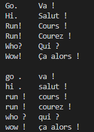

# 09现代循环神经网络

## 9.1门控循环单元（GRU）

### 9.1.1门控隐状态

GRU支持隐状态的门控，模型有专门的机制来确定应该何时更新隐状态，以及何时重置隐状态。若第一个次元非常重要，模型将会在第一次观测后不更新状态，同样模型可以学会跳过不相关的临时观测、在需要的时候重置隐状态。

**1.重置门和更新门**

重置门和更新门是区间（0,1）的向量

- 重置门
	- 作用：控制前一时刻的隐藏状态信息对当前时刻的影响程度。它决定了应该“遗忘”多少过去的信息，有助于捕获序列中的短期依赖关系。
	- 原理：在计算当前的隐藏状态时，重置门决定了如何结合上一时刻的隐藏状态。重置门值越接近0，表示模型会“忘记”较多的先前信息；重置门值越接近1，表示模型会保留更多的历史信息。

$$
R_t = \sigma(X_t W_{xr} + H_{t-1} W_{hr} + b_r)
$$


- 更新门
	- 作用：控制当前隐藏状态对上一时刻隐藏状态的“更新”程度，它决定了是否保留之前的隐藏状态，或者用新的信息替换它，有助于捕获序列中的长期依赖关系。
	- 原理：决定了当前时刻的隐藏状态有多大比例来自于上一时刻的隐藏状态，多少比例来自于新的候选隐藏状态。如果更新门的值接近1，意味着大部分信息来自上一时刻的隐藏状态，当前输入信息的影响较小；如果更新门接近0，当前时刻的信息则完全依赖于新的候选隐藏状态。

$$
Z_t = \sigma(X_t W_{xz} + H_{t-1} W_{hz} + b_z)
$$

​				其中，求和的过程会触发广播机制。


**2.候选隐状态**

在时间步t的候选隐状态计算如下：
$$
\tilde{H}_t = \tanh(X_t W_{xh} + (R_t \odot H_{t-1}) W_{hh} + b_h)
$$
其中，⊙为Hadamard积（按元素乘积）运算符，并使用tanh非线性激活函数来确保候选隐状态中的值保持在区间(−1,1)中。每当重置门R~t~中的项接近1时，恢复一个普通的具有隐状态循环神经网络。


### 9.1.2 GRU实验报告

- 实验环境

i7-12700H、RTX 3050Ti Laptop、python v3.9

- 实验代码

```python
import torch
from torch import nn
from d2l import torch as d2l
import matplotlib.pyplot as plt

batch_size, num_steps = 32, 35
train_iter, vocab = d2l.load_data_time_machine(batch_size, num_steps)

def get_params(vocab_size, num_hiddens, device):
    num_inputs = num_outputs = vocab_size

    def normal(shape):
        return torch.randn(size=shape, device=device)*0.01

    def three():
        return (normal((num_inputs, num_hiddens)),
                normal((num_hiddens, num_hiddens)),
                torch.zeros(num_hiddens, device=device))

    W_xz, W_hz, b_z = three()  # 更新门参数
    W_xr, W_hr, b_r = three()  # 重置门参数
    W_xh, W_hh, b_h = three()  # 候选隐状态参数
    # 输出层参数
    W_hq = normal((num_hiddens, num_outputs))
    b_q = torch.zeros(num_outputs, device=device)
    # 附加梯度
    params = [W_xz, W_hz, b_z, W_xr, W_hr, b_r, W_xh, W_hh, b_h, W_hq, b_q]
    for param in params:
        param.requires_grad_(True)
    return params

def init_gru_state(batch_size, num_hiddens, device):
    return (torch.zeros((batch_size, num_hiddens), device=device), )

def gru(inputs, state, params):
    W_xz, W_hz, b_z, W_xr, W_hr, b_r, W_xh, W_hh, b_h, W_hq, b_q = params
    H, = state
    outputs = []
    for X in inputs:
        Z = torch.sigmoid((X @ W_xz) + (H @ W_hz) + b_z)
        R = torch.sigmoid((X @ W_xr) + (H @ W_hr) + b_r)
        H_tilda = torch.tanh((X @ W_xh) + ((R * H) @ W_hh) + b_h)
        H = Z * H + (1 - Z) * H_tilda
        Y = H @ W_hq + b_q
        outputs.append(Y)
    return torch.cat(outputs, dim=0), (H,)

vocab_size, num_hiddens, device = len(vocab), 256, d2l.try_gpu()
num_epochs, lr = 500, 1
model = d2l.RNNModelScratch(len(vocab), num_hiddens, device, get_params,
                            init_gru_state, gru)
d2l.train_ch8(model, train_iter, vocab, lr, num_epochs, device)
plt.savefig('perplexity.png') 
```

- 实验报错

 

这次用自己电脑跑的，跑出来发现用CPU跑的，然后查了一下是因为安装的pytorch是CPU的，改装一下CUDA版本。

 

- 实验结果

 

## 9.2 长短期记忆网络（LSTM）

### 9.2.1门控记忆元

**1.输入门、遗忘门和输出门**

假设有h个隐藏单元，批量大小为n，输入数为d，输入为X~t~，前一时间步的隐状态为H~t-1~。并且时间步t的门定义：输入门是I~t~，遗忘门为F~t~，输出门为O~t~。

- 输入门：控制何时将新信息写入记忆元

$$
\mathbf{I}_t = \sigma(\mathbf{X}_t \mathbf{W}_{xi} + \mathbf{H}_{t-1} \mathbf{W}_{hi} + \mathbf{b}_i)
$$

- 遗忘门：决定是否保留或丢弃已有的记忆内容

$$
\mathbf{F}_t = \sigma(\mathbf{X}_t \mathbf{W}_{xf} + \mathbf{H}_{t-1} \mathbf{W}_{hf} + \mathbf{b}_f)
$$

- 输出门：控制记忆内容的输出

$$
\mathbf{O}_t = \sigma(\mathbf{X}_t \mathbf{W}_{xo} + \mathbf{H}_{t-1} \mathbf{W}_{ho} + \mathbf{b}_o)
$$


**2.候选记忆元**

候选记忆元用于计算“可能需要记住的信息”，计算与三个门计算类似，但是使用tanh作为激活函数，函数值范围为（-1，1），其在时间步t处的计算如下：
$$
\tilde{\mathbf{C}}_t = \tanh(\mathbf{X}_t \mathbf{W}_{xc} + \mathbf{H}_{t-1} \mathbf{W}_{hc} + \mathbf{b}_c)
$$


**3.记忆元**

输入门控制采用多少来自候选记忆元的新数据，遗忘门控制保留多少过去的记忆元C~t-1~的内容，使用按元素乘法：
$$
\mathbf{C}_t = \mathbf{F}_t \odot \mathbf{C}_{t-1} + \mathbf{I}_t \odot \tilde{\mathbf{C}}_t
$$
若遗忘门始终为1且输入门始终为0，则过去的记忆元C~t-1~将随时间被保存并传递到当前时间步，这种设计是为了缓解梯度消失的问题，并更好地捕获序列中的长距离依赖关系。


**4.隐状态**

隐状态是 LSTM 的主要输出，既用于下一时刻的计算，也常作为最终的特征表示用于下游任务。在LSTM中，它仅为记忆元的tanh门控版本，值域始终在区间（-1,1）内：
$$
\mathbf{H}_t = \mathbf{O}_t \odot \tanh(\mathbf{C}_t)
$$
只要输出门接近1，就能够有效地将所有记忆信息传递给预测部分。而对于输出门接近0，只保留记忆元内的所有信息，而不需要更新隐状态。


### 9.2.2 LSTM实验报告

- 实验环境

i7-12700H、RTX 3050Ti Laptop、python v3.9

- 实验代码

```python
import torch
from torch import nn
from d2l import torch as d2l
import matplotlib.pyplot as plt

batch_size, num_steps = 32, 35
train_iter, vocab = d2l.load_data_time_machine(batch_size, num_steps)

def get_lstm_params(vocab_size, num_hiddens, device):
    num_inputs = num_outputs = vocab_size

    def normal(shape):
        return torch.randn(size=shape, device=device)*0.01

    def three():
        return (normal((num_inputs, num_hiddens)),
                normal((num_hiddens, num_hiddens)),
                torch.zeros(num_hiddens, device=device))

    W_xi, W_hi, b_i = three()  # 输入门参数
    W_xf, W_hf, b_f = three()  # 遗忘门参数
    W_xo, W_ho, b_o = three()  # 输出门参数
    W_xc, W_hc, b_c = three()  # 候选记忆元参数
    # 输出层参数
    W_hq = normal((num_hiddens, num_outputs))
    b_q = torch.zeros(num_outputs, device=device)
    # 附加梯度
    params = [W_xi, W_hi, b_i, W_xf, W_hf, b_f, W_xo, W_ho, b_o, W_xc, W_hc,
              b_c, W_hq, b_q]
    for param in params:
        param.requires_grad_(True)
    return params

def init_lstm_state(batch_size, num_hiddens, device):
    return (torch.zeros((batch_size, num_hiddens), device=device),
            torch.zeros((batch_size, num_hiddens), device=device))

def lstm(inputs, state, params):
    [W_xi, W_hi, b_i, W_xf, W_hf, b_f, W_xo, W_ho, b_o, W_xc, W_hc, b_c,
     W_hq, b_q] = params
    (H, C) = state
    outputs = []
    for X in inputs:
        I = torch.sigmoid((X @ W_xi) + (H @ W_hi) + b_i)
        F = torch.sigmoid((X @ W_xf) + (H @ W_hf) + b_f)
        O = torch.sigmoid((X @ W_xo) + (H @ W_ho) + b_o)
        C_tilda = torch.tanh((X @ W_xc) + (H @ W_hc) + b_c)
        C = F * C + I * C_tilda
        H = O * torch.tanh(C)
        Y = (H @ W_hq) + b_q
        outputs.append(Y)
    return torch.cat(outputs, dim=0), (H, C)

vocab_size, num_hiddens, device = len(vocab), 256, d2l.try_gpu()
num_epochs, lr = 500, 1
model = d2l.RNNModelScratch(len(vocab), num_hiddens, device, get_lstm_params,
                            init_lstm_state, lstm)
d2l.train_ch8(model, train_iter, vocab, lr, num_epochs, device)
plt.savefig('perplexity.png') 
```

- 实验结果

 

## 9.3 深度循环时间网络

为了提高表达能力和处理复杂时间序列的能力，可以通过堆叠多个循环层来构建深度RNN结构。


### 9.3.1函数依赖关系

该架构由L个隐藏层构成，假设在时间步t有一个小批量输入数据X~t~，同时，将第l层隐藏层的隐状态设为H~t~^(l)^，输出层变量为O~t~，设H~t~^(0)^=X~t~，第l个隐藏层的隐状态使用激活函数Φ~l~，则：
$$
\mathbf{H}_t^{(l)} = \phi_l \left( \mathbf{H}_t^{(l-1)} \mathbf{W}_{xh}^{(l)} + \mathbf{H}_{t-1}^{(l)} \mathbf{W}_{hh}^{(l)} + \mathbf{b}_h^{(l)} \right),
$$
输出层的计算仅基于第l个隐藏层的最终隐状态：
$$
\mathbf{O}_t = \mathbf{H}_t^{(L)} \mathbf{W}_{hq} + \mathbf{b}_q,
$$
与多层感知机一样，隐藏层数目L和隐藏单元数目h都是超参数，除此之外，用门控循环单元或长短期记忆网络的隐状态来代替（10）中的隐状态进行计算， 可以得到深度门控循环神经网络或深度长短期记忆神经网络。

### 9.3.2实验报告

- 实验环境

i7-12700H、RTX 3050Ti Laptop、python v3.9

- 实验代码

```python
import torch
from torch import nn
from d2l import torch as d2l
import matplotlib.pyplot as plt

batch_size, num_steps = 32, 35
train_iter, vocab = d2l.load_data_time_machine(batch_size, num_steps)

vocab_size, num_hiddens, num_layers = len(vocab), 256, 2
num_inputs = vocab_size
device = d2l.try_gpu()
lstm_layer = nn.LSTM(num_inputs, num_hiddens, num_layers)
model = d2l.RNNModel(lstm_layer, len(vocab))
model = model.to(device)

num_epochs, lr = 500, 2
d2l.train_ch8(model, train_iter, vocab, lr*1.0, num_epochs, device)
plt.savefig('perplexity.png') 
```

- 实验结果


## 9.4双向循环神经网络

### 9.4.1Bi-RNN

构造：

- 一个前向RNN隐藏层
- 一个方向RNN隐藏层
- 合并两个隐状态得到输出


定义：

对于任意时间步t，给定一个小批量输入数据X~t~，激活函数为Φ，设该时间步的前向和反向隐状态非别为H^→^t和H^←^t，其更新如下：
$$
\overrightarrow{H_t} = \phi \left( X_t W^{(f)}_{xh} + \overrightarrow{H_{t-1}} W^{(f)}_{hh} + b^{(f)}_h \right)
$$

$$
\overleftarrow{H_t} = \phi \left( X_t W^{(b)}_{xh} + \overleftarrow{H_{t+1}} W^{(b)}_{hh} + b^{(b)}_h \right)
$$

再将前向隐状态和反向隐状态连接起来，获得需要送入输出层的隐状态。在具有多个隐藏层的深度双向循环神经网络中， 该信息作为输入传递到下一个双向层。最后，输出层计算得到的输出为O~t~：
$$
H_t = \left[ \overrightarrow{H_t}, \overleftarrow{H_t} \right]
$$

$$
O_t = H_t W_{hq} + b_q
$$


Bi-RNN通过反向更新的隐藏层来利用方向时间信息，适用于对序列抽取特征、填空（完形填空）而不适用于预测未来。

### 9.4.2 Bi-RNN错误应用实验

- 实验环境

i7-12700H、RTX 3050Ti Laptop、python v3.9

- 实验代码

```python
import torch
from torch import nn
from d2l import torch as d2l
import matplotlib.pyplot as plt

# 加载数据
batch_size, num_steps, device = 32, 35, d2l.try_gpu()
train_iter, vocab = d2l.load_data_time_machine(batch_size, num_steps)
# 通过设置“bidirective=True”来定义双向LSTM模型
vocab_size, num_hiddens, num_layers = len(vocab), 256, 2
num_inputs = vocab_size
lstm_layer = nn.LSTM(num_inputs, num_hiddens, num_layers, bidirectional=True)
model = d2l.RNNModel(lstm_layer, len(vocab))
model = model.to(device)
# 训练模型
num_epochs, lr = 500, 1
d2l.train_ch8(model, train_iter, vocab, lr, num_epochs, device)
plt.savefig('perplexity.png') 
```

- 实验结果


## 9.5机器翻译与数据集

### 9.5.1实验报告

- 实验环境

i7-12700H、RTX 3050Ti Laptop、python v3.9

- 实验报告

```python
import os
import requests
import zipfile
from tqdm import tqdm
import torch
from d2l import torch as d2l

# 下载并显示进度条
def download_with_progress(url, save_path):
    """下载文件并显示进度条"""
    response = requests.get(url, stream=True)
    total_size = int(response.headers.get('content-length', 0))
    with open(save_path, 'wb') as file, tqdm(
        desc=f"Downloading {os.path.basename(save_path)}",
        total=total_size,
        unit='iB',
        unit_scale=True,
        unit_divisor=1024,
    ) as bar:
        for data in response.iter_content(chunk_size=1024):
            size = file.write(data)
            bar.update(size)

# 下载并解压 fra-eng.zip 文件
def download_extract_fra_eng():
    url = 'http://d2l-data.s3-accelerate.amazonaws.com/fra-eng.zip'
    zip_name = 'fra-eng.zip'
    extract_dir = 'fra-eng'

    if not os.path.exists(zip_name):
        download_with_progress(url, zip_name)

    if not os.path.exists(extract_dir):
        with zipfile.ZipFile(zip_name, 'r') as zip_ref:
            zip_ref.extractall()
    return extract_dir

# 读取数据
def read_data_nmt():
    """载入“英语－法语”数据集"""
    data_dir = download_extract_fra_eng()
    with open(os.path.join(data_dir, 'fra.txt'), 'r', encoding='utf-8') as f:
        return f.read()

raw_text = read_data_nmt()
print(raw_text[:75])

# 文本预处理
def preprocess_nmt(text):
    """预处理“英语－法语”数据集"""
    def no_space(char, prev_char):
        return char in set(',.!?') and prev_char != ' '

    text = text.replace('\u202f', ' ').replace('\xa0', ' ').lower()
    out = [' ' + char if i > 0 and no_space(char, text[i - 1]) else char
           for i, char in enumerate(text)]
    return ''.join(out)

text = preprocess_nmt(raw_text)
print(text[:80])

# 词元化
def tokenize_nmt(text, num_examples=None):
    """词元化“英语－法语”数据数据集"""
    source, target = [], []
    for i, line in enumerate(text.split('\n')):
        if num_examples and i > num_examples:
            break
        parts = line.split('\t')
        if len(parts) == 2:
            source.append(parts[0].split(' '))
            target.append(parts[1].split(' '))
    return source, target

source, target = tokenize_nmt(text)
print(source[:2])
print(target[:2])

# 显示直方图
def show_list_len_pair_hist(legend, xlabel, ylabel, xlist, ylist):
    """绘制列表长度对的直方图并保存图像"""
    d2l.set_figsize()
    _, _, patches = d2l.plt.hist(
        [[len(l) for l in xlist], [len(l) for l in ylist]])
    d2l.plt.xlabel(xlabel)
    d2l.plt.ylabel(ylabel)
    for patch in patches[1].patches:
        patch.set_hatch('/')
    d2l.plt.legend(legend)
    d2l.plt.savefig('token_length_histogram.png', bbox_inches='tight')  

show_list_len_pair_hist(['source', 'target'], '# tokens per sequence',
                        'count', source, target)

#@save
def tokenize_nmt(text, num_examples=None):
    """词元化“英语－法语”数据数据集"""
    source, target = [], []
    for i, line in enumerate(text.split('\n')):
        if num_examples and i > num_examples:
            break
        parts = line.split('\t')
        if len(parts) == 2:
            source.append(parts[0].split(' '))
            target.append(parts[1].split(' '))
    return source, target

source, target = tokenize_nmt(text)
print(source[:6], target[:6])

src_vocab = d2l.Vocab(source, min_freq=2,
                      reserved_tokens=['<pad>', '<bos>', '<eos>'])

print(len(src_vocab))

#@save
def truncate_pad(line, num_steps, padding_token):
    """截断或填充文本序列"""
    if len(line) > num_steps:
        return line[:num_steps]  # 截断
    return line + [padding_token] * (num_steps - len(line))  # 填充

truncate_pad(src_vocab[source[0]], 10, src_vocab['<pad>'])

#@save
def build_array_nmt(lines, vocab, num_steps):
    """将机器翻译的文本序列转换成小批量"""
    lines = [vocab[l] for l in lines]
    lines = [l + [vocab['<eos>']] for l in lines]
    array = torch.tensor([truncate_pad(
        l, num_steps, vocab['<pad>']) for l in lines])
    valid_len = (array != vocab['<pad>']).type(torch.int32).sum(1)
    return array, valid_len

#@save
def load_data_nmt(batch_size, num_steps, num_examples=600):
    """返回翻译数据集的迭代器和词表"""
    text = preprocess_nmt(read_data_nmt())
    source, target = tokenize_nmt(text, num_examples)
    src_vocab = d2l.Vocab(source, min_freq=2,
                          reserved_tokens=['<pad>', '<bos>', '<eos>'])
    tgt_vocab = d2l.Vocab(target, min_freq=2,
                          reserved_tokens=['<pad>', '<bos>', '<eos>'])
    src_array, src_valid_len = build_array_nmt(source, src_vocab, num_steps)
    tgt_array, tgt_valid_len = build_array_nmt(target, tgt_vocab, num_steps)
    data_arrays = (src_array, src_valid_len, tgt_array, tgt_valid_len)
    data_iter = d2l.load_array(data_arrays, batch_size)
    return data_iter, src_vocab, tgt_vocab

train_iter, src_vocab, tgt_vocab = load_data_nmt(batch_size=2, num_steps=8)
for X, X_valid_len, Y, Y_valid_len in train_iter:
    print('X:', X.type(torch.int32))
    print('X的有效长度:', X_valid_len)
    print('Y:', Y.type(torch.int32))
    print('Y的有效长度:', Y_valid_len)
    break
```

- 实验结果

 


 

## 9.6编码器-解码器架构

- 编码器：接受一个长度可变的序列作为输入， 并将其转换为具有固定形状的编码状态，即将输入编程成中间表达形式（特征）。
- 解码器：将固定形状的编码状态映射到长度可变的序列，即将中间表示解码成输出。

 

 

```python
from torch import nn

#@save
class Encoder(nn.Module):
    """编码器-解码器架构的基本编码器接口"""
    def __init__(self, **kwargs):
        super(Encoder, self).__init__(**kwargs)

    def forward(self, X, *args):
        raise NotImplementedError
        
#@save
class Decoder(nn.Module):
    """编码器-解码器架构的基本解码器接口"""
    def __init__(self, **kwargs):
        super(Decoder, self).__init__(**kwargs)

    def init_state(self, enc_outputs, *args):
        raise NotImplementedError

    def forward(self, X, state):
        raise NotImplementedError

#@save
class EncoderDecoder(nn.Module):
    """编码器-解码器架构的基类"""
    def __init__(self, encoder, decoder, **kwargs):
        super(EncoderDecoder, self).__init__(**kwargs)
        self.encoder = encoder
        self.decoder = decoder

    def forward(self, enc_X, dec_X, *args):
        enc_outputs = self.encoder(enc_X, *args)
        dec_state = self.decoder.init_state(enc_outputs, *args)
        return self.decoder(dec_X, dec_state)
```

## 9.7序列到序列学习（seq2seq）

seq2seq用于处理序列数据之间的映射关系，其基本作用是将一个输入序列（如一段文字、语音、时间序列等）转换为另一个输出序列。


编码器为一个RNN，读取输入句子，可以是双向的，因为可以正着读也可以反着读；解码器使用另一个RNN来输出，不能是双向的，原因在于解码器的生成过程是自回归的，即每一步的输出（生成的词）会影响下一步的生成。

- 编码器-解码器细节
	- 编码器是没有输出的RNN
	- 编码器最后时间步的隐状态作为解码器的初始隐状态


### 9.7.1编码器

编码器将长度可变的输入序列转换成 形状固定的上下文变量c， 并且将输入序列的信息在该上下文变量中进行编码。

假设输入序列是x~1~,…,x~T~， 其中x~t~是输入文本序列中的第t个词元。 在时间步t，循环神经网络将词元x~t~的输入特征向量 x~t~和h~t−1~（即上一时间步的隐状态）转换为h~t~（即当前步的隐状态）。使用一个函数f来描述循环神经网络的循环层所做的变换：
$$
h_t = f(x_t, h_{t-1})
$$

编码器通过选定的函数q，将所有时间步的隐状态转换为上下文变量：
$$
c = q(h_1, \dots, h_T)
$$
当选择q(h~1~,…,h~T~)=h~T~时 ， 上下文变量仅仅是输入序列在最后时间步的隐状态h~T~。

### 9.7.2解码器

编码器输出的上下文变量c 对整个输入序列x~1~,…,x~T~进行编码。 来自训练数据集的输出序列y~1~,y~2~,…,y~T′~， 对于每个时间步t′（与输入序列或编码器的时间步t不同），解码器输出y~t′~的概率取决于先前的输出子序列 y~1~,…,y~t′−1~和上下文变量c， 即P(y~t′~∣y~1~,…,y~t′−1~,c)。

 在输出序列上的任意时间步t′， RNN将来自上一时间步的输出y~t′−1~ 和上下文变量c作为其输入， 然后在当前时间步将它们和上一隐状态 s~t′−1~转换为 隐状态s~t′~。 因此，可以使用函数g来表示解码器的隐藏层的变换：
$$
s_{t'} = g(y_{t'-1}, c, s_{t'-1})
$$
在获得解码器的隐状态之后， 可以使用输出层和softmax操作来计算在时间步t′时输出y~t′~的条件概率分布 P(y~t′~∣y~1~,…,y~t′−1~,c)。

### 9.7.3 BLEU（Bilingual Evaluation Understudy）

- n-gram 精度：BLEU通过比较生成文本中的n-gram与参考翻译中的n-gram来衡量生成文本的质量。例如，1-gram是单个词，2-gram是由两个词组成的序列，以此类推。
- 精度：生成的文本中有多少n-gram与参考翻译中的n-gram相匹配。BLEU计算不同n值（如1-gram, 2-gram等）的精度。
	- 例如，对于标签序列ABCDEF和预测序列ABBCD，p1=4/5，p2=3/4，p3=1/3，p4=0
- 简短惩罚（Brevity Penalty）：为了避免生成的文本过短而获得过高的评分，BLEU会对翻译长度过短的情况进行惩罚。这是为了防止翻译内容的过度压缩。

BLEU定义：
$$
\exp \left( \min \left( 0, 1 - \frac{\text{len}_{\text{label}}}{\text{len}_{\text{pred}}} \right) \right) \prod_{n=1}^{k} p_n^{1/2^n}
$$

### 9.7.4seq2seq实验报告

- 实验环境

i7-12700H、RTX 3050Ti Laptop、python v3.9

- 实验代码

```python
import collections
import math
import torch
from torch import nn
from d2l import torch as d2l

#@save
class Seq2SeqEncoder(d2l.Encoder):
    """用于序列到序列学习的循环神经网络编码器"""
    def __init__(self, vocab_size, embed_size, num_hiddens, num_layers,
                 dropout=0, **kwargs):
        super(Seq2SeqEncoder, self).__init__(**kwargs)
        # 嵌入层
        self.embedding = nn.Embedding(vocab_size, embed_size)
        self.rnn = nn.GRU(embed_size, num_hiddens, num_layers,
                          dropout=dropout)

    def forward(self, X, *args):
        # 输出'X'的形状：(batch_size,num_steps,embed_size)
        X = self.embedding(X)
        # 在循环神经网络模型中，第一个轴对应于时间步
        X = X.permute(1, 0, 2)
        # 如果未提及状态，则默认为0
        output, state = self.rnn(X)
        # output的形状:(num_steps,batch_size,num_hiddens)
        # state的形状:(num_layers,batch_size,num_hiddens)
        return output, state
    
encoder = Seq2SeqEncoder(vocab_size=10, embed_size=8, num_hiddens=16,
                         num_layers=2)
encoder.eval()
X = torch.zeros((4, 7), dtype=torch.long)
output, state = encoder(X)
print(output.shape, state.shape) 

class Seq2SeqDecoder(d2l.Decoder):
    """用于序列到序列学习的循环神经网络解码器"""
    def __init__(self, vocab_size, embed_size, num_hiddens, num_layers,
                 dropout=0, **kwargs):
        super(Seq2SeqDecoder, self).__init__(**kwargs)
        self.embedding = nn.Embedding(vocab_size, embed_size)
        self.rnn = nn.GRU(embed_size + num_hiddens, num_hiddens, num_layers,
                          dropout=dropout)
        self.dense = nn.Linear(num_hiddens, vocab_size)

    def init_state(self, enc_outputs, *args):
        return enc_outputs[1]

    def forward(self, X, state):
        # 输出'X'的形状：(batch_size,num_steps,embed_size)
        X = self.embedding(X).permute(1, 0, 2)
        # 广播context，使其具有与X相同的num_steps
        context = state[-1].repeat(X.shape[0], 1, 1)
        X_and_context = torch.cat((X, context), 2)
        output, state = self.rnn(X_and_context, state)
        output = self.dense(output).permute(1, 0, 2)
        # output的形状:(batch_size,num_steps,vocab_size)
        # state的形状:(num_layers,batch_size,num_hiddens)
        return output, state
    
decoder = Seq2SeqDecoder(vocab_size=10, embed_size=8, num_hiddens=16,
                         num_layers=2)
decoder.eval()
state = decoder.init_state(encoder(X))
output, state = decoder(X, state)
print(output.shape, state.shape)

#@save
def sequence_mask(X, valid_len, value=0):
    """在序列中屏蔽不相关的项"""
    maxlen = X.size(1)
    mask = torch.arange((maxlen), dtype=torch.float32,
                        device=X.device)[None, :] < valid_len[:, None]
    X[~mask] = value
    return X

X = torch.tensor([[1, 2, 3], [4, 5, 6]])
print(sequence_mask(X, torch.tensor([1, 2])))

X = torch.ones(2, 3, 4)
print(sequence_mask(X, torch.tensor([1, 2]), value=-1))

#@save
class MaskedSoftmaxCELoss(nn.CrossEntropyLoss):
    """带遮蔽的softmax交叉熵损失函数"""
    # pred的形状：(batch_size,num_steps,vocab_size)
    # label的形状：(batch_size,num_steps)
    # valid_len的形状：(batch_size,)
    def forward(self, pred, label, valid_len):
        weights = torch.ones_like(label)
        weights = sequence_mask(weights, valid_len)
        self.reduction='none'
        unweighted_loss = super(MaskedSoftmaxCELoss, self).forward(
            pred.permute(0, 2, 1), label)
        weighted_loss = (unweighted_loss * weights).mean(dim=1)
        return weighted_loss
    
loss = MaskedSoftmaxCELoss()
loss(torch.ones(3, 4, 10), torch.ones((3, 4), dtype=torch.long),
     torch.tensor([4, 2, 0]))

#@save
def train_seq2seq(net, data_iter, lr, num_epochs, tgt_vocab, device):
    """训练序列到序列模型"""
    def xavier_init_weights(m):
        if type(m) == nn.Linear:
            nn.init.xavier_uniform_(m.weight)
        if type(m) == nn.GRU:
            for param in m._flat_weights_names:
                if "weight" in param:
                    nn.init.xavier_uniform_(m._parameters[param])

    net.apply(xavier_init_weights)
    net.to(device)
    optimizer = torch.optim.Adam(net.parameters(), lr=lr)
    loss = MaskedSoftmaxCELoss()
    net.train()
    animator = d2l.Animator(xlabel='epoch', ylabel='loss',
                     xlim=[10, num_epochs])
    for epoch in range(num_epochs):
        timer = d2l.Timer()
        metric = d2l.Accumulator(2)  # 训练损失总和，词元数量
        for batch in data_iter:
            optimizer.zero_grad()
            X, X_valid_len, Y, Y_valid_len = [x.to(device) for x in batch]
            bos = torch.tensor([tgt_vocab['<bos>']] * Y.shape[0],
                          device=device).reshape(-1, 1)
            dec_input = torch.cat([bos, Y[:, :-1]], 1)  # 强制教学
            Y_hat, _ = net(X, dec_input, X_valid_len)
            l = loss(Y_hat, Y, Y_valid_len)
            l.sum().backward()      # 损失函数的标量进行“反向传播”
            d2l.grad_clipping(net, 1)
            num_tokens = Y_valid_len.sum()
            optimizer.step()
            with torch.no_grad():
                metric.add(l.sum(), num_tokens)
        if (epoch + 1) % 10 == 0:
            animator.add(epoch + 1, (metric[0] / metric[1],))
    print(f'loss {metric[0] / metric[1]:.3f}, {metric[1] / timer.stop():.1f} '
        f'tokens/sec on {str(device)}')
    
embed_size, num_hiddens, num_layers, dropout = 32, 32, 2, 0.1
batch_size, num_steps = 64, 10
lr, num_epochs, device = 0.005, 300, d2l.try_gpu()

train_iter, src_vocab, tgt_vocab = d2l.load_data_nmt(batch_size, num_steps)
encoder = Seq2SeqEncoder(len(src_vocab), embed_size, num_hiddens, num_layers,
                        dropout)
decoder = Seq2SeqDecoder(len(tgt_vocab), embed_size, num_hiddens, num_layers,
                        dropout)
net = d2l.EncoderDecoder(encoder, decoder)
train_seq2seq(net, train_iter, lr, num_epochs, tgt_vocab, device)

#@save
def predict_seq2seq(net, src_sentence, src_vocab, tgt_vocab, num_steps,
                    device, save_attention_weights=False):
    """序列到序列模型的预测"""
    # 在预测时将net设置为评估模式
    net.eval()
    src_tokens = src_vocab[src_sentence.lower().split(' ')] + [
        src_vocab['<eos>']]
    enc_valid_len = torch.tensor([len(src_tokens)], device=device)
    src_tokens = d2l.truncate_pad(src_tokens, num_steps, src_vocab['<pad>'])
    # 添加批量轴
    enc_X = torch.unsqueeze(
        torch.tensor(src_tokens, dtype=torch.long, device=device), dim=0)
    enc_outputs = net.encoder(enc_X, enc_valid_len)
    dec_state = net.decoder.init_state(enc_outputs, enc_valid_len)
    # 添加批量轴
    dec_X = torch.unsqueeze(torch.tensor(
        [tgt_vocab['<bos>']], dtype=torch.long, device=device), dim=0)
    output_seq, attention_weight_seq = [], []
    for _ in range(num_steps):
        Y, dec_state = net.decoder(dec_X, dec_state)
        # 我们使用具有预测最高可能性的词元，作为解码器在下一时间步的输入
        dec_X = Y.argmax(dim=2)
        pred = dec_X.squeeze(dim=0).type(torch.int32).item()
        # 保存注意力权重（稍后讨论）
        if save_attention_weights:
            attention_weight_seq.append(net.decoder.attention_weights)
        # 一旦序列结束词元被预测，输出序列的生成就完成了
        if pred == tgt_vocab['<eos>']:
            break
        output_seq.append(pred)
    return ' '.join(tgt_vocab.to_tokens(output_seq)), attention_weight_seq

def bleu(pred_seq, label_seq, k):  #@save
    """计算BLEU"""
    pred_tokens, label_tokens = pred_seq.split(' '), label_seq.split(' ')
    len_pred, len_label = len(pred_tokens), len(label_tokens)
    score = math.exp(min(0, 1 - len_label / len_pred))
    for n in range(1, k + 1):
        num_matches, label_subs = 0, collections.defaultdict(int)
        for i in range(len_label - n + 1):
            label_subs[' '.join(label_tokens[i: i + n])] += 1
        for i in range(len_pred - n + 1):
            if label_subs[' '.join(pred_tokens[i: i + n])] > 0:
                num_matches += 1
                label_subs[' '.join(pred_tokens[i: i + n])] -= 1
        score *= math.pow(num_matches / (len_pred - n + 1), math.pow(0.5, n))
    return score

engs = ['go .', "i lost .", 'he\'s calm .', 'i\'m home .']
fras = ['va !', 'j\'ai perdu .', 'il est calme .', 'je suis chez moi .']
for eng, fra in zip(engs, fras):
    translation, attention_weight_seq = predict_seq2seq(
        net, eng, src_vocab, tgt_vocab, num_steps, device)
    print(f'{eng} => {translation}, bleu {bleu(translation, fra, k=2):.3f}')

```

- 实验报错

 

报错原因：Windows 默认使用 gbk编码打开文本文件，fra-eng数据集中包含法语（如 J’ai），包含无法用 gbk 解码的字符。

解决方案：在D:\application\Anaconda3\envs\d2l\lib\site-packages\d2l\torch.py的函数read_data_nmt()中强制utf-8打开文件。

 

- 实验结果

 

 

## 9.8束搜索

### 9.8.1贪心搜索

对于输出序列的每一时间步t′，基于贪心搜索从y中找到具有最高条件概率的词元：
$$
y_t = \arg\max_{y \in \mathcal{Y}} P(y \mid y_1, \dots, y_{t-1}, c)
$$

当输出序列包含<eos>或达到其最大长度T′，则输出完成。但贪心大概率不是最优解。

 

### 9.8.2穷举搜索

最优算法，对所有可能的序列计算其概率，选取最优。

若输出字典大小为n，序列最长为T，则需要考察n^T^个序列，计算上不可行

### 9.8.3束搜索

束搜索是贪心的改进。其超参数为束宽k。在时间步1时，选择具有最高条件概率的k个词元，这个词元将分别是k个候选输出序列的第一个词元。在随后的每个时间步，基于上一时间步的k个候选输出序列， 将继续从k|Y|个可能的选择中挑出具有最高条件概率的k个候选输出序列。


束搜索时间复杂度为O（knT），每个候选的最终分数为：
$$
\frac{1}{L^\alpha} \log P(y_1, \dots, y_L \mid c) = \frac{1}{L^\alpha} \sum_{t=1}^{L} \log P(y_t \mid y_1, \dots, y_{t-1}, c)
$$
其中通常α为0.75。