# 10注意力机制

## 10.1注意力提示

### 10.1.1 query、key、value

卷积、全链接、池化层只考虑不随意线索

注意力机制则显示的考虑随意线索

- 随意线索被称为查询query
- 每个输入是一个值value和不随意线索key的对
- 通过注意力池化层来有偏向性的选择某些输入

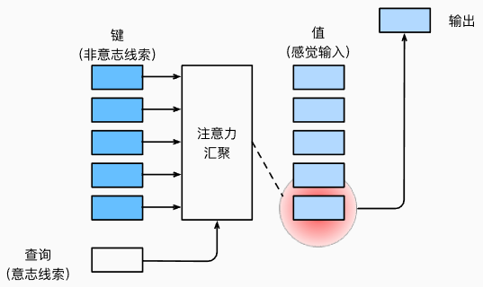

### 10.1.2注意力的可视化实验

- 实验环境

i7-12700H、RTX 3050Ti Laptop、python v3.9

- 实验代码

```python
import torch
from d2l import torch as d2l
import matplotlib.pyplot as plt

#@save
def show_heatmaps(matrices, xlabel, ylabel, titles=None, figsize=(2.5, 2.5),
                  cmap='Reds'):
    """显示矩阵热图"""
    d2l.use_svg_display()
    num_rows, num_cols = matrices.shape[0], matrices.shape[1]
    fig, axes = d2l.plt.subplots(num_rows, num_cols, figsize=figsize,
                                 sharex=True, sharey=True, squeeze=False)
    for i, (row_axes, row_matrices) in enumerate(zip(axes, matrices)):
        for j, (ax, matrix) in enumerate(zip(row_axes, row_matrices)):
            pcm = ax.imshow(matrix.detach().numpy(), cmap=cmap)
            if i == num_rows - 1:
                ax.set_xlabel(xlabel)
            if j == 0:
                ax.set_ylabel(ylabel)
            if titles:
                ax.set_title(titles[j])
    fig.colorbar(pcm, ax=axes, shrink=0.6);
    # 保存热力图
    d2l.plt.savefig('attention_heatmaps.png')

attention_weights = torch.eye(10).reshape((1, 1, 10, 10))
show_heatmaps(attention_weights, xlabel='Keys', ylabel='Queries')
```

- 实验结果

 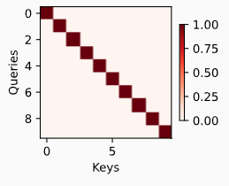

## 10.2注意力汇聚

### 10.2.1平均汇聚

平均汇聚是最简单的方案：
$$
f(x) = \frac{1}{n} \sum_{i=1}^{n} y_{i}
$$

### 10.2.2非参数注意力汇聚

更好的方案是60年代提出来的Nadaraya-Waston核回归，根据输入的位置对输出y~i~进行加权：
$$
f(x) = \sum_{i=1}^{n} \frac{K(x - x_i)}{\sum_{j=1}^{n} K(x - x_j)} y_i
$$
其中K为核kernel，从注意力机制框架的角度重写该公式，得到一个更通用的注意力汇聚公式：
$$
f(x) = \sum_{i=1}^{n} \alpha(x, x_i) y_i
$$
其中，x为查询，（x~i~，y~i~）是键值对。将查询x和键x~i~之间的关系建模为注意力权重α（x，x~i~），这个权重被分配给每一个对应值y~i~。对于任何查询，模型在所有键值对注意力权重都是有一个有效的概率分布，其为非负且总和为1。

高斯核的定义为：
$$
K(u) = \frac{1}{\sqrt{2\pi}} \exp\left(-\frac{u^2}{2}\right)
$$
将高斯核代入以上公式可以得到：
$$
\begin{align*}
f(x) &= \sum_{i=1}^{n} \alpha(x, x_i) y_i \\
     &= \sum_{i=1}^{n} \frac{\exp\left(-\frac{1}{2}(x - x_i)^2\right)}{\sum_{j=1}^{n} \exp\left(-\frac{1}{2}(x - x_j)^2\right)} y_i \\
     &= \sum_{i=1}^{n} \mathrm{softmax}\left(-\frac{1}{2}(x - x_i)^2\right) y_i
\end{align*}
$$
如果一个键xi越是接近给定的查询x， 那么分配给这个键对应值yi的注意力权重就会越大， 也就“获得了更多的注意力”。

### 10.2.3带参数的注意力汇聚

非参数的Nadaraya-Watson核回归具有一致性（consistency）的优点： 如果有足够的数据，此模型会收敛到最优结果。 尽管如此，还是可以轻松地将可学习的参数集成到注意力汇聚中。

在查询x和键x~i~之间的距离乘以可学习参数w：
$$
\begin{align*}
f(x) &= \sum_{i=1}^{n} \alpha(x, x_i) y_i \\
     &= \sum_{i=1}^{n} \frac{\exp\left(-\frac{1}{2}((x - x_i) w)^2\right)}{\sum_{j=1}^{n} \exp\left(-\frac{1}{2}((x - x_j) w)^2\right)} y_i \\
     &= \sum_{i=1}^{n} \mathrm{softmax}\left(-\frac{1}{2}((x - x_i) w)^2\right) y_i.
\end{align*}
$$

### 10.2.4注意力汇聚实验

- 实验环境

i7-12700H、RTX 3050Ti Laptop、python v3.9

- 实验代码

```python
import torch
from torch import nn
from d2l import torch as d2l

n_train = 50  # 训练样本数
x_train, _ = torch.sort(torch.rand(n_train) * 5)   # 排序后的训练样本

def f(x):
    return 2 * torch.sin(x) + x**0.8

y_train = f(x_train) + torch.normal(0.0, 0.5, (n_train,))  # 训练样本的输出
x_test = torch.arange(0, 5, 0.1)  # 测试样本
y_truth = f(x_test)  # 测试样本的真实输出
n_test = len(x_test)  # 测试样本数
print(n_test)

def plot_kernel_reg(y_hat):
    d2l.plot(x_test, [y_truth, y_hat], 'x', 'y', legend=['Truth', 'Pred'],
             xlim=[0, 5], ylim=[-1, 5])
    d2l.plt.plot(x_train, y_train, 'o', alpha=0.5);
    d2l.plt.savefig('kernel_regression.png')  # 保存第一张图

y_hat = torch.repeat_interleave(y_train.mean(), n_test)
plot_kernel_reg(y_hat)

# X_repeat的形状:(n_test,n_train),
# 每一行都包含着相同的测试输入（例如：同样的查询）
X_repeat = x_train.repeat_interleave(n_train).reshape((-1, n_train))
# x_train包含着键。attention_weights的形状：(n_test,n_train),
# 每一行都包含着要在给定的每个查询的值（y_train）之间分配的注意力权重
attention_weights = nn.functional.softmax(-(X_repeat - x_train)**2 / 2, dim=1)
# y_hat的每个元素都是值的加权平均值，其中的权重是注意力权重
y_hat = torch.matmul(attention_weights, y_train)
plot_kernel_reg(y_hat)
d2l.plt.savefig('kernel_regression_with_attention.png')  # 保存第二张图

d2l.show_heatmaps(attention_weights.unsqueeze(0).unsqueeze(0),
                  xlabel='Sorted training inputs',
                  ylabel='Sorted testing inputs')
d2l.plt.savefig('attention_heatmap.png')  # 保存注意力热图

X = torch.ones((2, 1, 4))
Y = torch.ones((2, 4, 6))
print(torch.bmm(X, Y).shape)

class NWKernelRegression(nn.Module):
    def __init__(self, **kwargs):
        super().__init__(**kwargs)
        self.w = nn.Parameter(torch.rand((1,), requires_grad=True))

    def forward(self, queries, keys, values):
        # queries和attention_weights的形状为(查询个数，“键－值”对对数)
        queries = queries.repeat_interleave(keys.shape[1]).reshape((-1, keys.shape[1]))
        self.attention_weights = nn.functional.softmax(
            -((queries - keys) * self.w)**2 / 2, dim=1)
        # values的形状为(查询个数，“键－值”对对数)
        return torch.bmm(self.attention_weights.unsqueeze(1),
                         values.unsqueeze(-1)).reshape(-1)

# X_tile的形状:(n_train，n_train)，每一行都包含着相同的训练输入
X_tile = x_train.repeat((n_train, 1))
# Y_tile的形状:(n_train，n_train)，每一行都包含着相同的训练输出
Y_tile = y_train.repeat((n_train, 1))
# keys的形状:('n_train'，'n_train'-1)
keys = X_tile[(1 - torch.eye(n_train)).type(torch.bool)].reshape((n_train, -1))
# values的形状:('n_train'，'n_train'-1)
values = Y_tile[(1 - torch.eye(n_train)).type(torch.bool)].reshape((n_train, -1))

net = NWKernelRegression()
loss = nn.MSELoss(reduction='none')  # 修正了这里的拼写错误
trainer = torch.optim.SGD(net.parameters(), lr=0.5)
animator = d2l.Animator(xlabel='epoch', ylabel='loss', xlim=[1, 5])

for epoch in range(5):
    trainer.zero_grad()
    l = loss(net(x_train, keys, values), y_train)
    l.sum().backward()
    trainer.step()
    print(f'epoch {epoch + 1}, loss {float(l.sum()):.6f}')
    animator.add(epoch + 1, float(l.sum()))

# keys的形状:(n_test，n_train)，每一行包含着相同的训练输入（例如，相同的键）
keys = x_train.repeat((n_test, 1))
# value的形状:(n_test，n_train)
values = y_train.repeat((n_test, 1))
y_hat = net(x_test, keys, values).unsqueeze(1).detach()
plot_kernel_reg(y_hat)
d2l.plt.savefig('final_kernel_regression.png')  # 保存最终的回归图

d2l.show_heatmaps(net.attention_weights.unsqueeze(0).unsqueeze(0),
                  xlabel='Sorted training inputs',
                  ylabel='Sorted testing inputs')
d2l.plt.savefig('final_attention_heatmap.png')  # 保存最终的注意力热图
```

- 实验结果

 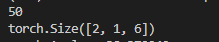

 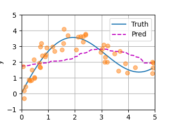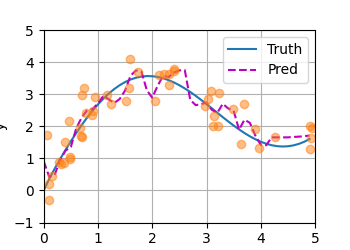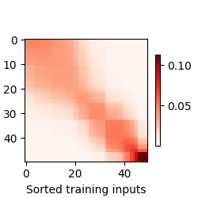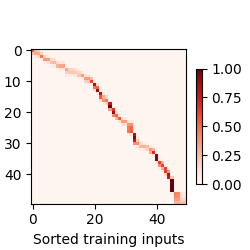

## 10.3注意力评分函数

回归高斯核：
$$
f(x) = \sum_{i} \alpha(x, x_i) y_i = \sum_{i=1}^{n} \text{softmax} \left( -\frac{1}{2} (x - x_i)^2 \right) y_i
$$
其中，-1/2（x-x~i~）为注意力分数，即计算相似度的值。x为查询query，x~i~为键key,（x-x~i~)^2^ 计算的是查询于每个键的距离。通过计算这种差异来衡量查询和键的“相似程度”，差异越小，相似度越高。这个值通常会被用来决定一个键对查询的相关性。

接着，注意力分数会经过softmax函数进行处理：
$$
\alpha(x, x_i) = \text{softmax} \left( -\frac{1}{2} (x - x_i)^2 \right)
$$
softmax 函数的作用是将这些分数转换为一个概率分布，确保它们的总和为 1。具体来说，softmax 会放大较高的分数，并缩小较低的分数。经过 softmax 处理后，得到的 α(x,x~i~)就是注意力权重，它表示每个 y~i~在最终计算结果中所占的权重。权重越大，表示该项对最终结果的贡献越大。

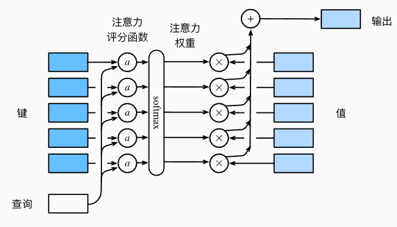

假设有一个查询q和m个键值对（k~1~，v~1~），…，(k~m~，v~m~)，注意力汇聚函数f为值的加权和：
$$
f(q, (k_1, v_1), \dots, (k_m, v_m)) = \sum_{i=1}^{m} \alpha(q, k_i) v_i, \quad v_i \in \mathbb{R}^v
$$
其中，查询q和键ki的注意力权重（标量）是通过注意力评分函数a将两个向量映射成标量，再经过softmax运算得到的：
$$
\alpha(q, k_i) = \text{softmax}(\alpha(q, k_i)) = \frac{\exp(\alpha(q, k_i))}{\sum_{j=1}^{m} \exp(\alpha(q, k_j))}, \quad \alpha(q, k_i) \in \mathbb{R}
$$

### 10.3.1加性注意力

当查询和键是不同长度的矢量时，可以使用加性注意力作为评分函数。给定查询q和键k，加性注意力的评分函数为：
$$
a(q, k) = w_v^\top \tanh(W_q q + W_k k) \in \mathbb{R}
$$
其中，W~q~、W~k~和w~v~为可学习参数。将查询和键连结起来后输入到一个多层感知机（MLP）中， 感知机包含一个隐藏层，其隐藏单元数是一个超参数h。 通过使用tanh作为激活函数，并且禁用偏置项。即将key和value合并起来放入一个隐藏层大小为h输出大小为1的单隐藏层MLP。

### 10.3.2缩放点积注意力

如果query和key的长度都相同，那么缩放点积注意力评分函数为：
$$
a(q, k) = \frac{q^\top k}{\sqrt{d}}
$$
向量化版本，查询和键长度为d，值的长度为v，查询为Q，键为K，值为V：
$$
\text{softmax}\left(\frac{QK^\top}{\sqrt{d}}\right) V \in \mathbb{R}^{n \times v}
$$
总结：

- 注意力分数是query和key的相似度，注意力权重是分数的softmax结果
- 两种常见的分数计算：
	- 将query和key合并起来进入一个单输出单隐藏层的MLP
	- 直接将query和key做内积

### 10.3.3实验报告

- 实验环境

i7-12700H、RTX 3050Ti Laptop、python v3.9

- 实验代码

```python
import math
import torch
from torch import nn
from d2l import torch as d2l
import matplotlib.pyplot as plt

#@save
def masked_softmax(X, valid_lens):
    """通过在最后一个轴上掩蔽元素来执行softmax操作"""
    # X:3D张量，valid_lens:1D或2D张量
    if valid_lens is None:
        return nn.functional.softmax(X, dim=-1)
    else:
        shape = X.shape
        if valid_lens.dim() == 1:
            valid_lens = torch.repeat_interleave(valid_lens, shape[1])
        else:
            valid_lens = valid_lens.reshape(-1)
        # 最后一轴上被掩蔽的元素使用一个非常大的负值替换，从而其softmax输出为0
        X = d2l.sequence_mask(X.reshape(-1, shape[-1]), valid_lens,
                              value=-1e6)
        return nn.functional.softmax(X.reshape(shape), dim=-1)

# 打印第一个masked_softmax调用的结果
result1 = masked_softmax(torch.rand(2, 2, 4), torch.tensor([2, 3]))
print("First masked_softmax result:")
print(result1)
print()

# 打印第二个masked_softmax调用的结果
result2 = masked_softmax(torch.rand(2, 2, 4), torch.tensor([[1, 3], [2, 4]]))
print("Second masked_softmax result:")
print(result2)
print()

#@save
class AdditiveAttention(nn.Module):
    """加性注意力"""
    def __init__(self, key_size, query_size, num_hiddens, dropout, **kwargs):
        super(AdditiveAttention, self).__init__(**kwargs)
        self.W_k = nn.Linear(key_size, num_hiddens, bias=False)
        self.W_q = nn.Linear(query_size, num_hiddens, bias=False)
        self.w_v = nn.Linear(num_hiddens, 1, bias=False)
        self.dropout = nn.Dropout(dropout)

    def forward(self, queries, keys, values, valid_lens):
        queries, keys = self.W_q(queries), self.W_k(keys)
        features = queries.unsqueeze(2) + keys.unsqueeze(1)
        features = torch.tanh(features)
        scores = self.w_v(features).squeeze(-1)
        self.attention_weights = masked_softmax(scores, valid_lens)
        return torch.bmm(self.dropout(self.attention_weights), values)
    
queries, keys = torch.normal(0, 1, (2, 1, 20)), torch.ones((2, 10, 2))
values = torch.arange(40, dtype=torch.float32).reshape(1, 10, 4).repeat(
    2, 1, 1)
valid_lens = torch.tensor([2, 6])

attention = AdditiveAttention(key_size=2, query_size=20, num_hiddens=8,
                              dropout=0.1)
attention.eval()
additive_attention_output = attention(queries, keys, values, valid_lens)
print("Additive attention output:")
print(additive_attention_output)
print()

# 显示并保存加性注意力的热力图
fig = d2l.show_heatmaps(attention.attention_weights.reshape((1, 1, 2, 10)),
                  xlabel='Keys', ylabel='Queries')
plt.savefig('additive_attention_heatmap.png', dpi=300, bbox_inches='tight')
plt.close()

#@save
class DotProductAttention(nn.Module):
    """缩放点积注意力"""
    def __init__(self, dropout, **kwargs):
        super(DotProductAttention, self).__init__(**kwargs)
        self.dropout = nn.Dropout(dropout)

    def forward(self, queries, keys, values, valid_lens=None):
        d = queries.shape[-1]
        scores = torch.bmm(queries, keys.transpose(1,2)) / math.sqrt(d)
        self.attention_weights = masked_softmax(scores, valid_lens)
        return torch.bmm(self.dropout(self.attention_weights), values)
    
queries = torch.normal(0, 1, (2, 1, 2))
attention = DotProductAttention(dropout=0.5)
attention.eval()
dot_product_attention_output = attention(queries, keys, values, valid_lens)
print("Dot product attention output:")
print(dot_product_attention_output)
print()

# 显示并保存点积注意力的热力图
fig = d2l.show_heatmaps(attention.attention_weights.reshape((1, 1, 2, 10)),
                  xlabel='Keys', ylabel='Queries')
plt.savefig('dot_product_attention_heatmap.png', dpi=300, bbox_inches='tight')
plt.close()
```

- 实验结果

 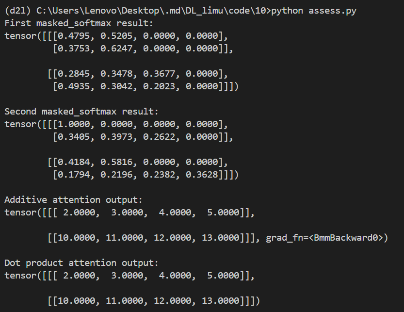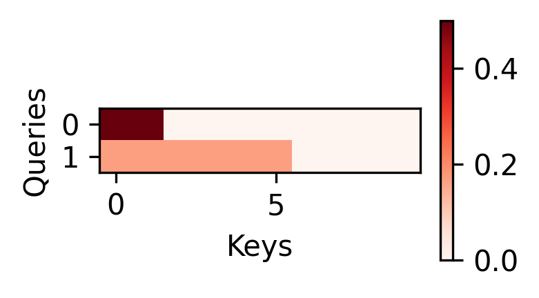

## 10.4 Bahdanau注意力

### 10.4.1模型

在传统的序列到序列模型中，编码器会将整个输入序列压缩成一个固定长度的上下文向量，然后解码器基于这个固定的上下文向量生成输出。这种做法在处理较长输入序列时会遇到问题，因为信息会在传递过程中丢失，导致模型难以记住输入序列的所有重要信息。

Bahdanau注意力机制的核心思想是让解码器在生成每个输出的同时，能够“聚焦”在输入序列的不同部分。它通过引入一个注意力权重机制，使得模型在生成每个输出时，可以根据当前输入的不同部分分配不同的权重。

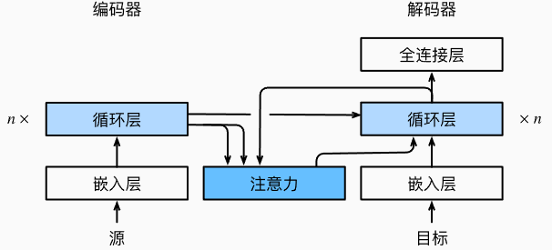
$$
c_t' = \sum_{t=1}^{T} \alpha(s_{t-1}, h_t) h_t
$$

其中上下文变量c在任何时间步t′都会被c~t′~替换，假设输入序列中有T个词元， 解码时间步t′的上下文变量是注意力集中的输出。时间步t′−1时的解码器隐状态s~t′−1~是查询， 编码器隐状态h~t~既是键也是值。

### 10.4.2实验报告

- 实验环境

i7-12700H、RTX 3050Ti Laptop、python v3.9

- 实验代码

```python
import torch
from torch import nn
from d2l import torch as d2l

#@save
class AttentionDecoder(d2l.Decoder):
    """带有注意力机制解码器的基本接口"""
    def __init__(self, **kwargs):
        super(AttentionDecoder, self).__init__(**kwargs)

    @property
    def attention_weights(self):
        raise NotImplementedError
    
class Seq2SeqAttentionDecoder(AttentionDecoder):
    def __init__(self, vocab_size, embed_size, num_hiddens, num_layers,
                 dropout=0, **kwargs):
        super(Seq2SeqAttentionDecoder, self).__init__(**kwargs)
        self.attention = d2l.AdditiveAttention(
            num_hiddens, num_hiddens, num_hiddens, dropout)
        self.embedding = nn.Embedding(vocab_size, embed_size)
        self.rnn = nn.GRU(
            embed_size + num_hiddens, num_hiddens, num_layers,
            dropout=dropout)
        self.dense = nn.Linear(num_hiddens, vocab_size)

    def init_state(self, enc_outputs, enc_valid_lens, *args):
        # outputs的形状为(batch_size，num_steps，num_hiddens).
        # hidden_state的形状为(num_layers，batch_size，num_hiddens)
        outputs, hidden_state = enc_outputs
        return (outputs.permute(1, 0, 2), hidden_state, enc_valid_lens)

    def forward(self, X, state):
        # enc_outputs的形状为(batch_size,num_steps,num_hiddens).
        # hidden_state的形状为(num_layers,batch_size,
        # num_hiddens)
        enc_outputs, hidden_state, enc_valid_lens = state
        # 输出X的形状为(num_steps,batch_size,embed_size)
        X = self.embedding(X).permute(1, 0, 2)
        outputs, self._attention_weights = [], []
        for x in X:
            # query的形状为(batch_size,1,num_hiddens)
            query = torch.unsqueeze(hidden_state[-1], dim=1)
            # context的形状为(batch_size,1,num_hiddens)
            context = self.attention(
                query, enc_outputs, enc_outputs, enc_valid_lens)
            # 在特征维度上连结
            x = torch.cat((context, torch.unsqueeze(x, dim=1)), dim=-1)
            # 将x变形为(1,batch_size,embed_size+num_hiddens)
            out, hidden_state = self.rnn(x.permute(1, 0, 2), hidden_state)
            outputs.append(out)
            self._attention_weights.append(self.attention.attention_weights)
        # 全连接层变换后，outputs的形状为
        # (num_steps,batch_size,vocab_size)
        outputs = self.dense(torch.cat(outputs, dim=0))
        return outputs.permute(1, 0, 2), [enc_outputs, hidden_state,
                                          enc_valid_lens]

    @property
    def attention_weights(self):
        return self._attention_weights
    
encoder = d2l.Seq2SeqEncoder(vocab_size=10, embed_size=8, num_hiddens=16,
                             num_layers=2)
encoder.eval()
decoder = Seq2SeqAttentionDecoder(vocab_size=10, embed_size=8, num_hiddens=16,
                                  num_layers=2)
decoder.eval()
X = torch.zeros((4, 7), dtype=torch.long)  # (batch_size,num_steps)
state = decoder.init_state(encoder(X), None)
output, state = decoder(X, state)
print(output.shape, len(state), state[0].shape, len(state[1]), state[1][0].shape)

embed_size, num_hiddens, num_layers, dropout = 32, 32, 2, 0.1
batch_size, num_steps = 64, 10
lr, num_epochs, device = 0.005, 250, d2l.try_gpu()

train_iter, src_vocab, tgt_vocab = d2l.load_data_nmt(batch_size, num_steps)
encoder = d2l.Seq2SeqEncoder(
    len(src_vocab), embed_size, num_hiddens, num_layers, dropout)
decoder = Seq2SeqAttentionDecoder(
    len(tgt_vocab), embed_size, num_hiddens, num_layers, dropout)
net = d2l.EncoderDecoder(encoder, decoder)
d2l.train_seq2seq(net, train_iter, lr, num_epochs, tgt_vocab, device)

engs = ['go .', "i lost .", 'he\'s calm .', 'i\'m home .']
fras = ['va !', 'j\'ai perdu .', 'il est calme .', 'je suis chez moi .']
for eng, fra in zip(engs, fras):
    translation, dec_attention_weight_seq = d2l.predict_seq2seq(
        net, eng, src_vocab, tgt_vocab, num_steps, device, True)
    print(f'{eng} => {translation}, ',
          f'bleu {d2l.bleu(translation, fra, k=2):.3f}')

attention_weights = torch.cat([step[0][0][0] for step in dec_attention_weight_seq], 0).reshape((
    1, 1, -1, num_steps))

# 加上一个包含序列结束词元
d2l.show_heatmaps(
    attention_weights[:, :, :, :len(engs[-1].split()) + 1].cpu(),
    xlabel='Key positions', ylabel='Query positions')
```

- 实验结果

 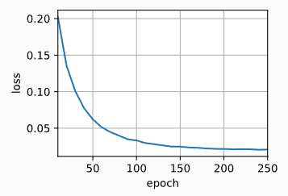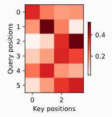

## 10.5多头注意力

多头注意力的基本思想是通过多个注意力头并行工作，每个头学习不同的表示，从而使模型能够关注输入数据的不同子空间。每个头对输入数据进行独立的注意力计算，捕捉到不同的信息，然后将这些信息合并起来，以得到更加丰富的表示。

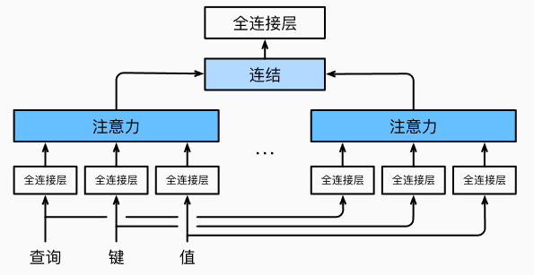

### 10.5.1模型

给定查询q、键k、值v，每个注意力头h~i~的计算方法为：
$$
h_i = f(W_i^{(q)} q, W_i^{(k)} k, W_i^{(v)} v) \in \mathbb{R}^{p_v}
$$
其中，可学习的参数包括W~i~^(q)^，W~i~^(k)^，W~i~^(v)^，以及代表注意力汇聚的函数f。多头注意力的输出需要经过另一个线性转换，其对应着h个头连结后的结果，因此其可学习参数为W~o~：
$$
\left[ \begin{array}{c}
| h_1 | \\
\vdots \\
| h_h |
\end{array} \right] W_o \in \mathbb{R}^{p_o}.
$$
基于这种设计，每个头都可能会关注输入的不同部分， 可以表示比简单加权平均值更复杂的函数。

### 10.5.2实验报告

- 实验环境

i7-12700H、RTX 3050Ti Laptop、python v3.9

- 实验代码

```python
import math
import torch
from torch import nn
from d2l import torch as d2l

#@save
class MultiHeadAttention(nn.Module):
    """多头注意力"""
    def __init__(self, key_size, query_size, value_size, num_hiddens,
                 num_heads, dropout, bias=False, **kwargs):
        super(MultiHeadAttention, self).__init__(**kwargs)
        self.num_heads = num_heads
        self.attention = d2l.DotProductAttention(dropout)
        self.W_q = nn.Linear(query_size, num_hiddens, bias=bias)
        self.W_k = nn.Linear(key_size, num_hiddens, bias=bias)
        self.W_v = nn.Linear(value_size, num_hiddens, bias=bias)
        self.W_o = nn.Linear(num_hiddens, num_hiddens, bias=bias)

    def forward(self, queries, keys, values, valid_lens):
        # queries，keys，values的形状:
        # (batch_size，查询或者“键－值”对的个数，num_hiddens)
        # valid_lens　的形状:
        # (batch_size，)或(batch_size，查询的个数)
        # 经过变换后，输出的queries，keys，values　的形状:
        # (batch_size*num_heads，查询或者“键－值”对的个数，
        # num_hiddens/num_heads)
        queries = transpose_qkv(self.W_q(queries), self.num_heads)
        keys = transpose_qkv(self.W_k(keys), self.num_heads)
        values = transpose_qkv(self.W_v(values), self.num_heads)

        if valid_lens is not None:
            # 在轴0，将第一项（标量或者矢量）复制num_heads次，
            # 然后如此复制第二项，然后诸如此类。
            valid_lens = torch.repeat_interleave(
                valid_lens, repeats=self.num_heads, dim=0)

        # output的形状:(batch_size*num_heads，查询的个数，
        # num_hiddens/num_heads)
        output = self.attention(queries, keys, values, valid_lens)

        # output_concat的形状:(batch_size，查询的个数，num_hiddens)
        output_concat = transpose_output(output, self.num_heads)
        return self.W_o(output_concat)
    
    #@save
def transpose_qkv(X, num_heads):
    """为了多注意力头的并行计算而变换形状"""
    # 输入X的形状:(batch_size，查询或者“键－值”对的个数，num_hiddens)
    # 输出X的形状:(batch_size，查询或者“键－值”对的个数，num_heads，
    # num_hiddens/num_heads)
    X = X.reshape(X.shape[0], X.shape[1], num_heads, -1)

    # 输出X的形状:(batch_size，num_heads，查询或者“键－值”对的个数,
    # num_hiddens/num_heads)
    X = X.permute(0, 2, 1, 3)

    # 最终输出的形状:(batch_size*num_heads,查询或者“键－值”对的个数,
    # num_hiddens/num_heads)
    return X.reshape(-1, X.shape[2], X.shape[3])


#@save
def transpose_output(X, num_heads):
    """逆转transpose_qkv函数的操作"""
    X = X.reshape(-1, num_heads, X.shape[1], X.shape[2])
    X = X.permute(0, 2, 1, 3)
    return X.reshape(X.shape[0], X.shape[1], -1)

num_hiddens, num_heads = 100, 5
attention = MultiHeadAttention(num_hiddens, num_hiddens, num_hiddens,
                               num_hiddens, num_heads, 0.5)
print(attention.eval())

batch_size, num_queries = 2, 4
num_kvpairs, valid_lens =  6, torch.tensor([3, 2])
X = torch.ones((batch_size, num_queries, num_hiddens))
Y = torch.ones((batch_size, num_kvpairs, num_hiddens))
print(attention(X, Y, Y, valid_lens).shape) # (2, 4, 100)   
```

- 实验结果

 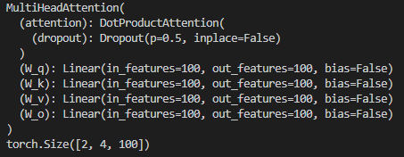

## 10.6自注意力和位置编码

### 10.6.1自注意力

自注意力是一种让神经网络在处理序列数据时，每个元素能够“关注”序列中其他所有元素的机制。它通过计算序列中各个元素之间的关系，调整每个元素的表示，从而捕捉序列中不同部分之间的相互依赖关系。

给定一个由词元组成的输入序列x~1~,…,x~n~， 其中任意x~i~∈R^d^（1≤i≤n）。 该序列的自注意力输出为一个长度相同的序列 y~1~,…,y~n~，其中：
$$
y_i = f\left( x_i, (x_1, x_2), \dots, (x_n, x_n) \right) \in \mathbb{R}^d
$$

### 10.6.2比较

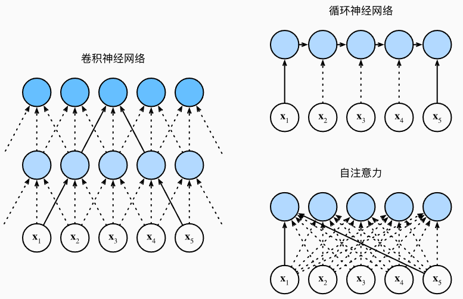

- 对于一个卷积核大小为k的卷积核，长度序列为n，输入和输出的通道数量为d，则卷积层的计算复杂度为O(knd^2^)。由于CNN是分层的，有O(1)个顺序操作，最大路径长度为O(n/k)
- 对于RNN更新其隐状态时， d×d权重矩阵和d维隐状态的乘法计算复杂度为O(d^2^)，长度序列为n，其计算复杂度为O(nd^2^)，有O(n)个顺序操作无法并行化，最大路径长度为O(n)。
- 在自注意力中，查询、键和值都是n×d矩阵。其中n×d矩阵乘以d×n矩阵。，之后输出的n×n矩阵乘以n×d矩阵。 因此，自注意力具有O(n^2^d)计算复杂性。 每个词元都通过自注意力直接连接到任何其他词元，有O(1)个顺序操作可以并行计算， 最大路径长度为O(1)。

### 10.6.3位置编码

在处理词元序列时，CNN是逐个重复处理词元的，而自注意力由于并行计算放弃了顺序操作。为了获得序列的顺序信息，通过在输入表示中添加位置编码来注入绝对或相对的位置信息，位置编码可以通过学习得到也可以直接固定得到。

假设输入表示X包含一个序列中n个词元的d维嵌入表示。位置编码使用相同形状的位置嵌入矩阵 P输出X+P， 矩阵第i行、第2j列和2j+1列上的元素为：
$$
p_{i,2j} = \sin\left( \frac{i}{10000^{2j/d}} \right), \\
p_{i,2j+1} = \cos\left( \frac{i}{10000^{2j/d}} \right).
$$

### 10.6.4实验报告

- 实验环境

i7-12700H、RTX 3050Ti Laptop、python v3.9

- 实验代码

```python
import math
import torch
from torch import nn
from d2l import torch as d2l

num_hiddens, num_heads = 100, 5
attention = d2l.MultiHeadAttention(num_hiddens, num_hiddens, num_hiddens,
                                   num_hiddens, num_heads, 0.5)
print(attention.eval())

batch_size, num_queries, valid_lens = 2, 4, torch.tensor([3, 2])
X = torch.ones((batch_size, num_queries, num_hiddens))
print(attention(X, X, X, valid_lens).shape)

#@save
class PositionalEncoding(nn.Module):
    """位置编码"""
    def __init__(self, num_hiddens, dropout, max_len=1000):
        super(PositionalEncoding, self).__init__()
        self.dropout = nn.Dropout(dropout)
        # 创建一个足够长的P
        self.P = torch.zeros((1, max_len, num_hiddens))
        X = torch.arange(max_len, dtype=torch.float32).reshape(
            -1, 1) / torch.pow(10000, torch.arange(
            0, num_hiddens, 2, dtype=torch.float32) / num_hiddens)
        self.P[:, :, 0::2] = torch.sin(X)
        self.P[:, :, 1::2] = torch.cos(X)

    def forward(self, X):
        X = X + self.P[:, :X.shape[1], :].to(X.device)
        return self.dropout(X)
    
encoding_dim, num_steps = 32, 60
pos_encoding = PositionalEncoding(encoding_dim, 0)
pos_encoding.eval()
X = pos_encoding(torch.zeros((1, num_steps, encoding_dim)))
P = pos_encoding.P[:, :X.shape[1], :]
d2l.plot(torch.arange(num_steps), P[0, :, 6:10].T, xlabel='Row (position)',
         figsize=(6, 2.5), legend=["Col %d" % d for d in torch.arange(6, 10)])

for i in range(8):
    print(f'{i}的二进制是：{i:>03b}')

P = P[0, :, :].unsqueeze(0).unsqueeze(0)
d2l.show_heatmaps(P, xlabel='Column (encoding dimension)',
                  ylabel='Row (position)', figsize=(3.5, 4), cmap='Blues')
```

- 实验结果

 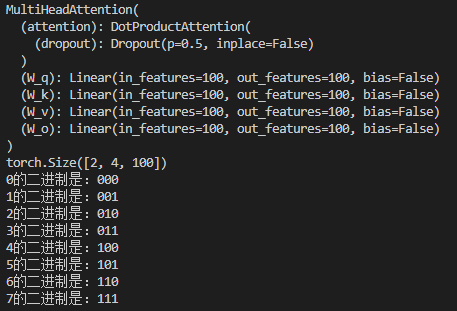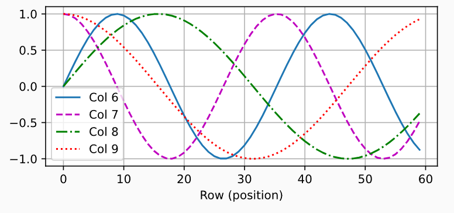

 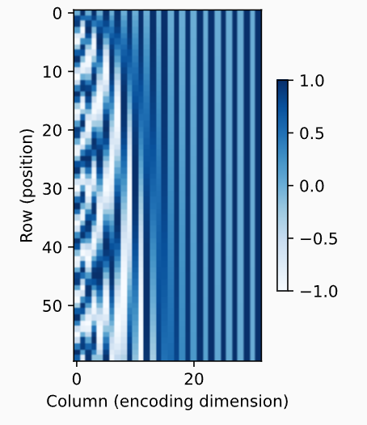

## 10.7 Transformer

### 10.7.1模型架构

transformer由编码器和解码器组成，该编码器和解码器基于自注意力的模块叠加而成，源（输入）序列和目标（输出）序列的嵌入表示将加上位置编码，再分别输入到编码器和解码器中。

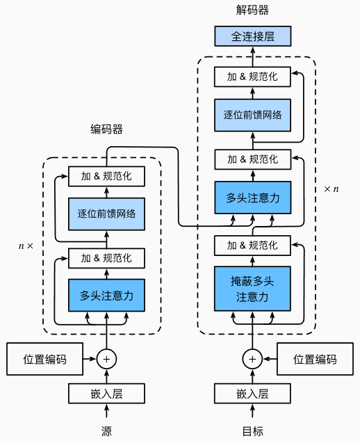

transformer基本组件：

1. 输入嵌入层
	- 输入的每个单词或标记通过嵌入（Embedding）转换成一个向量表示，这个表示将作为后续模型的输入。
2. 位置编码
	- transformer使用位置编码来捕捉序列中单词的顺序。位置编码是一个与输入嵌入向量相加的向量，帮助模型了解词汇在序列中的位置。
3. 自注意力机制
	- 自注意力机制允许模型在处理一个输入时关注该输入中的其他部分。具体地，对于输入序列中的每个词，模型计算该词与序列中其他词的关系，然后加权求和生成输出。
4. 多头注意力机制
	- Transformer使用多头注意力机制，即并行计算多个自注意力层，并将其结果拼接在一起，形成最终的输出。
5. 前馈神经网络
	- 每个自注意力层后面接着一个全连接的前馈神经网络，该网络通常由两个线性层和一个ReLU激活函数组成。
6. 层归一化
	- 在每一层的输入和输出之间都会进行层归一化，以提高训练稳定性。
7. 残差连接
	- 每个子层（如自注意力层和前馈神经网络层）都包含残差连接，意味着输入会直接加到输出上，帮助缓解深层网络训练中的梯度消失问题。
8. 编码器-解码器结构
	- 编码器：负责处理输入序列并生成一组上下文相关的表示。Transformer的编码器由多个相同的层组成，每层包括自注意力机制和前馈神经网络。
	- 解码器：解码器利用编码器生成的表示来生成目标序列。解码器的每一层也包括自注意力机制、编码器-解码器注意力（用于关注编码器的输出）和前馈神经网络。
9. 输出层
	- 在解码器的最后一层，模型通过softmax层生成输出序列的概率分布。

### 10.7.2 Transformer实验报告

- 实验环境

i7-12700H、RTX 3050Ti Laptop、python v3.9

- 实验代码

见transformer.py

- 实验结果

 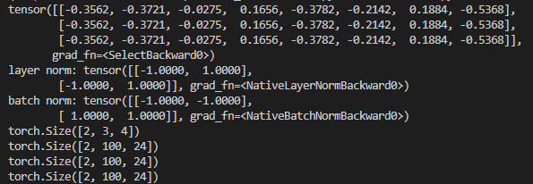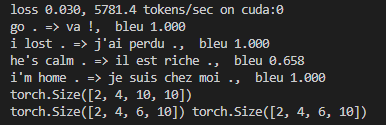

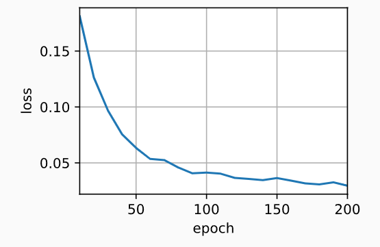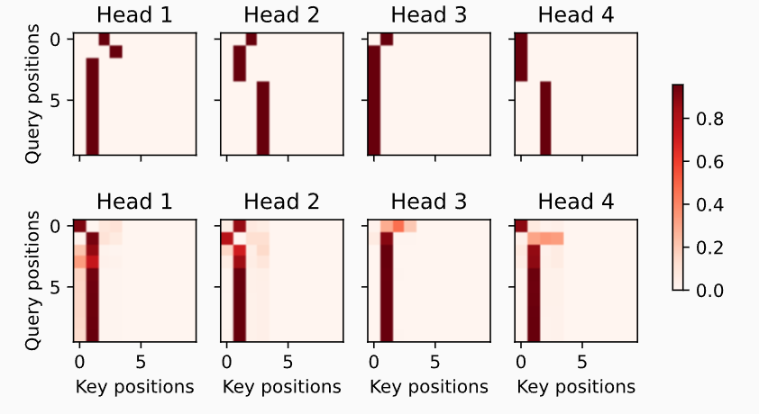

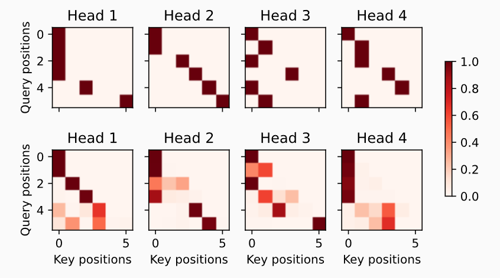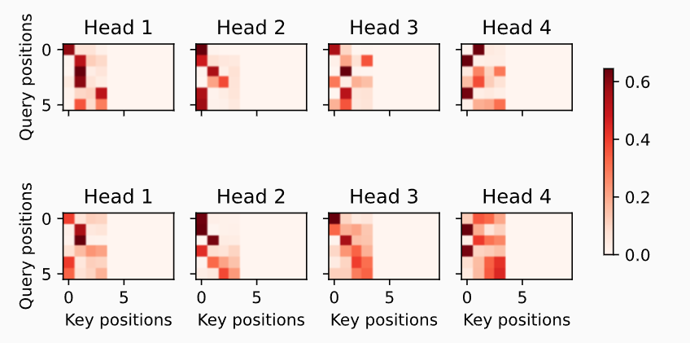