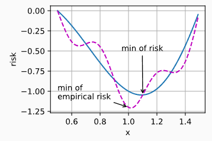
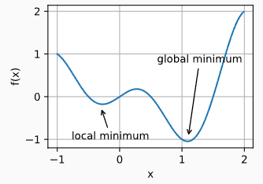
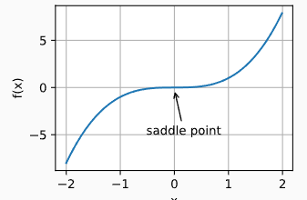
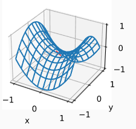
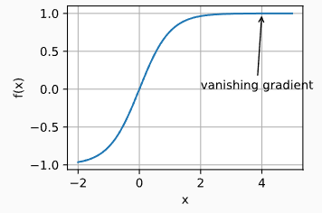
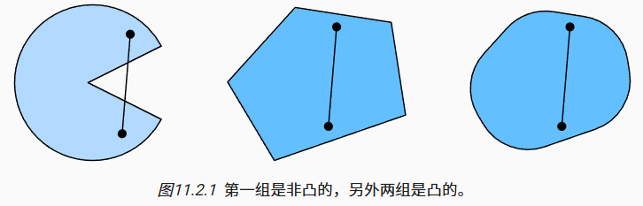
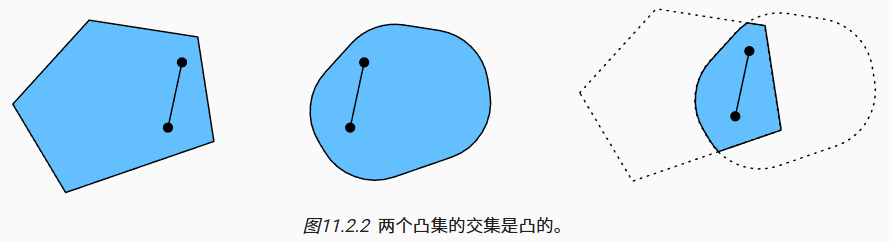
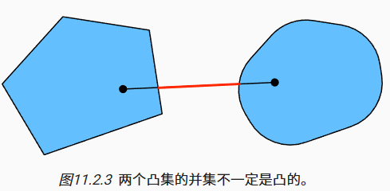
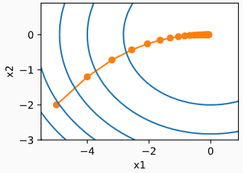

# 11优化算法

## 11.1优化和深度学习

对于深度学习问题，通常会先定义损失函数。一旦有了损失函数，就可以使用优化算法来尝试最小化损失。在优化中，损失函数通常被称为优化问题的目标函数。按照传统惯例，大多数优化算法都关注的是最小化。

### 11.1.1优化目标

优化和深度学习的目标是根本不同的。前者主要关注的是最小化目标，后者则关注在给定有限数据量的情况下寻找合适的模型。训练误差和泛化误差通常不同：由于优化算法的目标函数通常是基于训练数据集的损失函数，因此优化的目标是减少训练误差。但深度学习的目标是减少泛化误差。

- 经验风险：训练数据集的平均损失，即基于训练数据集计算的风险，其通过对训练数据集上的每个样本进行评估来近似真实的风险，可以看作是对真实风险的估计。
- 风险：整个数据群的预期损失，具体来说，是模型在实际应用中可能出现的误差，通常表现为期望损失。其是通过对所有可能的输入数据进行平均，计算模型的预测误差。

### 11.1.2深度学习中的优化挑战

1. **局部最小值**

	对于任何目标函数f(x)，如果在x处对应的f(x)值小于在x附近任意其他点的f(x)值，那么f(x)可能是局部最小值。如果f(x)在x处的值是整个域中目标函数的最小值，那么f(x)是全局最小值。

	

	使用迭代优化算法来求解，一般只能保证找到局部最小值。

2. **鞍点**

	除了局部最小值之外，鞍点是梯度消失的另一个原因。鞍点是指函数的所有梯度都消失但既不是全局最小值也不是局部最小值的任何位置。考虑这个函数f(x)=x^3^。它的一阶和二阶导数在x=0时消失。这时优化可能会停止，尽管它不是最小值。

	

	对于函数f(x,y)=x^2^−y^2^。其鞍点为(0,0)。这是关于y的最大值，也是关于x的最小值。

	

	假设函数的输入是k维向量，其输出是标量，因此其Hessian矩阵（黑塞矩阵）将有k个特征值，函数的解可能是局部最小值、局部最大值或函数梯度为零位置处的鞍点：

	- 当Hessian矩阵的特征值全部为正时，这意味着该函数在该点有局部最小值，因为正特征值意味着该点是一个凸点，即函数在该点的曲率是向上的。

	- 当Hessian矩阵的特征值全部为负时，函数在该点有局部最大值，因为负特征值表示该点是一个凹点，即函数在该点的曲率是向下的。
	
	- 当Hessian矩阵的特征值有正有负时，函数在该点有鞍点，即函数在某些方向上是凸的，在其他方向上则是凹的。
	
		对于高维度问题，部分特征值为负的可能性相当高，因此鞍点比局部最小值更有可能出现。

3. 梯度消失

	深度学习中遇到的最隐蔽的问题可能是梯度消失，假设要最小化函数f(x)=tanh⁡(x)，从x=4开始，f的梯度接近零。即f′(x)=1−tanh^2^⁡(x)，f′(4)=0.0013。因此，在取得进展之前，优化将会停滞很长一段时间。

	

## 11.2凸性

### 11.2.1定义

1. **凸集**

	凸集是凸性的基础。 简单地说，如果对于任何a,b∈X，连接a和b的线段也位于X中，则向量空间中的一个集合X是凸的。 在数学术语上，这意味着对于所有λ∈[0,1]，可以得到：
	$$
	\lambda a + (1 - \lambda) b \in \mathcal{X} \iff a, b \in \mathcal{X}.
	$$
	

	假设X和Y是凸集，那么X∩Y也是凸集的。 现在考虑任意a,b∈X∩Y， 因为X和Y是凸集， 所以连接a和b的线段包含在X和Y中。 因此其也需要包含在X∩Y中。

	

	给定凸集X~i~，其交集∩~i~X~i~是凸的。 但是反之是不正确的，考虑两个不相交的集合X∩Y=∅， 取a∈X和b∈Y。 因为假设X∩Y=∅， 连接a和b的线段需要包含一部分既不在X也不在Y中。 因此线段也不在X∪Y中，因此证明了凸集的并集不一定是凸的，即非凸的。

	

	通常，深度学习中的问题是在凸集上定义的。 例如R^d^，即实数的d-维向量的集合是凸集（毕竟R^d^中任意两点之间的线存在R^d^）中。

2. **凸函数**
	给定一个凸集X，如果对于所有x,x′∈X和所有λ∈[0,1]，函数f：X→R是凸的，可以得到：
	$$
	\lambda f(x) + (1 - \lambda) f(x') \geq f(\lambda x + (1 - \lambda) x')
	$$
	余弦函数为非凸的，而抛物线函数和指数函数为凸的。

3. **詹森不等式**
	给定一个凸函数f，最有用的数学工具之一就是詹森不等式。 其为凸性定义的一种推广：
	$$
	\sum_i \alpha_i f(x_i) \geq f \left( \sum_i \alpha_i x_i \right) \quad \text{and} \quad E_X[f(X)] \geq f(E_X[X])
	$$
	詹森不等式的一个常见应用：用一个较简单的表达式约束一个较复杂的表达式。

### 11.2.2性质

- 凸函数的局部极小值也是全局极小值。
- 凸函数的下水平集是凸的

## 11.3梯度下降

梯度下降是最简单的迭代求解算法，选取开始点x~0~，对t=1，…，T，更新规则为：
$$
x_t = x_{t-1} - \eta \nabla f(x_{t-1})
$$
其中η为学习率，∇f(xt−1)为梯度，即损失函数 f(x)对当前参数 x~t−1~的偏导数，梯度表示损失函数在该点的最陡上升方向。

## 11.4随机梯度下降

传统梯度下降（Batch Gradient Descent） 在每次迭代时使用所有训练数据来计算梯度，并进行参数更新。虽然这种方法收敛稳定，但在大数据集上计算成本较高，且内存占用大。

**随机梯度下降（SGD）** 只使用一个样本来计算梯度并更新参数，这使得每次更新的计算量较小，适合处理大规模数据集。然而，由于每次更新依赖于单一数据点，更新过程会更为“噪声”化，并且不如批量梯度下降稳定。

SGD 的更新规则与梯度下降相似，但它使用每个样本计算梯度。具体更新公式为：
$$
x_t = x_{t-1} - \eta \nabla f(x_{t-1}^{(i)})
$$
其中x~t~ 是在第 t 次迭代时更新后的参数值，x~t−1~是前一次迭代的参数值，η 是学习率，∇f(x^(i)^ ~t−1~) 是损失函数在样本x^(i)^ ~t−1~上的梯度。

- 优点：计算速度快、占用内存少、更容易逃脱局部最小值
- 缺点：不稳定、收敛速度慢

## 11.5小批量随机梯度下降

计算单样本的梯度难以完全利用硬件资源，小批量随机梯度下降在时间t采样一个随机子集I~t~∈{1，…，n}，使得|I~t~|=b，
$$
x_t = x_{t-1} - \frac{\eta_t}{b} \sum_{i \in I_t} \nabla \ell_i(x_{t-1})
$$
其中，x~t~表示在第 t次迭代时的参数值，x~t−1~表示在第t−1 次迭代时的参数值，η~t~表示在第t次迭代的学习率，可以随着迭代步骤变化，进行动态调整，b表示小批量的大小，即每次迭代使用的样本数量。∑~i∈It~∇ℓ~i~(x~t−1~)表示对小批量中的所有样本i（这些样本的索引集合为 I~t~）的梯度求和。每个ℓ~i~(x~t−1~)是第i个样本的损失函数，∇ℓ~i~(x~t−1~)是该样本的梯度。

## 11.6动量法

动量法（Momentum Method）的核心思想是通过引入“动量”来加速梯度下降过程，同时减少梯度下降过程中的震荡，使得优化更加平稳、有效。

**梯度计算**：
$$
g_t = \frac{1}{b} \sum_{i \in I_t} \nabla \ell_i(x_{t-1})
$$
g~t~表示当前时刻t的梯度，该梯度基于时刻 t−1的参数 x~t−1~计算的。 b为批量大小，I~t~是当前时刻用于计算梯度的样本集合的索引。

**动量更新公式**：
$$
v_t = \beta v_{t-1} + g_t
$$
v~t~表示当前时刻t的动量。β为动量系数，通常设置在 0≤β≤10，一般值为0.9 或 0.99。v~t−1~表示上一次时刻的动量。

动量公式的核心思想是“惯性”，即当前的动量不仅依赖于当前梯度 g~t~，还依赖于上一步的动量 v~t−1~，这有助于加速梯度下降并避免震荡。

**参数更新公式**：
$$
w_t = w_{t-1} - \eta v_t
$$
w~t~表示当前时刻t的模型参数（如权重）。η为学习率，控制每次参数更新的步长。w~t−1~表示上一次时刻的模型参数。

**梯度平滑公式（动量累计公式）：**
$$
v_t = g_t + \beta g_{t-1} + \beta^2 g_{t-2} + \beta^3 g_{t-3} + \dots
$$
每次更新的动量v~t~不仅仅是当前梯度 g~t~，而是通过累积和加权过去几步的梯度，这有助于加速收敛并使梯度下降过程更稳定。β为折扣因子，其决定历史梯度对当前更新的影响。较大的 β值意味着历史梯度对当前更新的影响更大。

## 11.7AdaGrad算法

AdaGrad的核心思想是为每个参数分配一个不同的学习率，并随着训练过程的进行，逐步减小那些出现过大的梯度的参数的学习率。通过这种方式，AdaGrad可以在训练时对稀疏特征进行更大的更新，对频繁出现的特征进行较小的更新，从而使得优化过程更加高效。

**梯度平方和：**
$$
G_{t} = G_{t-1} + \nabla \ell(x_t)^2
$$
其中，G~t~是时刻t所有历史梯度的平方和，∇ℓ(x~t~)是损失函数对参数的梯度。每个参数的梯度平方会累积在G~t~中，从而使得每个参数的学习率自适应调整。

**学习率的调整：**
$$
\theta_t = \theta_{t-1} - \frac{\eta}{\sqrt{G_t + \epsilon}} \nabla \ell(x_t)
$$
θ~t~ 为当前时刻模型的参数。η为初始学习率（通常是一个小的常数）。G~t~为历史梯度的平方和。ϵ为一个非常小的常数（通常为 10^−8^）用来避免除以零的情况。∇ℓ(x~t~)为当前时刻的梯度。

## 11.8RMSProp算法

RMSProp 是一种改进的梯度下降优化算法，其解决了 AdaGrad 算法在长时间训练后学习率急剧衰减的问题。RMSProp 通过对梯度平方的指数加权平均来调整每个参数的学习率，从而使得学习率的衰减更加平稳，避免了 AdaGrad 的学习率过早下降的问题。

**梯度平方的指数加权平均：**
$$
v_t = \beta v_{t-1} + (1 - \beta) \nabla J(\theta_t)^2
$$
其中，v~t~ 为时刻t的梯度平方的指数加权平均，具有记忆效果。相对于 AdaGrad 的累加所有梯度平方，RMSProp 会考虑较近的梯度平方，避免了过早衰减。β为指数衰减因子，通常取值为0.9 或 0.99。∇J(θ~t~) 是损失函数关于参数θ~t~的梯度。

**参数更新公式：**
$$
\theta_{t} = \theta_{t-1} - \frac{\eta}{\sqrt{v_{t-1} + \epsilon}} \nabla J(\theta_{t-1})
$$
其中，θ~t~ 是时刻t的参数（例如神经网络的权重）。η 是学习率（或称步长）。v~t~是梯度平方的指数加权平均。ϵ 是一个小常数（如 10^−8^），防止除零错误。

## 11.9Adadelta算法

Adadelta是一种自适应学习率优化算法，是对 AdaGrad的改进。它通过调整学习率来避免 AdaGrad 中学习率过早衰减的问题。Adadelta 不再维护所有过去的梯度平方的累积，而是使用一个指数加权移动平均来计算梯度的平方，从而使得算法在长期训练中能够保持较为稳定的学习率。

**梯度平方的指数加权平均：**
$$
E[\nabla \theta^2]_t = \beta E[\nabla \theta^2]_{t-1} + (1 - \beta) \nabla J(\theta_t)^2
$$
**更新方向的指数加权平均：**
$$
E[\Delta \theta^2]_t = \beta E[\Delta \theta^2]_{t-1} + (1 - \beta) \Delta \theta_t^2
$$
**参数更新公式：**
$$
\Delta \theta_t = - \frac{\sqrt{E[\Delta \theta^2]_{t-1} + \epsilon}}{\sqrt{E[\nabla \theta^2]_t + \epsilon}} \nabla J(\theta_t)
$$
**更新参数：**
$$
\theta_{t} = \theta_{t-1} + \Delta \theta_{t-1}
$$

## 11.10Adam算法

Adam（ 是一种广泛应用的优化算法，它结合了动量法和 RMSProp的优点。其使用梯度的一阶矩（均值）和二阶矩（方差）来动态调整每个参数的学习率。该算法的主要优点是能够快速收敛且适应不同的数据集。

Adam 算法通过计算梯度的一阶矩和二阶矩的指数加权平均来调整学习率，并引入了偏差校正机制来确保在算法初期能够保持正确的估计。

**1.一阶矩（梯度的均值）：**Adam 计算每个参数的梯度的均值（即一阶矩），表示梯度的方向。动量法的思想就是借用过去的梯度信息来帮助当前的梯度更新。
$$
m_t = \beta_1 m_{t-1} + (1 - \beta_1) \nabla J(\theta_t)
$$
m~t~为时刻t的一阶矩估计（梯度的均值）。β1为一阶矩的衰减率，通常取 0.9。

**2.二阶矩（梯度的方差）**：同时，Adam 计算每个参数的梯度平方的均值（即二阶矩），表示梯度的方差。RMSProp 算法的思想是用梯度的方差来调整学习率，避免了在不同维度上使用相同的学习率。
$$
v_t = \beta_2 v_{t-1} + (1 - \beta_2) \nabla J(\theta_t)^2
$$
v~t~是时刻t的二阶矩估计（梯度的方差）。β~2~是二阶矩的衰减率，通常取 0.999。

**3.偏差校正**：由于 Adam 计算一阶和二阶矩时是以指数衰减的方式进行的，初始时这些矩估计值会偏小，因此需要通过偏差校正来进行修正，确保在算法初期能够正确估计梯度。
$$
\hat{m}_t = \frac{m_t}{1 - \beta_1^t}\\

\hat{v}_t = \frac{v_t}{1 - \beta_2^t}
$$
m^^^t 和 v^^^t 是偏差校正后的矩估计。

**4.参数更新：**在获得校正后的矩估计后，参数更新的公式为：
$$
\theta_{t+1} = \theta_t - \frac{\eta}{\sqrt{\hat{v}_t} + \epsilon} \hat{m}_t
$$
θ~t+1~是时刻t+1 的参数。η是学习率。ϵ是一个非常小的常数（通常取 10^−8^），用来防止除零错误。