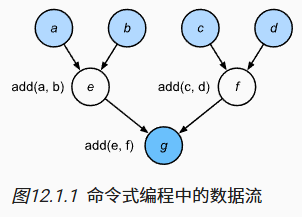

# 12计算性能

## 12.1编译器和解释器

### 12.1.1命令式编程

命令式编程是一种使用语句来改变程序状态的编程范式，其通过语句如何改变状态来描述计算过程。

对于下列代码：

```python
def add(a, b):
    return a + b

def fancy_func(a, b, c, d):
    e = add(a, b)
    f = add(c, d)
    g = add(e, f)
    return g

print(fancy_func(1, 2, 3, 4))
```

在python中对于fancy_func函数求值时，其按顺序执行函数体的操作，通过e=add(a,b)求值，并将结果存储为变量e从而改变程序的状态。接下来的两个语句f = add(c, d)和g = add(e, f)也将执行类似地操作，即执行加法计算并将结果存储为变量。



命令式编程很方便，但可能效率不高。python会单独执行三个函数的调用，忽略add函数在fancy_func中被重复调用。如果在一个GPU（甚至多个GPU）上执行这些命令，那么Python解释器产生的开销可能会非常大。

### 12.1.2符号式编程

代码在完全定义了过程之后才执行计算。一般步骤如下：

- 定义计算流程
- 将流程编译成可执行的程序
- 给定输入，调用编译好的程序执行

命令式（解释型）编程和符号式编程的区别如下：

- 命令式编程更容易使用。在Python中，命令式编程的大部分代码都是简单易懂的。命令式编程也更容易调试，这是因为无论是获取和打印所有的中间变量值，或者使用Python的内置调试工具都更加简单；
- 符号式编程运行效率更高，更易于移植。符号式编程更容易在编译期间优化代码，同时还能够将程序移植到与Python无关的格式中，从而允许程序在非Python环境中运行，避免了任何潜在的与Python解释器相关的性能问题。

## 12.2异步计算

不需要等待某个操作完成就可以继续执行后续操作的一种计算方式。它常用于需要等待外部资源（如文件、网络、数据库）的场景，可以提升程序的效率和响应速度。

```python
# GPU计算热身
device = d2l.try_gpu()
a = torch.randn(size=(1000, 1000), device=device)
b = torch.mm(a, a)

with d2l.Benchmark('numpy'):
    for _ in range(10):
        a = numpy.random.normal(size=(1000, 1000))
        b = numpy.dot(a, a)

with d2l.Benchmark('torch'):
    for _ in range(10):
        a = torch.randn(size=(1000, 1000), device=device)
        b = torch.mm(a, a)
```

若任务A花费2s完成，任务B花费3s，总的花费少于5s（串行执行为5s）。
